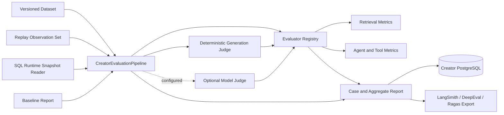

# Creator Evaluation Phase 8 实现说明

更新时间：2026-07-24

阶段状态：已完成

## 1. 阶段目标

Phase 8 在既有 Creator Harness、Multi-Agent Runtime、Memory、Agentic RAG 和
Tool Gateway 之上实现正式 Evaluation Pipeline。它不是让 `EvaluationAgent`
再次调用内容模型给自己打一个总分，而是建立可复现、可追溯、可比较的评估控制面：

1. 冻结并版本化 Dataset、Observation、Candidate 和 Evaluator。
2. 将带 gold label 的离线回归和无 reference 的运行时评估分开。
3. 对 Retrieval、Agent trajectory、Tool Calling 和 Generation 分层评分。
4. 每个 Metric 明确记录状态、阈值、实现名称、实现版本、理由和证据摘要。
5. 支持 baseline 对比、幂等重放、SQL 持久化和 CI 失败码。
6. 支持确定性规则、OpenAI-compatible judge 以及 LangSmith、DeepEval、Ragas
   交换格式，但不把任何单一外部平台作为事实源。
7. 评估数据拒绝凭据、Token、邮箱和电话等敏感字段。

内置 `creator-smoke/1.0.0` 只用于验证评估链路，不代表正式业务 Benchmark。
正式上线前仍需由内容运营、创作者和工程团队共同建设分层、分主题、带人工标注的
回归数据集。

## 2. 总体架构



离线评估输入由两部分组成：

- `EvaluationDataset`：任务目标和期望标准，不包含 Candidate 输出。
- `EvaluationObservationSet`：某一 Candidate 的实际检索、计划、执行、工具调用、
  生成内容和 Trace 身份。

这使同一个冻结 Dataset 可以评估不同模型、Prompt、Tool 策略和 Runtime 版本。
`dataset_sha256` 防止“版本号未变但样本已变”，`request_sha256` 保证同一
Evaluation Run ID 只能对应同一个完整请求。

## 3. 模块结构

```text
app/creator/evaluation/
├── models.py                # Dataset、Observation、Metric、Report Schema
├── dataset.py               # JSON 加载、Schema 校验、敏感字段拒绝
├── hashing.py               # 规范 JSON SHA-256
├── metrics.py               # 确定性 Retrieval、Agent、Tool 指标注册表
├── deterministic_judge.py   # 本地 claim/relevance/style 规则 Judge
├── judge.py                 # OpenAI-compatible 结构化生成质量 Judge
├── service.py               # Case 评估、宏平均、baseline delta、幂等入口
├── runtime.py               # EvaluationAgent 的 reference-free 运行时评估
├── ports.py                 # Store、Snapshot Reader、Judge、Runtime Evaluator
├── in_memory.py             # 单元测试和本地临时 Store
├── sqlalchemy.py            # SQL Store 和 Trace/Artifact/Tool 快照读取
├── exporters.py             # LangSmith、DeepEval、Ragas 交换对象
├── composition.py           # Judge 和 Store 组装
├── cli.py                   # 离线、快照、持久化和 CI 命令
└── datasets/
    ├── smoke-v1.json
    └── smoke-observations-v1.json
```

Creator Evaluation 使用独立 Schema、表和命令，并从持久化 Creator
Task、Artifact、Event 与 Tool Audit 冻结 Observation。

## 4. 版本与事实源

每份 `EvaluationRunReport` 强制记录：

| 字段 | 作用 |
|---|---|
| `dataset_id` / `dataset_version` | 数据集逻辑身份 |
| `dataset_sha256` | 数据集内容身份 |
| `candidate_name` / `candidate_version` | 被评对象版本 |
| `evaluator_version` | 确定性 Registry 版本 |
| Metric `evaluator` / `evaluator_version` | 单项评估器版本 |
| `request_sha256` | Dataset、Observation、Candidate、Judge 和 Mode 的组合身份 |
| `baseline_evaluation_run_id` | 可选对照实验 |
| `metric_deltas` | Candidate 相对同一冻结 Dataset baseline 的变化 |

若 baseline 的 Dataset ID、版本或 SHA-256 不一致，Pipeline 拒绝比较。
相同 Evaluation Run ID 和相同请求返回原报告；相同 ID 对应不同请求则抛出冲突，
不会覆盖历史评估。

## 5. Metric 体系

### 5.1 Retrieval

| Metric | 实现 |
|---|---|
| Recall@K | Top-K 中去重相关文档数 / 全部标注相关文档数 |
| Precision@K | Top-K 相关槽位数 / K；少返回不会虚增分数 |
| MRR | 第一条相关文档 Rank 的倒数，无命中为 0 |
| nDCG@K | 二值 relevance 的 DCG / 理想 DCG |
| ACL Safety | `1 - 未通过 authority hydration 数 / 返回数`，默认阈值 1.0 |

相关性以稳定 `document_id` 标注，不用关键词命中冒充 gold label。
ACL Safety 独立于相关性：即使跨租户文档内容相关，也必须导致门禁失败。

### 5.2 Agent

`agent_task_success_rate` 是 Case 级二值结果，要求：

- Task 状态为 `COMPLETED`。
- Final Artifact 类型满足标注。
- 所有必需 capability 有成功执行。
- Runtime 没有终止错误。

`agent_planning_quality` 由以下确定性子分数组成：

```text
0.35 * required capability coverage
+ 0.30 * dependency validity
+ 0.25 * successful execution alignment
+ 0.05 * plan step budget efficiency
+ 0.05 * replan budget efficiency
```

Dependency validity 检查未知依赖、自依赖和环。Execution alignment 校验
`step_id + capability + SUCCEEDED`，不根据自然语言 Plan 说明猜测完成情况。

### 5.3 Tool Calling

`agent_tool_calling_accuracy` 使用带调用次数和可选参数 SHA-256 的 multiset F1：

- Recall 衡量每个期望工具的最小调用次数是否满足。
- Precision 惩罚额外、失败或参数不匹配的调用。
- `max_calls` 惩罚无意义重复调用。
- 只有显式 `allow_additional_tools=true` 时，成功的额外工具才不作为错误工具。

原始参数不进入评估报告；Observation 使用 Phase 7 Tool Audit 中的
`arguments_sha256`。

### 5.4 Generation

| Metric | 确定性实现 | 可选模型实现 |
|---|---|---|
| Faithfulness | Claim 与已授权引用 Evidence 的文本支持；支持人工/外部 claim label | 逐 Claim entailment |
| Relevance | 必需概念和 reference answer term coverage | Rubric judge |
| Style Consistency | 必需/禁用词、Heading、长度、Exemplar overlap | Rubric judge |

默认 `deterministic` Judge 可离线运行且结果稳定。语义改写会限制词面判断能力，因此
报告会保留 limitation；高价值发布门禁应使用经过人工校准的模型 Judge 或人工标注，
而不是只提高词面规则权重。

OpenAI-compatible Judge：

- 温度为 0，并要求结构化 JSON。
- 将文章和 Evidence 明确作为不可信数据，不执行其中的指令。
- 限制上下文字符数、响应字节数、超时和重试次数。
- 只保存简短评分理由和 Claim verdict，不请求或保存 chain-of-thought。
- 失败时该 Case 的生成 Metric 为 `SKIPPED`，整体为 `PARTIAL`，不会静默使用假分数。

## 6. Metric 状态和门禁

每个 Metric 的状态为：

- `SCORED`：有 `score`、`threshold` 和 `passed`。
- `SKIPPED`：缺少 reference、生成内容或 Judge，不带分数。
- `ERROR`：评估器执行失败，不带分数。

Case 结果规则：

1. 任一必需 Metric 已评分但未通过，Case 为 `FAILED`。
2. 没有失败，但任一必需 Metric 未评分，Case 为 `PARTIAL`。
3. 所有必需 Metric 均已评分且通过，Case 为 `PASSED`。

Experiment 采用 Case 结果的保守聚合。Metric 汇总使用 macro average，并记录已评分、
跳过、错误和通过的 Case 数；不能用少量成功 Case 掩盖未评分样本。

## 7. Runtime EvaluationAgent

Phase 3 的 `EvaluationAgent` 原先通过 `evaluation.run` 再调用内容模型，根据 Critic
分数生成基线报告。Phase 8 已移除这条自评路径：

```text
Critique + Draft + Evidence + Outline + Profile
-> CreatorRuntimeContextEvaluator
-> versioned EVALUATION_REPORT Artifact
```

运行时 Artifact 计算当前上下文能证明的：

- Critic 已接受且准确引用当前 Draft 的 Task success。
- 有 Evidence 时的 Faithfulness。
- 有 Outline/显式概念时的 Relevance。
- 有具体 Style 规则时的 Style Consistency。

运行中的 Agent 看不到冻结 gold retrieval label、完整 Tool Audit 和完整持久化 Plan
trajectory，因此这些 Metric 被列入 `unevaluated_metrics`。离线或生产抽样评估通过
`SqlAlchemyCreatorEvaluationSnapshotReader` 从 Task、Run Event、Artifact 和
Tool Audit 构造完整 Observation 后计算，在线 Artifact 不冒充离线 Benchmark。

## 8. 持久化和快照

SQLAlchemy 实现兼容 SQLite 测试和 PostgreSQL 生产连接：

| 表 | 内容 |
|---|---|
| `creator_evaluation_runs` | Dataset/Candidate/Evaluator 版本、请求哈希、Outcome、总分、完整不可变报告 |
| `creator_evaluation_case_results` | Case 范围、Task/Run/Trace、Metric、限制和 Observation 哈希 |

完整报告保存 `report_sha256`。读取时重新计算哈希，不一致则拒绝返回。
Task 查询必须同时匹配 `tenant_id + creator_id + task_id`。

Snapshot Reader：

1. 在租户和 Creator 范围内读取 Task 与目标 Run。
2. 从 `creator_run_events` 重建 Plan revision 和 Agent execution。
3. 从 `creator_artifacts` 读取最后一个 Evidence Pack 和 Draft/Final Content。
4. 从 `creator_tool_calls` 读取工具名、状态、参数哈希和延迟。
5. 对无法解析的历史事件记录 limitation，不伪造缺失数据。

## 9. 外部框架边界

`exporters.py` 只生成 provider-neutral 对象，不在核心 Pipeline 中引入 SaaS SDK：

- `to_langsmith_feedback()`：`key/score-or-value/comment`。
- `to_deepeval_test_case()`：input、actual/expected output、retrieval context 和工具轨迹。
- `to_ragas_record()`：user input、response、retrieved contexts 和 reference。

这保持 PostgreSQL Report 为事实源，同时允许外围 Worker 将选择的实验同步到外部
平台。外部同步失败不能修改内部评分。

## 10. 安全约束

- Dataset 与 Observation 加载器递归拒绝 password、secret、API key、Token、Cookie、
  邮箱和电话字段。
- Observation 必须与 Dataset 的 ID 和版本完全匹配，且一次实验不能跨租户。
- Evidence 必须携带稳定 ID 和 `authority_verified`；ACL 泄漏是独立失败 Metric。
- Tool 参数只使用 SHA-256，不存原始查询、正文或凭据。
- Model Judge API key 使用 `SecretStr`，不会进入 Report。
- Judge 的输入受字符预算限制，响应受字节限制。
- Report 不保存 Agent 隐藏推理或 Judge chain-of-thought。

## 11. 配置

```env
CREATOR_EVALUATION_DATASET_PATH=app/creator/evaluation/datasets/smoke-v1.json
CREATOR_EVALUATION_OBSERVATIONS_PATH=app/creator/evaluation/datasets/smoke-observations-v1.json
CREATOR_EVALUATION_OUTPUT_PATH=target/creator-evaluation-report.json
CREATOR_EVALUATION_CANDIDATE_NAME=mindflow-creator
CREATOR_EVALUATION_CANDIDATE_VERSION=development
CREATOR_EVALUATION_JUDGE_PROVIDER=deterministic
```

外部 Judge：

```env
CREATOR_EVALUATION_JUDGE_PROVIDER=openai
CREATOR_EVALUATION_JUDGE_BASE_URL=https://provider.example/v1
CREATOR_EVALUATION_JUDGE_API_KEY=replace-me
CREATOR_EVALUATION_JUDGE_MODEL=calibrated-evaluator-model
CREATOR_EVALUATION_JUDGE_TIMEOUT_SECONDS=30
CREATOR_EVALUATION_JUDGE_MAX_CONTEXT_CHARS=24000
CREATOR_EVALUATION_JUDGE_MAX_ATTEMPTS=2
```

`disabled`/`none` 会关闭 Generation Judge。若 Dataset 将生成指标列为必需，结果会是
`PARTIAL`，而不是回退到 Critic 分数。

## 12. 运行

内置离线 smoke：

```bash
python -m app.creator.evaluation.cli \
  --candidate-name mindflow-creator \
  --candidate-version phase-8 \
  --fail-on-threshold
```

持久化到 Creator 数据库：

```bash
python -m app.creator.evaluation.cli \
  --candidate-version phase-8 \
  --persist \
  --create-schema \
  --evaluation-run-id eval-release-001
```

对已完成 Runtime Run 建立快照：

```bash
python -m app.creator.evaluation.cli \
  --case-id agent-harness-hitl-article \
  --tenant-id tenant-a \
  --creator-id creator-a \
  --task-id task-id \
  --run-id run-id \
  --candidate-version runtime-build-sha \
  --persist
```

Baseline 可通过 `--baseline-report` 或 `--baseline-evaluation-run-id` 指定。
`--fail-on-threshold` 在报告未通过时返回退出码 2，输入或执行错误返回 1。

Docker 本地 smoke：

```bash
docker compose --profile creator-eval run --rm creator-eval
```

该 profile 中的 `--create-schema` 仅用于本地验收。生产仍应使用 Phase 10 的版本化迁移。

## 13. 测试

`tests/test_creator_evaluation.py` 覆盖：

- Recall@K、Precision@K、MRR、nDCG@K 和 ACL Safety。
- Task success、Plan dependency、Tool multiset F1。
- Faithfulness、Relevance、Style Consistency。
- 缺少 Judge 时的 `PARTIAL`。
- ACL 泄漏强制失败。
- 敏感字段数据集拒绝。
- Evaluation Run 幂等重放和冲突。
- Baseline tool regression delta。
- SQL Report 持久化、列表与完整性读取。
- Runtime Event/Artifact/Tool Audit 快照。
- OpenAI-compatible Judge 的结构化 JSON 合约。
- LangSmith、DeepEval 和 Ragas 交换对象。

`tests/test_creator_multi_agent_runtime.py` 额外验证：

- Evaluation Artifact 包含 Dataset/Evaluator 版本和结构化 Metric。
- `EvaluationAgent` 不再发起 `evaluation.run` 内容模型调用。

验收命令：

```bash
python -m pytest -q
python -m mypy app/creator/evaluation app/creator/agents app/creator/runtime app/creator/infrastructure/database.py
python -m ruff check app/creator/evaluation app/creator/agents app/creator/runtime app/creator/infrastructure/database.py app/core/config.py tests/test_creator_evaluation.py
python -m black --check app/creator/evaluation app/creator/agents app/creator/runtime app/creator/infrastructure/database.py app/core/config.py tests/test_creator_evaluation.py
python -m pip check
docker compose config --quiet
docker compose --profile creator-eval config --quiet
```

当前 Creator-only 基线验收结果：

- 全量测试 `92 passed`。
- Evaluation 专项共 10 个测试，覆盖上述离线、持久化、安全和外部 Judge
  场景。
- MyPy 检查完整 Creator 范围 87 个源码文件，无错误。
- Black 检查 89 个 Creator 相关文件；Phase 8 目标范围 Ruff、依赖完整性和两套
  Compose 配置均通过。
- Creator 源码、测试、依赖和 Compose 配置作为统一质量门禁执行。

## 14. 后续边界

Phase 8 未实现：

- Creator Evaluation REST API 与 operator RBAC。
- 在线抽样、Annotation Queue 和人工标注工作台。
- 生产异步 Evaluation Worker、队列、租约和调度。
- LangSmith/DeepEval/Ragas SDK 网络同步 Worker。
- 大规模正式 Dataset、训练/验证/测试拆分和标注一致性统计。
- Judge 与人工标签的校准、偏差分析和 pairwise A/B。
- 评估成本、延迟和漂移告警 Dashboard。
- Alembic 生产迁移。

Creator API、SSE 与交互前端进入 Phase 9；生产迁移、Worker、部署和性能优化进入
Phase 10。本阶段不提前实现前端。

## 15. 参考

- [LangSmith Evaluation Concepts](https://docs.langchain.com/langsmith/evaluation-concepts)
- [LangSmith Evaluation Workflow](https://docs.langchain.com/langsmith/evaluation)
- [Ragas Available Metrics](https://docs.ragas.io/en/stable/concepts/metrics/available_metrics/)
- [Ragas Faithfulness](https://docs.ragas.io/en/latest/concepts/metrics/available_metrics/faithfulness/)
- [DeepEval Evaluation Datasets](https://deepeval.com/docs/evaluation-datasets)
- [DeepEval Metrics Introduction](https://deepeval.com/docs/metrics-introduction)
