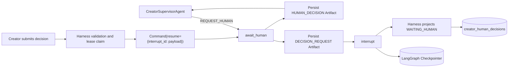

# Creator Human-in-the-loop Phase 4 实现说明

更新时间：2026-07-24

阶段状态：已完成

## 1. 阶段目标

Phase 4 将 Phase 3 的类型化人工决策请求升级为可恢复执行协议：

1. 选题和大纲节点使用真实 `interrupt()` 暂停。
2. Task、Run、Decision 和 checkpoint 身份持久化，不依赖进程内 Future。
3. 用户提交必须恢复精确 interrupt，不能从头重跑整条创作链路。
4. 重复提交、越权提交、陈旧页面和非法候选项必须被确定性拒绝。
5. 用户要求修改时由 Supervisor 重规划，不能把拒绝当作批准。

本阶段不实现 Creator HTTP API 和前端工作台。它们属于 Phase 9；Phase 4
提供可被 API 层直接调用的 Harness 应用接口。

## 2. 总体设计



三类存储各自承担不同职责：

| 存储 | 职责 |
|---|---|
| Creator SQL 控制库 | Task、Run、Decision、Event、Outbox、幂等与租约 |
| LangGraph Checkpointer | 图状态、待执行节点、interrupt 和恢复位置 |
| Artifact Store | 选题、大纲、人工请求、人工响应、正文和评审等不可变产物 |

控制库不复制完整 LangGraph State，checkpoint 也不替代业务授权和审计记录。

## 3. 决策协议

### 3.1 决策类型

| `kind` | 允许动作 | 约束 |
|---|---|---|
| `TOPIC_SELECTION` | `SELECT`, `REQUEST_CHANGES` | `SELECT` 必须携带白名单内的 `selected_option_id` |
| `OUTLINE_APPROVAL` | `APPROVE`, `REQUEST_CHANGES` | 修改请求必须携带非空 `feedback` |

`RuntimeDecisionRequest` 同时包含：

- 确定性 `decision_id`，与 `DECISION_REQUEST` Artifact ID 相同。
- LangGraph 生成的 `interrupt_id`。
- 当前 checkpoint ID。
- 来源 Artifact、提示语、允许动作和允许候选项。

恢复时 Runtime 使用精确映射：

```python
Command(
    resume={
        decision.interrupt_id: decision.model_dump(mode="json"),
    }
)
```

不使用无 ID 的广播式 resume，因此一个响应不能误恢复其他中断。

### 3.2 生命周期

```text
PENDING
  -> SUBMITTED   用户输入已校验并持久化，Run lease 已取得
  -> APPLIED     LangGraph 已确认 applied_decision_id
```

`SUBMITTED` 是必要的中间状态。若 Runtime 或 checkpoint 服务暂时失败，同一请求可在
租约释放或过期后继续恢复，而不需要重新接受用户输入。

Task/Run 的对应状态：

```text
RUNNING -> WAITING_HUMAN -> RUNNING
                         -> RETRYING -> RUNNING
                         -> COMPLETED / FAILED
```

Task 和 Run 都保存 `pending_decision_id`；Run 额外保存当前 `checkpoint_id`。

## 4. LangGraph 暂停与重放

`await_human` 节点先写入不可变 `DECISION_REQUEST` Artifact，再调用
`interrupt()`。LangGraph 恢复 interrupt 时会从节点起点重新执行，因此暂停前的
副作用必须可重放：

- Artifact ID 由身份、step、revision 和规范化内容确定。
- SQL 与内存 Artifact Store 都允许同 ID、同内容的重复写入。
- Artifact JSON 在写入前规范化 list/tuple 表示，避免数据库往返后产生伪冲突。
- 不允许同 ID、不同内容覆盖。

用户响应通过 Pydantic 再次校验后写入 `HUMAN_DECISION` Artifact，并将其 ID
加入后续 Final Artifact 的父引用，形成完整审计链。

## 5. Harness 安全边界

`CreatorAgentHarness.get_decision()` 和 `submit_decision()` 承担应用边界校验：

1. tenant、creator、task、run 和 decision 归属一致。
2. 当前 actor 必须是任务所有者。
3. 首次提交的 `expected_version` 必须等于 Task 当前版本。
4. Task 与 Run 必须都在 `WAITING_HUMAN`，且指向同一活动决策。
5. Run checkpoint 必须等于决策创建时 checkpoint。
6. action 和 option 必须位于决策白名单。
7. Run lease 防止两个 Worker 同时恢复同一线程。

提交幂等范围包含 tenant、creator、task 和 decision；请求哈希包含动作、候选项、
反馈和 actor。相同 key、相同请求返回已保存结果；相同 key、不同请求或已经应用的
不同提交会返回明确冲突。

## 6. Supervisor 反馈闭环

人工决策不会绕过 Supervisor：

- 选题 `SELECT` 写入 `selected_topic_id`，Supervisor 才允许构建大纲。
- 选题 `REQUEST_CHANGES` 写入反馈和来源 ID，Supervisor 创建新的选题计划版本。
- 大纲 `APPROVE` 设置 `outline_approved`，Supervisor 才允许 Writer 执行。
- 大纲 `REQUEST_CHANGES` 创建新的大纲计划版本，再次进入人工确认。

每次修改都会生成新 revision 和新的 Decision，不会覆写旧 Artifact。

## 7. Checkpointer

配置项：

```env
CREATOR_CHECKPOINT_BACKEND=sqlite
CREATOR_CHECKPOINT_SQLITE_PATH=data/mindflow-checkpoints.db
CREATOR_CHECKPOINT_POSTGRES_URL=
```

- `sqlite`：本地开发和单进程测试。
- `postgres`：生产部署；需填写独立 psycopg 连接字符串。

`open_creator_checkpointer()` 负责创建目录、初始化表并关闭连接。
`JsonPlusSerializer` 使用 Creator State 类型 allowlist，避免依赖不受控的 pickle
反序列化。Runtime 只使用稳定 `thread_id` 定位 checkpoint，外部 Run ID 不充当
checkpoint 身份。

## 8. 错误恢复

| 场景 | 行为 |
|---|---|
| Runtime 暂时不可用 | Task/Run 进入 `RETRYING`，Decision 保持 `SUBMITTED` |
| Worker 在恢复前退出 | lease 过期后，同一提交可重新 claim |
| Graph 已前进但控制面尚未投影 | Runtime 读取 checkpoint 中的 `applied_decision_id` 并对账 |
| 页面持有旧 Task version | 返回 `TASK_VERSION_CONFLICT` |
| checkpoint 或 interrupt 已改变 | 返回 Runtime/checkpoint contract error |
| 决策已被不同输入应用 | 返回 `DECISION_STATE_CONFLICT` |

当前恢复由同一提交重试或 Worker 的 lease 恢复入口触发。自动扫描
`SUBMITTED` 决策并消费 Outbox 的独立后台 Worker 尚未实现，不能把同步 Harness
调用描述为完整消息队列。

## 9. 数据模型变更

新增 `creator_human_decisions`：

```text
id PK
task_id FK
run_id FK
checkpoint_id
interrupt_id UNIQUE
kind
prompt
source_artifact_id
allowed_actions_json
allowed_option_ids_json
status
version
submission_hash
idempotency_key_hash
action
actor_id
selected_option_id
feedback
created_at
submitted_at
applied_at
```

`creator_tasks` 和 `creator_runs` 新增 `pending_decision_id`，Run 已有
`checkpoint_id` 现在保存真实 checkpoint。

本仓库当前仍使用开发期 `metadata.create_all()`。生产环境在 Phase 10 必须使用版本化
迁移，不能直接对已有表依赖 `create_all()` 加列。

## 10. 测试与验证

专项测试 `tests/test_creator_human_in_loop.py` 覆盖：

- 选题暂停、选择、大纲暂停、批准和最终完成。
- Decision `PENDING -> SUBMITTED -> APPLIED`。
- 幂等重放及已应用决策的冲突提交。
- tenant/actor、Task version 和候选项白名单校验。
- 选题与大纲 `REQUEST_CHANGES` 后的 revision 重规划。
- Runtime 暂时失败后复用已提交决策恢复。
- SQLite checkpoint 关闭并重建 Runtime 后继续执行。

运行：

```bash
python -m unittest discover -s tests -p "test_creator*.py" -v
python -m ruff check app/creator tests/test_creator_harness.py \
  tests/test_creator_multi_agent_runtime.py tests/test_creator_human_in_loop.py
python -m mypy app/creator
```

## 11. 后续阶段边界

Phase 4 未实现：

- Redis、PostgreSQL 画像和 Qdrant 三级 Memory。
- Agentic RAG 与 Retriever Agent。
- Creator MCP Server。
- 正式 Evaluation Pipeline。
- Creator HTTP/SSE API、前端决策组件和后台审批 Worker。
- PostgreSQL checkpointer 的容器级集成测试和生产迁移。

这些能力继续按 Phase 5 至 Phase 10 实现。
