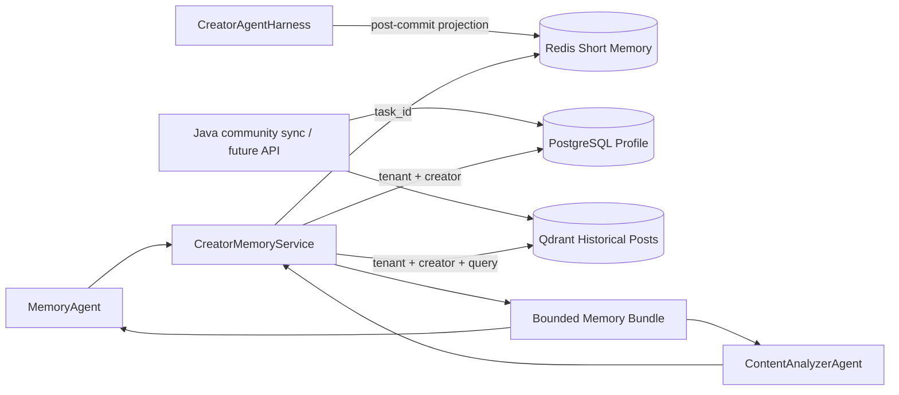

# Creator Memory Phase 5 实现说明

更新时间：2026-07-24

阶段状态：已完成

## 1. 阶段目标

Phase 5 将 Creator Memory 从 Prompt 占位字段升级为独立、可审计、可降级的三级系统：

1. Redis Short Memory 保存当前 Task/Run 的紧凑工作快照。
2. PostgreSQL Long Memory 保存创作者长期画像和偏好。
3. Qdrant Semantic Memory 保存可按目标检索的历史文章分块。
4. MemoryAgent 和 ContentAnalyzer 只能读取当前租户、当前创作者且经
   `source_scope` 授权的数据。
5. 任一可选 Memory 后端失败时，主创作控制面仍可运行。

本阶段不是 Phase 6 Agentic RAG。Memory 检索只完成创作者自身历史的向量召回，
尚未实现 SQL、Vector Search 的自主选择、融合评分和 reranker。

## 2. 架构



Memory 与其他状态的职责边界：

| 数据 | 事实源 | Memory 中的角色 |
|---|---|---|
| Task/Run 生命周期 | Creator SQL 控制库 | Redis 可丢弃投影 |
| LangGraph 执行位置 | Checkpointer | Memory 不保存恢复指针 |
| Creator Profile | PostgreSQL Profile | 长期事实和偏好 |
| 历史文章正文 | Java/OSS | Qdrant 保存受控分块和元数据 |
| 当前文章产物 | Artifact Store | Memory 只提供上下文 |

## 3. 模块结构

```text
app/creator/memory/
├── composition.py   # Redis/Qdrant 生命周期和降级组合
├── embeddings.py    # Hashing 与 OpenAI-compatible embedding
├── errors.py        # Memory 冲突、不可用和完整性错误
├── in_memory.py     # 确定性测试适配器
├── models.py        # Profile、Task Snapshot、Post、Hit、Source Report
├── ports.py         # 三类 Store、Embedder、Reader 协议
├── semantic.py      # Qdrant 分块、索引、过滤和搜索
├── service.py       # 授权、并行读取、预算与降级聚合
├── short_term.py    # Redis TTL + Lua CAS
└── sqlalchemy.py    # PostgreSQL Profile Store
```

Agent 不直接依赖 Redis、SQLAlchemy 或 Qdrant SDK。

## 4. Short Memory

`CreatorTaskMemory` 保存：

- tenant、creator、task、run 和 trace 身份。
- Goal、constraints、source scope。
- Task/Run status 和乐观版本。
- execution attempt、checkpoint、pending decision 和 final artifact。
- Memory 自身版本与更新时间。

Redis key 使用 `tenant_id + task_id` 的 SHA-256，不暴露原始业务 ID。写入使用 Lua
CAS：

```text
读取当前版本
-> 校验 expected_version
-> 版本 +1
-> SET key JSON EX ttl
```

Harness 只在 Creator SQL 事务提交成功后投影 Redis。Redis 超时会记录结构化警告，
不会回滚已经提交的 Task/Run。下一次生命周期变化会重新覆盖快照，因此 Redis 不是
双写事实源。

## 5. Long Memory

`creator_memory_profiles` 使用 `(tenant_id, creator_id)` 复合主键并包含：

```text
display_name
bio
expertise_tags_json
audience_segments_json
style_traits_json
preferred_formats_json
language
explicit_preferences_json
inferred_preferences_json
source_system
source_revision
version
created_at
updated_at
```

显式偏好与推断偏好分开，调用方不能把模型推断伪装成用户声明。Store 使用
`SELECT FOR UPDATE` 和版本条件更新；陈旧写入返回
`CREATOR_MEMORY_VERSION_CONFLICT`。

Profile Schema 不包含 phone、email、password 等字段，并递归拒绝凭据、token、
联系方式和地址类 key 进入 preference JSON。

字段与 Java 社区用户模型保持兼容：

- `creator_id` 对应 Java `users.id` 的字符串形式。
- `display_name` 对应 `nickname`。
- `bio` 和 expertise tags 可由 `bio`、`tags_json` 映射。
- `source_system/source_revision` 支持未来增量同步和对账。

## 6. Semantic Memory

`CreatorHistoricalPost` 兼容 Java `know_posts`：

- post ID、creator ID、title、body、description。
- tags、content type、visibility、status、publish time。
- views、likes、favorites、comments、shares、heat score。
- source system 和 source revision。

### 6.1 多租户隔离

所有 Qdrant 查询、删除和重建都强制包含：

```text
tenant_id == current tenant
creator_id == current creator
```

系统使用一个 collection，并为 `tenant_id`、`creator_id`、`post_id` 和 `tags`
创建 payload index；`tenant_id` 标记为 tenant index。不会为每个创作者创建独立
collection。

### 6.2 稳定分块与更新

文章按字符预算和重叠窗口分块。Point ID 是
`UUIDv5(tenant, creator, post, chunk_index)`，payload 保留 `content_hash` 和
source revision。

更新顺序：

1. 完成全部新分块和 embedding。
2. upsert 新 points。
3. 删除本文章不再存在的旧 chunk IDs。

这比先删后写更能避免 embedding 或网络失败造成整篇文章暂时消失。Artifact 正文和
Java OSS 仍是原文事实源，Qdrant 只是可重建索引。

## 7. Context Budget 与授权

`CreatorMemoryService.load()` 并行读取三类 Memory，但每个 Agent 使用不同查询：

| Agent | Short | Profile | Semantic |
|---|---:|---:|---:|
| MemoryAgent | 是 | 是 | 经授权 |
| ContentAnalyzerAgent | 否 | 否 | 经授权 |

历史文章默认不读取。只有
`source_scope.include_creator_history=true` 时才查询 Qdrant。

上下文限制包括：

- Semantic Top-K 上限。
- 单个 excerpt 字符上限。
- tags filter 上限。
- 只传递命中的分块，不把完整历史库放入 Prompt。
- Source Report 仅暴露后端、状态、数量和错误类型，不暴露连接凭据。

## 8. 数据可用性与防幻觉

每个 tier 返回：

```text
AVAILABLE | EMPTY | DISABLED | DEGRADED
```

聚合结果映射为：

```text
AVAILABLE | PARTIAL | NOT_CONNECTED
```

MemoryAgent 和 ContentAnalyzer 会用该结果覆盖模型自行声明的数据可用性。若 Memory
完全不可用，MemoryAgent 强制清空 style、audience 和 preferred format，避免离线
fallback 生成看似真实的用户画像；ContentAnalyzer 也不会声称分析过历史文章。

## 9. Embedding

支持两种 provider：

| Provider | 用途 |
|---|---|
| `hashing` | 离线开发和确定性测试，只提供有限词法相似度 |
| `openai` | OpenAI-compatible `/embeddings` 生产调用 |

`hashing` 不被描述为生产级语义模型。生产配置必须保证
`CREATOR_MEMORY_EMBEDDING_DIMENSIONS` 与实际模型输出及 Qdrant collection 一致。
切换模型或维度时应使用新 collection 并重建，现有 collection 的维度不匹配会在启动
时失败。

## 10. 降级与启动策略

`open_creator_memory()` 管理 Redis 和 Qdrant 连接生命周期：

- optional 后端启动失败：记录日志并以 `DISABLED/DEGRADED` 继续。
- `CREATOR_SHORT_MEMORY_REQUIRED=true`：Redis 启动失败即失败。
- `CREATOR_SEMANTIC_MEMORY_REQUIRED=true`：Qdrant 或 embedding 启动失败即失败。
- SQL Profile 在访问时暴露数据库错误，由聚合层转换为降级状态。

单个 Memory tier 的读取异常不转换成 Agent failure；控制面、Checkpoint 和 Artifact
Store 仍可继续工作。

## 11. 配置

```env
CREATOR_MEMORY_ENABLED=true
CREATOR_SHORT_MEMORY_ENABLED=true
CREATOR_SHORT_MEMORY_REQUIRED=false
CREATOR_SHORT_MEMORY_TTL_SECONDS=86400
CREATOR_LONG_MEMORY_ENABLED=true
CREATOR_SEMANTIC_MEMORY_ENABLED=true
CREATOR_SEMANTIC_MEMORY_REQUIRED=false
CREATOR_SEMANTIC_MEMORY_TOP_K=6
CREATOR_MEMORY_MAX_EXCERPT_CHARS=1200
CREATOR_MEMORY_QDRANT_URL=http://127.0.0.1:6333
CREATOR_MEMORY_QDRANT_API_KEY=
CREATOR_MEMORY_QDRANT_COLLECTION=mindflow_creator_memory
CREATOR_MEMORY_EMBEDDING_PROVIDER=hashing
CREATOR_MEMORY_EMBEDDING_DIMENSIONS=256
CREATOR_MEMORY_CHUNK_CHARS=1200
CREATOR_MEMORY_CHUNK_OVERLAP_CHARS=160
CREATOR_MEMORY_SCORE_THRESHOLD=0.0
```

Docker Compose 新增：

- `creator-postgres`：宿主机端口 `15432`。
- `qdrant`：HTTP `16333`，gRPC `16334`。

## 12. 组合方式

未来 Creator API lifespan 使用同一资源实例：

```python
async with open_creator_checkpointer(settings) as checkpointer:
    async with open_creator_memory(
        settings=settings,
        database=creator_database,
    ) as memory:
        runtime = build_creator_runtime(
            settings=settings,
            ai_client=ai_client,
            artifact_store=creator_database.artifact_store,
            checkpointer=checkpointer,
            memory=memory,
        )
        harness = CreatorAgentHarness(
            uow_factory=creator_database.uow_factory,
            runtime=runtime,
            task_memory=memory,
        )
```

Creator Memory 由 API 本地模式或独立 Runtime Worker 的生命周期统一持有。

## 13. 测试

`tests/test_creator_memory.py` 覆盖：

- Redis scope、TTL 和 CAS 冲突。
- Short Memory 内部 creator/run 身份与请求范围不一致时拒绝返回。
- SQL Profile tenant scope、创建、更新和陈旧版本拒绝。
- preference JSON 的敏感字段拒绝。
- Qdrant tenant/creator 隔离、tag filter、文章重建和删除。
- `source_scope` 授权与单 tier 降级。
- Harness 生命周期投影及 Redis 故障隔离。
- 无 Memory 时的画像防幻觉。
- MemoryAgent 和 ContentAnalyzer 消费真实 Profile/历史文章。

验证命令：

```bash
python -m unittest discover -s tests -v
python -m ruff check app/creator app/core/config.py tests/test_creator*.py
python -m mypy app/creator
python -m black --check app/creator app/core/config.py tests/test_creator*.py
docker compose config --quiet
```

2026-07-24 验收结果：

- Phase 5 定向测试：9 项通过。
- 全量回归测试：51 项通过。
- Creator 范围 Ruff、Mypy 和 Black 检查通过。
- Docker Compose 配置解析通过。

## 14. 后续边界

Phase 5 未实现：

- 从 Java 服务自动同步用户、帖子和互动事件。
- Memory 写入 HTTP/MCP API。
- SQL、Qdrant 的 Agent 自主选择。
- BM25、embedding、business score 融合及 reranker。
- Memory 质量、命中率和陈旧度 Evaluation。
- Creator 前端和版本化生产迁移。

这些能力分别进入 Phase 6、Phase 7、Phase 8、Phase 9 和 Phase 10。

参考：

- [Qdrant Multitenancy](https://qdrant.tech/documentation/manage-data/multitenancy/)
- [Qdrant Async API](https://qdrant.tech/documentation/database-tutorials/async-api/)
