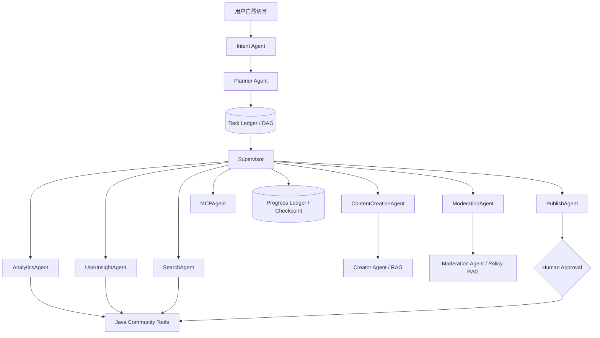

# Community Agent Orchestration Platform

## 设计目标

社区助手把模型的不确定性限制在“理解与规划”，把状态迁移、权限、审批、幂等、
超时和版本检查放在确定性代码中。它可以自主拆解任务，但不能绕过 Java 平台的用户
身份、资源范围和发布状态机。

## 运行结构



## 确定性边界

- Intent 和 Planner 由真实 LLM 生成结构化结果，再经 Pydantic 契约与 Agent Registry 校验。
- LangGraph 编译 DAG 并暴露 Mermaid 图；PostgreSQL 是生产状态的唯一事实源。
- 无依赖只读任务按 DAG frontier 并行；写入任务由副作用账本和幂等键保护。
- Run、Step、Artifact 引用、审批、Capability、事件、租约和 Runtime Identity 都可审计。
- 暂停会释放租约；恢复从完成步骤继续；旧执行者提交结果时必须仍持有当前租约。
- Creator 和 Moderation 长任务使用 `WAITING_DEPENDENCY` 释放 Worker，以轮询或事件信号恢复。
- 删除、立即发布等外部写入绑定 `run version + plan hash + exact input hash` 后人工确认。
- “删除全部帖子”中的“全部”固定解释为当前登录用户的全部未删除内容。系统必须先调用
  `community.list_own_posts` 枚举完整资源，再调用 `community.delete_own_posts_batch`；
  公开检索、上下文帖子和模型填写的 ID 均不能作为批量删除依据。

## 社区运营示例

“帮我运营一下 AI 专区，提高最近一周活跃度”应生成类似以下 DAG：

```text
AnalyzeTrend ─────┐
                  ├─> GenerateContent -> ModerationCheck -[PASS]-> Publish
AnalyzeUsers ─────┘
```

AnalyticsAgent 与 UserInsightAgent 可以并行。ContentCreationAgent 只能使用两者的真实
输出作为参考；ModerationAgent 读取 Java 中与 Creator SHA-256 绑定的草稿；PublishAgent
只有在审核 PASS 且用户确认后才能发布。

## MCP

MCP 是外接能力协议，不是浏览互联网的必要条件。社区内检索直接走 Java Tool；
只有需要外部研究、日历或其他系统时才配置 MCP Server。配置采用显式白名单：

```dotenv
ASSISTANT_MCP_SERVERS_JSON=[{"name":"research","url":"http://127.0.0.1:9000/mcp","allowed_tools":["search"]}]
```

未配置时不会连接任何 MCP Server。当前网关只把远程 MCP 工具注册为 READ 风险；
需要外部写入时必须扩展独立权限、审批和幂等契约，不能直接把通用 MCP 写工具暴露给模型。

## 评估

`evals/run_planner_eval.py` 使用真实模型分别执行 Intent 与 Planner，并计算：

- Intent Accuracy
- Task Coverage
- Planning Efficiency
- Tool Selection Accuracy
- Agent Selection Accuracy

运行结果评估还应结合恢复成功率、过期结果拒绝率、人工等待时间、端到端耗时和最终社区
指标。规划分数高并不等于运营目标已经提升。
# 四层记忆（2026-07-29）

社区助手的记忆不是一个无限增长的 Prompt，而是四个职责不同的层次：

1. **Working Memory**：`assistant_runs`、Step、Checkpoint、Task Ledger 与 Progress
   Ledger 保存当前任务的执行状态，支持租约恢复和拒绝过期 Worker 结果。
2. **Conversation Memory**：当前会话最近消息经过确定性字符预算裁剪后注入模型。
3. **Episodic Memory**：成功完成的非敏感任务会生成带来源 Run、工具、产物引用、
   重要度和过期时间的任务摘要。普通问答和包含密码、密钥、Token、证件号的请求不会
   自动沉淀。
4. **Semantic Memory**：PostgreSQL 中的语义文档是真相源，Qdrant
   `greenbook_assistant_memory` 只是可重建索引。召回按
   `tenant_id + user_id` 隔离，并融合向量相似度、关键词重合与时间衰减；Qdrant
   不可用时自动退回 PostgreSQL 关键词召回，不阻断主任务。

历史记忆作为不可信证据注入 Intent、Planner 和最终 Answer，不能扩大当前权限、不能
授权副作用，也不能证明历史动作已在当前任务执行。用户可关闭任务记忆或语义索引，
查看、逐条删除或清空历史任务记忆。默认保留期为 180 天。

语义向量默认使用本地确定性 feature hashing，适合低资源开发环境且不是 Mock；需要
模型级语义相似度时，配置 OpenAI-compatible `/embeddings` 服务。无论使用哪种向量
方式，PostgreSQL 始终是可审计、可删除的事实源。
