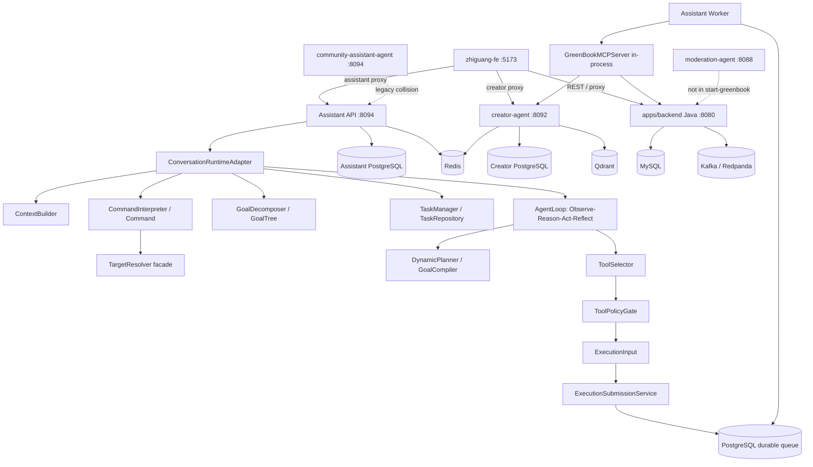

> **Historical migration document.** Retained for traceability; it does not define current architecture or active topology. See [current architecture](../architecture/CURRENT_ARCHITECTURE.md).

# GreenBook Phase 6 Pre-Audit

审计日期：2026-08-11（Asia/Shanghai）  
审计范围：`D:\agent\green-book` 当前工作区  
审计性质：只读盘点。此阶段没有移动、重命名、删除或重构源码。

本报告以当前文件、imports、启动脚本、测试收集、构建配置和数据库 migration 为准；历史 migration 文档只作为背景，不作为当前架构事实。工作区包含前几阶段尚未提交或已提交的混合变更，因此下文描述的是当前工作树，而不是某个 Git commit 的理想状态。

## 1. Executive Summary

GreenBook 当前不是单一应用，而是一个包含两代 Assistant、两份 Java Backend、两份 Creator、一个独立 Moderation 平台和一套新的 Agent Runtime 的 monorepo。新的 Assistant 主链路已经存在并且默认消息入口可达，但仓库仍有明显的 deployment owner、数据库、测试和文档分叉。

当前最重要的事实：

- 新 Agent Intelligence Layer 位于 `packages/assistant_core`，由 `Command → Context → Goal → Task → AgentLoop → Tool/Planner → ExecutionInput` 组成。
- 可靠执行资产位于 `assistant_core/execution`，包含 queue、worker、retry、checkpoint、ledger、lease、reconciliation、evidence 和 ToolRuntime，应保留。
- `apps/assistant_api` 是当前默认 Assistant HTTP 入口；`apps/assistant_worker` 是独立 worker，也可由 API 进程内启动。
- `scripts/start-greenbook.ps1` 启动的是 `apps/backend`、根目录 `creator-agent`、新的 Assistant API 和 `zhiguang-fe`；它不启动独立 MCP，也不启动 `moderation-agent`。
- `zhiguang-be` 仍被 Docker/CI 部分配置使用，和 `apps/backend` 不是同一份职责：前者保留 Moderation，后者包含 `/api/v1/agent` Agent Facade。Java Backend 目前存在 split-brain。
- 根目录 `creator-agent` 是启动脚本实际使用的 Creator；`apps/creator-agent` 是高度重复的第二份实现；`services/creator_agent` 基本是空骨架并仍被 workspace manifest 引用。
- `community-assistant-agent` 仍有旧 Intent/Memory/Graph/DB 体系，并被 CI、脚本和测试触达；它不是已排空的 archive，不能直接假装删除。
- 内容审核业务仍出现在 `moderation-agent`、`zhiguang-be`、前端 Admin Moderation、Java schema、脚本和配置中。它与 execution security 不同，应作为 Phase 6 的产品级删除候选，需先确认数据和调用方迁移。
- MCP 当前主要是 Python in-process package，不是 `start-greenbook` 单独拉起的服务；MCP registry、contracts、capability policy 仍有 metadata 漂移。
- 只读校验：`pytest --collect-only -q -p no:cacheprovider` 收集 665 项；`uv lock --check` 通过但提示旧式 `tool.uv.dev-dependencies`；`git diff --check` 无 whitespace error，但报告了大量 LF/CRLF 转换警告。

Phase 6 不应从局部删除开始，而应先确定唯一部署 owner、唯一数据库 owner 和唯一外部 API contract，然后再清理兼容层。

## 2. Current Monorepo Tree

以下树排除了 `.venv`、`.venv-v2`、`node_modules`、`target`、`dist`、`build`、`__pycache__`、`.git` 以及临时缓存；括号是本次审计标签。

```text
green-book/                                                        [REPO]
├── apps/                                                          [APP]
│   ├── assistant_api/                                             [APP][ACTIVE]
│   │   └── greenbook_assistant_api/                               [SERVICE]
│   ├── assistant_worker/                                           [APP][ACTIVE]
│   │   └── greenbook_assistant_worker/                             [SERVICE]
│   ├── backend/                                                   [APP][ACTIVE START TARGET]
│   │   ├── src/main/java/com/tongji/                               [SERVICE]
│   │   ├── src/main/resources/                                    [CONFIG]
│   │   ├── db/                                                    [DB]
│   │   └── pom.xml                                                [BUILD]
│   └── creator-agent/                                             [APP][DUPLICATE CANDIDATE]
│       └── app/                                                   [SERVICE]
├── packages/                                                       [PACKAGE]
│   ├── assistant_core/                                             [PACKAGE][CANONICAL INTELLIGENCE]
│   ├── contracts/                                                 [PACKAGE][CANONICAL CONTRACTS]
│   ├── creator_client/                                             [PACKAGE]
│   ├── evaluation/                                                [PACKAGE]
│   ├── java_client/                                                [PACKAGE]
│   ├── observability/                                              [PACKAGE]
│   └── security/                                                   [PACKAGE]
├── services/                                                       [SERVICE/PACKAGE]
│   ├── greenbook_mcp/                                              [SERVICE PACKAGE][IN-PROCESS ACTIVE]
│   └── creator_agent/                                              [PACKAGE STUB][DEAD CANDIDATE]
├── creator-agent/                                                  [APP][ACTIVE START TARGET]
│   └── app/                                                        [SERVICE]
├── moderation-agent/                                               [SERVICE][LEGACY BUSINESS][DELETE CANDIDATE]
│   ├── src/agents/                                                 [MODERATION]
│   ├── src/moderation/                                             [MODERATION]
│   ├── src/rag/                                                    [MODERATION]
│   ├── src/service/                                                [MODERATION API]
│   ├── migrations/                                                 [DB]
│   ├── tests/                                                      [TEST]
│   └── evals/                                                      [EVAL]
├── community-assistant-agent/                                     [APP][LEGACY/COMPATIBILITY]
│   ├── app/                                                        [OLD INTELLIGENCE]
│   ├── tests/                                                      [TEST]
│   ├── evals/                                                      [EVAL]
│   ├── migrations/                                                 [DB]
│   └── run_service.py / run_worker.py                             [ENTRY]
├── zhiguang-be/                                                    [APP][DUPLICATE JAVA][MODERATION VARIANT]
├── zhiguang-fe/                                                    [APP][ACTIVE FRONTEND]
├── contracts/                                                      [CONTRACT][OPENAPI]
│   ├── assistant-openapi.yaml
│   └── java-openapi.yaml
├── tests/                                                          [TEST][ROOT RUNTIME]
│   ├── compat/
│   ├── contract/
│   ├── e2e/
│   ├── evaluation/
│   ├── integration/
│   └── unit/
├── evaluation/                                                     [EVAL DATA]
├── infra/                                                          [INFRA]
│   ├── docker-compose.dev.yml
│   └── postgres/
├── scripts/                                                        [OPS/DEV]
├── docs/                                                           [DOC]
│   ├── architecture/
│   ├── migration/
│   ├── archive/
│   ├── progress/
│   └── reports/
├── archive/                                                        [ARCHIVE/REFERENCE]
│   ├── creator/
│   ├── legacy/
│   └── workflows/
├── design-system/                                                  [REFERENCE/DESIGN]
├── .github/                                                        [INFRA/CI]
├── .claude/ / .idea/ / .vscode/                                    [TOOLING]
├── docker-compose.yml                                              [INFRA]
├── pyproject.toml / uv.lock                                        [BUILD/PYTHON]
├── .env / .env.example                                              [CONFIG]
└── README.md / PROJECT_CONTEXT.md / MOVE_PLAN.md                   [DOC]
```

补充 hygiene 事实：根目录存在两个名称异常的 8192 字节 stray 文件（名称类似 `tash show --name-only ...` 和 `tore .dir`），以及多个临时目录/缓存。它们没有被生产 imports、启动脚本或测试引用，是高置信度的 Phase 6 删除候选，但本次没有删除。`archive/legacy/community-assistant-agent` 还包含 vendored `.venv`，不应进入 production package scan。

## 3. Active Services

### 3.1 服务清单

| Service | Path | Language / framework | Entry point | Port | Current status | Purpose | Data / dependencies |
|---|---|---|---|---:|---|---|---|
| Assistant API | `apps/assistant_api` | Python, FastAPI/Uvicorn | `greenbook_assistant_api.main:create_app` | 8094 | `[ACTIVE]` | 用户消息、对话、运行时查询/控制、SSE、审批入口 | PostgreSQL, Redis/config, Java, Creator, in-process MCP |
| Assistant Worker | `apps/assistant_worker` | Python | `greenbook_assistant_worker.main` | 无 HTTP 端口 | `[ACTIVE]` | 消费 durable execution queue，调用 ToolRuntime/MCP | PostgreSQL queue, Java, Creator, MCP |
| Java Backend | `apps/backend` | Java 21, Spring Boot/Maven | `ZhiguangApplication` | 8080 | `[ACTIVE START TARGET]` | 社区用户、帖子、草稿、发布、评论、分析等系统 | MySQL 33306, Redis 26379, Kafka/Redpanda 39092 |
| Creator service | 根目录 `creator-agent` | Python, FastAPI, LangGraph/SQLAlchemy | `run_service.py` / `app.main` | 8092 | `[ACTIVE START TARGET]` | 创作领域工作流、内容生成、研究、评估、HITL、artifact | PostgreSQL 25432, Redis, Qdrant 26333, Java |
| Frontend | `zhiguang-fe` | React 18, TypeScript, Vite | Vite dev entry | 5173 | `[ACTIVE]` | 社区、Assistant、Creator、Task、Admin 页面 | HTTP proxy to Java/Assistant/Creator |
| MCP package | `services/greenbook_mcp` | Python, Pydantic/FastAPI-compatible contracts | `GreenBookMCPServer` imported in API/worker | 无独立启动端口证据 | `[ACTIVE IN-PROCESS]` | 统一工具 schema、policy metadata、handler、Java/Creator client boundary | JavaClient, CreatorClient |
| Moderation Agent | `moderation-agent` | Python, FastAPI/LangGraph/Alembic | `src/run_service.py` | 8088 | `[LEGACY BUSINESS][DELETE CANDIDATE]` | 独立内容审核平台 | PostgreSQL `content_moderation`, Redis, Qdrant, Java callback |
| Community Assistant old | `community-assistant-agent` | Python, FastAPI/SQLAlchemy/LangGraph | `run_service.py`, `run_worker.py` | 8094 | `[LEGACY/COMPATIBILITY]` | 旧 Assistant 的 Intent、Graph、Memory、DB runtime | PostgreSQL/Redis/old DB queue |
| Creator duplicate | `apps/creator-agent` | Python, FastAPI/LangGraph | app entry | 8092 candidate | `[DUPLICATE OWNER]` | 与根 `creator-agent` 高度重复 | 同 Creator 配置 |
| Java duplicate | `zhiguang-be` | Java 21, Spring Boot/Maven | Spring Boot entry | 8080 candidate | `[DUPLICATE OWNER]` | 与 `apps/backend` 大部分相同，但保留 Moderation | MySQL/Redis/Kafka |

### 3.2 独立启动能力

- 可以独立启动：`apps/backend`、根 `creator-agent`、`apps/assistant_api`、`apps/assistant_worker`、`zhiguang-fe`、`moderation-agent`、旧 `community-assistant-agent`。
- `services/greenbook_mcp` 当前没有被 `start-greenbook.ps1` 作为独立进程启动；代码通过 API/Worker in-process 使用。其 package 描述了 Streamable HTTP 方向，但当前启动拓扑没有对应独立 server owner。
- Assistant Worker 可以由 API 进程内启动，也可由 `start-assistant-worker.ps1` 独立启动；这是一种运行模式，不是第二套业务语义链路。

## 4. Runtime Topology

### 4.1 默认启动脚本事实

`scripts/start-greenbook.ps1` 的顺序是：

1. `scripts/start-be.ps1` → **`apps/backend`** → 8080。
2. `scripts/start-creator.ps1` → **根 `creator-agent`** → 8092。
3. `scripts/start-assistant.ps1` → **`apps/assistant_api`** → 8094；可按配置在 API 内启动 worker。
4. `scripts/start-fe.ps1` → **`zhiguang-fe`** → 5173。

它不会启动 `moderation-agent`，也不会启动 standalone MCP。`start-moderation.ps1` 是另一路径。

### 4.2 当前拓扑



### 4.3 真实主链路与目标描述的差异

代码验证的默认 Assistant 消息路径是：

```text
POST /api/v1/assistant/conversations/{conversation_id}/messages
  -> _send_runtime_message
  -> ConversationRuntimeAdapter.execute
  -> ContextBuilder
  -> CommandInterpreter(message + context)
  -> control handling / TargetResolver where needed
  -> GoalDecomposer(command + context)
  -> TaskManager binding
  -> AgentLoop
       Observe -> Reason -> Act -> Reflect
       DynamicPlanner / ToolSelector / ToolPolicyGate
  -> GoalCompiler / ExecutablePlan
  -> ExecutionInput
  -> RuntimeAgentService.submit_plan
  -> ExecutionSubmissionService / PostgreSQL queue
  -> ExecutionQueueWorker / ExecutionWorker
  -> GreenBookMCPServer
  -> Java Backend or Creator service
```

差异和风险：

- `TargetResolver` 不是一个独立 HTTP 层步骤，而是在 command/context/goal runtime 内被调用的 facade。
- `RuntimeAgentService` 已经是 queue submission/execution boundary，但 `execute()` 直接调用和 `_execute_single` 仍保留 compatibility/fallback 分支。
- API 还维护 `run_id ↔ execution_id` 的历史 response projection；Execution API 是新事实源，run projection 仍是兼容面。
- `orchestration.models` 里的 `PlanStep`、`TaskPlan` 仍被 GoalCompiler、Planner、Execution 使用；`orchestration` 不能在 Phase 6 第一批直接整目录删除。
- MCP 不是当前拓扑里的独立网络节点，而是 API/Worker 可导入的 Python runtime boundary。

## 5. Agent Runtime

### 5.1 当前目录与职责

```text
packages/assistant_core/greenbook_assistant_core/
├── agent/              [CANONICAL] actions.py, loop.py, recovery.py, selector.py, state.py
├── command/            [CANONICAL] correction.py, interpreter.py, models.py, target.py
├── context/            [CANONICAL] builder.py, manager.py, models.py, projection.py
├── conversation/       [ACTIVE PERSISTENCE] context_manager.py, control.py, preferences.py
├── goal/               [CANONICAL] compiler.py, decomposer.py, models.py
├── task/               [CANONICAL + LEGACY CONTRACTS]
│   ├── manager.py, repository.py, registry.py, models.py
│   ├── graph_models.py
│   ├── intent_models.py, intent_preprocessor.py
│   ├── intent_validator.py, intent_llm_trace.py, intent_validation_trace.py
│   └── [TaskIntent / IntentSpec remain in compatibility surface]
├── planning/           [CANONICAL STRATEGY] dynamic.py, models.py, validation.py
├── orchestration/      [MIXED COMPATIBILITY + PLAN CONTRACTS]
│   ├── models.py, context.py, orchestrator.py, templates.py
│   └── templates are fallback, not safe primary planner
├── toolruntime/        [CANONICAL TOOL POLICY FACADE] metadata.py, policy.py, registry.py
├── capability/         [SEMANTIC CATALOG, POLICY DRIFT]
├── execution/          [RELIABLE EXECUTION; KEEP]
├── artifact/           [DURABLE ARTIFACT; KEEP]
├── human/              [APPROVAL/HITL; KEEP]
├── memory/             [DURABLE MEMORY]
├── observability/      [TRACE/METRICS]
├── db/                 [ASSISTANT DB REPOSITORIES/MIGRATIONS]
├── compatibility/history/ [RUN/EXECUTION HISTORY BRIDGE]
├── runtime/            [COMPOSITION ROOT]
├── prompts/            [PROMPT CONTRACTS]
├── skills/             [EMPTY/LOW-VALUE PACKAGE CANDIDATE]
├── agent_memory/       [EMPTY ORPHAN DIRECTORY; no current caller found]
└── resource/           [EMPTY ORPHAN DIRECTORY; no current caller found]
```

### 5.2 主要依赖关系

```text
apps/assistant_api
  -> ConversationRuntimeAdapter
  -> assistant_core.command / context / goal / task / agent
  -> assistant_core.execution / toolruntime
  -> services.greenbook_mcp

goal/compiler.py -> orchestration.models + task.graph_models
planning/models.py -> orchestration.models
planning/validation.py -> orchestration.models + capability/tool metadata
execution/worker.py -> orchestration.models
orchestration/orchestrator.py -> GoalCompiler + TaskIntent/IntentSpec + templates
conversation/context_manager.py -> db repositories + session context
context/manager.py -> conversation.ContextManager
```

因此，新的目录名称已经比 Phase 1 清晰，但依赖方向还未完全收敛。最明显的重复是：

1. `context.ContextManager` 包装 `conversation.context_manager.ContextManager`，同名 Manager 有两个 owner。
2. `orchestration.models` 仍是计划/图的共享 contract，同时 `orchestration.orchestrator/context/templates` 继续携带旧语义。
3. `task` 中 canonical TaskManager 与 TaskIntent/IntentSpec models 共存。
4. `capability.models.Capability` 仍拥有 `risk_level`、`requires_approval`、`side_effect` 等应由 ToolMetadata 管理的 policy 字段。
5. `toolruntime`、MCP registry、`packages/contracts` 都有 Tool metadata 投影。

### 5.3 Canonical 判定

| Module | Status | Evidence | Phase 6 direction |
|---|---|---|---|
| `agent/` | `[ACTIVE/CANONICAL]` | API 默认路径实例化 AgentLoop | KEEP |
| `command/` | `[ACTIVE/CANONICAL]` | CommandInterpreter、TargetResolver、Correction 被 adapter 使用 | KEEP |
| `context/` | `[ACTIVE/CANONICAL]` | ContextBuilder 构建 bounded ContextSnapshot | KEEP；收敛 Conversation Manager |
| `goal/` | `[ACTIVE/CANONICAL]` | GoalDecomposer/Compiler 为新消息路径提供 GoalTree/Plan | KEEP；抽离共享 graph contracts |
| `task/manager.py` / `repository.py` | `[ACTIVE/CANONICAL]` | Task lifecycle / persistence | KEEP |
| `planning/` | `[ACTIVE/CANONICAL]` | DynamicPlanner typed decision | KEEP |
| `execution/` | `[ACTIVE/RELIABLE ASSET]` | queue/worker/retry/checkpoint/ledger | 不改底座；只换输入 contract |
| `artifact/`, `human/`, `observability/`, `memory/`, `db/` | `[ACTIVE]` | runtime/context/tests 使用 | KEEP；明确边界 |
| `orchestration/orchestrator.py` | `[COMPATIBILITY]` | RuntimeAgentService fallback、测试、旧 planner context 仍引用 | 迁移 caller 后删除 |
| `orchestration/templates.py` | `[COMPATIBILITY]` | TaskOrchestrator fallback 使用 | 删除业务 Workflow template，保留必要 recipe 或删除 |
| `task/intent_*`, `TaskIntent`, `IntentSpec` | `[COMPATIBILITY]` | 27/14 个文件仍有引用，含 direct service tests/eval | 先迁移再删 |
| `capability/` | `[ACTIVE + DRIFT]` | Tool candidate semantic mapping | 保留 semantic index，删除 policy duplication |
| `compatibility/history/` | `[ACTIVE COMPATIBILITY]` | API run/execution linkage tests | 运行 ID retirement 后删 |
| `agent_memory/`, `resource/` | `[DEAD CANDIDATE]` | 当前无文件/无 caller | Phase 6 清空目录时删除 |

## 6. Creator

### 6.1 当前实现

实际启动的根目录 `creator-agent` 包含：

```text
creator-agent/app/
├── main.py, api/, core/
└── creator/
    ├── agents/          specialists.py 等
    ├── runtime/         supervisor.py, graph.py
    ├── application/     harness.py
    ├── domain/          task/run/artifact contracts
    ├── drafts/          draft lifecycle
    ├── publication/     handoff/publication
    ├── memory/          Redis/SQL/Qdrant memory
    ├── persistence/     PostgreSQL/SQLAlchemy/Alembic
    ├── providers/       LLM/providers
    ├── retrieval/       research/retrieval
    ├── tools/           creator tools
    ├── worker/          background handling
    ├── evaluation/      creator evaluation
    └── studio/          UI/static integration
```

主要 HTTP API 包含 health/status/workspace/projects/materials/tasks/cancel/retry/decisions/artifacts/drafts/publication handoffs/suggestions/branches/channel variants/ratings/feedback/event stream 等。

### 6.2 Agent 还是 Workflow Service

结论：Creator 更准确地是 **内容创作领域 Workflow/Service，内部带一个真实的 specialist runtime**，不是 GreenBook 用户级主 Agent。

- `CreatorSupervisorAgent` 有独立状态、预算、失败恢复、重新规划和 HITL 决策，是真正的 control-plane reasoning boundary。
- `LangGraph StateGraph` 有 `supervise → execute_agent → await_human → finalize/fail` 节点，并支持 checkpoint/interrupt/resume。
- `MemoryAgent`、`ContentAnalyzerAgent`、`ResearchAgent`、`StrategyAgent`、`WriterAgent`、`CriticAgent`、`EvaluationAgent` 各自更接近 capability-specific specialist/prompt-model wrapper；它们没有必要都作为跨域独立 Agent 对外暴露。
- Creator 自己拥有 memory、retry、HITL、checkpoint、artifact 和 evaluation，但这些服务于内容创作域的内部生命周期，不应重新成为 GreenBook 的用户 Command/Task/Tool 路由器。

### 6.3 与 GreenBook 的边界建议

```text
GreenBook Agent Runtime
  owns: Command, Target, Goal, Task, user context, tool policy, execution submission
       ↓ explicit tool contract / prepared creator input
Creator Service
  owns: content research/generation/revision workflow, creator artifacts,
        specialist selection, creator-domain retries/HITL/evaluation
       ↓ artifact/result/handoff
GreenBook Reliable Execution / Artifact projection
```

保留 Creator 的领域 workflow 与 specialist，但避免 Creator 再实现第二个跨领域用户 AgentLoop、第二个 TaskManager 或直接访问 GreenBook Memory DB。根 `creator-agent` 与 `apps/creator-agent` 的重复实现必须先选 deployment owner，再删除另一份。

## 7. Java Backend

### 7.1 两份 Backend 的真实差异

`apps/backend` 和 `zhiguang-be` 的 `pom.xml` 相同，核心 `com/tongji` Java 源码大部分相同，但不是同一个可安全互换的目录：

- `apps/backend`：由 `scripts/start-be.ps1` 启动；包含 `com/tongji/agentfacade/*`、Agent idempotency、scheduled publication DTO/mapper/service、V1/V2/V3 Agent migrations/tests。
- `zhiguang-be`：被 GitHub workflow 和 root Docker compose 的 schema mount 使用；包含完整 `com/tongji/moderation/*`、Moderation controllers/services/tests、Docker/README。
- `apps/backend` 缺少 `zhiguang-be` 的 Moderation Java source；`zhiguang-be` 缺少 `apps/backend` 的 Agent Facade source。

这不是简单的旧目录问题，而是生产路径、CI、DB schema 可能构建不同产品的风险。

### 7.2 模块与 Agent 实际调用 API

Java 主要业务模块包括 Auth/JWKS/Admin、KnowPost、KnowPostAi、Comment、Counter、Action、Relation、Profile、Notification、Storage、Assistant Tool、Agent Facade。新的 Python Java client 以 `contracts/java-openapi.yaml` 为 source contract，实际调用 `/api/v1/agent/...`：

| API | Controller | Purpose | Side effect / idempotency | MCP/tool caller |
|---|---|---|---|---|
| `GET /api/v1/agent/posts/search` | `AgentFacadeController` | 搜索公开帖子 | Read | `community.search_public_posts` |
| `GET /api/v1/agent/posts/{postId}` | `AgentFacadeController` | 帖子详情 | Read | `community.get_post` |
| `GET /api/v1/agent/me/posts` | `AgentFacadeController` | 当前用户帖子 | Read | `community.list_own_posts` |
| `POST /api/v1/agent/drafts` | `AgentFacadeController` | 创建 draft | Write; idempotency | `content.create_draft` |
| `GET /api/v1/agent/drafts/{draftId}` | `AgentFacadeController` | 获取 draft | Read | `content.get_draft` |
| `GET /api/v1/agent/me/drafts` | `AgentFacadeController` | 列出 drafts | Read | `content.list_drafts` |
| `PUT /api/v1/agent/drafts/{draftId}` | `AgentFacadeController` | 修改 draft | Write; version/idempotency contract | `content.revise_draft` |
| `POST /api/v1/agent/publications/schedules` | `AgentFacadeController` | 创建发布计划 | Write; `Idempotency-Key` | `publication.schedule` |
| `GET/PUT/DELETE /api/v1/agent/publications/schedules/{id}` | `AgentFacadeController` | 查询/改/取消计划 | Write operations idempotent | schedule tools |
| `POST /api/v1/agent/publications/publish-now` | `AgentFacadeController` | 立即发布 | High-risk side effect; approval required upstream | `publication.publish_now` |
| `GET /api/v1/agent/posts/{postId}/comments` | `AgentFacadeController` | 评论列表 | Read | `interaction.list_comments` |
| `POST /api/v1/agent/comments/{commentId}/replies` | `AgentFacadeController` | 回复评论 | Side effect; approval | `interaction.send_reply` |
| `GET /api/v1/agent/posts/{postId}/analytics` | `AgentFacadeController` | 帖子分析 | Read | `analytics.get_post_performance` |
| `GET /api/v1/agent/me/analytics/summary` | `AgentFacadeController` | 账号汇总 | Read | `analytics.get_account_summary` |

`apps/backend` 还存在 `/api/v1/assistant-tools` 的另一套工具 endpoint surface，包括 capability、帖子、analytics、draft、publish、删除、评论等。它与 `/api/v1/agent` 不是完全重复但边界重叠，Phase 6 应选择一个 canonical external contract，另一套只保留明确兼容期。

### 7.3 Java 删除候选

- `zhiguang-be` 或 `apps/backend` 中未被最终启动、CI、OpenAPI、client 选择的那一份：高风险迁移候选，不可仅凭目录相似直接删。
- `/api/v1/agent` 与 `/api/v1/assistant-tools` 的重复 endpoint：需要 contract 级合并。
- `zhiguang-be` 的 Moderation controllers/services/tests：产品确认删除审核业务后候选删除。
- `moderation_task_id`、`moderation_reason` 等 `know_posts` 字段：需要数据迁移和历史保留决定后再处理。

## 8. Frontend

### 8.1 当前结构

`zhiguang-fe` 是 React 18/TypeScript/Vite 5。Vite 端口 5173，proxy 指向：

- `/api` → Java 8080。
- `/creator-agent` → Creator 8092。
- `/assistant-agent` → Assistant API 8094。

主要页面/模块：

```text
src/
├── components/assistant/AssistantPanel.tsx, AssistantMarkdown
├── pages/Home, CreateHub, ManualCreate, AiCreate, TaskCenter, Profile
├── pages/AdminModerationPage.tsx
├── services/assistantService.ts
├── services/executionService.ts
├── services/creatorTaskService.ts
├── services/moderationService.ts
├── services/Java community clients
├── types/assistant.ts, execution.ts, moderation.ts
└── App.tsx / routing / auth / notifications
```

### 8.2 当前概念与旧概念

- `AssistantPanel` 仍显示“调用创作 Agent”“Creator Agent”，并读取 conversations/messages/memories/episodes/runs/executions。
- `TaskCenterPage` 合并 Assistant execution、Creator task、scheduled/publication task，并显示“助手 Agent”“创作 Agent”。
- `CreateHubPage`、`ManualCreatePage`、`TaskCenterPage` 仍出现审核 Agent/reviewing 相关文本或状态。
- `AdminModerationPage`、`moderationService.ts`、`types/moderation.ts`、管理员路由仍是 active moderation UI。
- `executionService.ts` 是新 durable execution UI，但服务名仍沿用 Assistant 语义。

结论：前端还没有统一成 “GreenBook Agent” 的产品概念；应先稳定 API contract，再进行文案/命名迁移。Moderation UI 是否删除取决于产品确认，不能把普通 `risk`/`approval` UI 与它混为一谈。

## 9. MCP

### 9.1 Tool 清单

当前 `services/greenbook_mcp/greenbook_mcp_server/tool_registry.py` 注册的主要工具如下。`Read/Write` 是对外部系统副作用分类，当前 caller 主要是 Assistant AgentLoop/Worker。

| Tool | Capability | Handler area | External service | R/W | Side effect | Approval | Current status |
|---|---|---|---|---|---|---|---|
| `community.search_public_posts` | SEARCH_COMMUNITY | community | Java | Read | No | No | Used |
| `community.get_post` | GET_POST_DETAIL | community | Java | Read | No | No | Used |
| `community.list_own_posts` | LIST_OWN_POSTS | community | Java | Read | No | No | Used |
| `content.create_draft` | GENERATE_CONTENT | content | Creator/Java | Write | Yes | Policy-dependent | Used |
| `content.get_draft` | GET_DRAFT | content | Java | Read | No | No | Used |
| `content.list_drafts` | LIST_DRAFTS | content | Java | Read | No | No | Used |
| `content.revise_draft` | IMPROVE_CONTENT | content | Creator/Java | Write | Yes | Policy-dependent | Used |
| `publication.schedule` | SCHEDULE_PUBLISH | publication | Java | Write | Yes | Policy-dependent | Used |
| `publication.get_status` | GET_SCHEDULE_STATUS | publication | Java | Read | No | No | Used |
| `publication.update_schedule` | MANAGE_SCHEDULE | publication | Java | Write | Yes | Policy-dependent | Used |
| `publication.cancel_schedule` | CANCEL_SCHEDULE | publication | Java | Write | Yes | Policy-dependent | Used |
| `publication.publish_now` | PUBLISH_NOW | publication | Java | Write | Yes/high risk | Yes | Used/careful |
| `interaction.list_comments` | LIST_COMMENTS | interaction | Java | Read | No | No | Used |
| `interaction.send_reply` | REPLY_USER | interaction | Java | Write | Yes | Yes | Used/careful |
| `analytics.get_post_performance` | ANALYZE_PERFORMANCE | analytics | Java | Read | No | No | Used |
| `analytics.get_account_summary` | ANALYZE_PERFORMANCE | analytics | Java | Read | No | No | Used |

没有在 active MCP registry 中发现 moderation tool。`services/greenbook_mcp/workflows/create_draft.py` 与 `revise_draft.py` 没有被 apps/packages/services/tests 的 imports 触达，属于强 DEAD candidate；`archive/workflows` 是重复 archive。

### 9.2 Contract / metadata 问题

- `packages/contracts/greenbook_contracts/tool_contract.py` 是 Python ToolMetadata/ToolRegistry/ToolContract 的主要 typed contract。
- MCP `ToolDefinition` 仍维护 category/capability/handler/policy，并有 `argument_model` 兼容入口。
- `assistant_core/toolruntime` 再包装 metadata/policy/registry。
- `capability.models.Capability` 还维护 risk/approval/side-effect；`planning/validation.py` 在 metadata 不完整时会 fallback 到 Capability policy。
- Tool contract 还保留 `argument_model`、`input_model`、`output_model`、`risk`、`risk_level` 等兼容属性。
- `ANALYZE_PERFORMANCE`、`MANAGE_SCHEDULE` 各对应多个工具；验证层存在按候选名选第一个的歧义风险，虽未发现新的字面 `cap.tools[0]`。

结论：MCP 能力已可用，但 ToolMetadata 还没有成为绝对唯一 policy source；Phase 6 应先做 metadata contract consolidation，再做工具删除。

## 10. Service Communication

| From → To | Protocol / client | Contract | Auth | Timeout / retry | Idempotency / failure handling | Audit finding |
|---|---|---|---|---|---|---|
| Frontend → Java | HTTP through Vite `/api` proxy | Java OpenAPI/client models | JWT/session | Client/API configuration | Java side-effect endpoints use idempotency/version checks | Active; `/agent` and `/assistant-tools` overlap |
| Frontend → Assistant API | HTTP/SSE through `/assistant-agent` proxy | Assistant API route models + run/execution projections | JWT/shared service auth | Runtime route config | Execution IDs and SSE; legacy run projection remains | Active but route/client names still Assistant/legacy |
| Frontend → Creator | HTTP through `/creator-agent` | Creator API schemas | Creator shared auth/JWT | Creator service settings | Creator task retry/cancel/HITL | Active, direct Creator UI boundary broad |
| Assistant API → PostgreSQL | SQLAlchemy/assistant repositories | `assistant_*` tables/migrations | DB URL | DB pool | Task/execution/artifact/memory persistence | Active source of truth; schema families need inventory |
| Assistant API/Worker → Redis | Redis clients/config | queue/cache/runtime locks depending component | password/config | client settings | PostgreSQL remains durable source where specified | Usage/DB numbering needs one config table |
| Assistant API → Java | `packages/java_client` HTTP | `contracts/java-openapi.yaml` | Authorization + service auth | connect/read/write/pool timeouts | Idempotency-Key for writes; ToolResult error classification | Active and typed, but endpoint surfaces overlap |
| Assistant API → Creator | `packages/creator_client` HTTP | Creator client/domain models | JWT/shared secret | configured read/write timeout | result/unknown delivery handling | Active; Creator duplicate owner unresolved |
| Agent/Worker → MCP | In-process Python call | `ToolContract`/Pydantic schemas | injected identity/session | Tool policy timeout/retry | ToolRuntime ledger/idempotency | Active; no standalone MCP network boundary |
| Worker → Queue | PostgreSQL durable queue/worker | ExecutionInput | worker access token/DB auth | lease/retry/checkpoint | queue-native for long/side-effect work | Active; reliable asset |
| MCP → Java | JavaClient | Java OpenAPI | propagated identity | client timeouts/retry | Java idempotency | Active |
| MCP → Creator | CreatorClient | Creator API contract | propagated identity | client timeouts/retry | Creator task/idempotency | Active |
| Moderation Agent → Java | HTTP callback/context APIs | moderation-specific schemas | moderation secret | service config | moderation callback/outbox | Legacy business path, not default start |
| CI/scripts → services | PowerShell/Maven/npm/Python subprocess | implicit paths/env | local secrets | script waits/health checks | process-level only | CI/scripts disagree on Java/Creator/Assistant owners |

需要统一的边界：

1. `apps/backend` 与 `zhiguang-be` 的 server owner 和 DB schema source。
2. `/api/v1/agent` 与 `/api/v1/assistant-tools` 的 canonical API。
3. Creator 根目录与 apps 目录的 owner。
4. MCP 是否永远 in-process，或是否需要真正独立 server；不能由 package 文档和启动脚本分别暗示两种模型。
5. CI、Docker、PowerShell 的服务启动矩阵。

## 11. Naming Problems

| Current name | Actual responsibility | Assessment | Proposed Phase 6 direction |
|---|---|---|---|
| `assistant_core` | GreenBook Agent Intelligence + reliable execution core | “Assistant” under-describes Agent Runtime | Risky rename; package/API compatibility first |
| `assistant_api` | User-facing GreenBook Agent Runtime API | Still understandable but product name stale | Prefer `agent_api` or `greenbook_agent_api` after API migration |
| `assistant_worker` | Durable execution worker | Accurate operationally, not intelligence | Could remain `agent_worker` only with deployment plan |
| `community-assistant-agent` | Previous full Assistant framework | Legacy business runtime, not current Agent | Retire after callers/data migration |
| `creator-agent` | Creator domain workflow service | “Agent” is partly true internally, but service boundary is workflow | Prefer `creator-service` externally; keep internal specialists |
| `agentfacade` | Java external tools for Agent | Facade and assistant-tools overlap | Select one `agent-tools` boundary |
| `greenbook_mcp` | In-process tool registry/runtime | “MCP server” overstates standalone status | Call package `tool_runtime` unless standalone MCP is real |
| `TaskIntent` / `IntentSpec` | Resolved execution/old semantic data | Misleading historical names | Replace with Goal/TaskPlan/ExecutionInput |
| `orchestration` | Mixed plan contracts, old orchestrator, fallback templates | Too broad and overloaded | Split contracts into goal/planning; delete wrapper later |
| `ContextManager` in two packages | Conversation persistence vs context projection | Ambiguous owner | Use `ConversationRepository/Store` and `ContextBuilder/Runtime` |
| `moderation-agent` | Business content moderation platform | Accurate but product-retired per request | Remove as feature after explicit signoff |
| `zhiguang-be` / `apps/backend` | Same Java product, divergent features | Largest naming/deployment problem | Choose one `community-backend` owner |

最大命名问题不是 `assistant` 单词本身，而是同名目录同时代表不同 generation、不同数据库 owner 和不同启动脚本。

## 12. Directory Problems

### 12.1 需要保持独立的目录

- `agent/`, `command/`, `goal/`, `task/`, `planning/`：各自有不同 typed responsibility，应保持清楚的依赖方向。
- `execution/`, `artifact/`, `human/`, `observability/`, `db/`：可靠执行、artifact、HITL、trace、持久化边界不同，不为目录好看而合并。
- `creator-agent`：作为独立领域服务保留一个 owner。
- `contracts/`/`packages/contracts`：可以保留一个 source-of-truth 体系，但需要明确 OpenAPI 与 Python contract 的生成/校验关系。

### 12.2 应合并或移动的候选

| Current locations | Problem | Recommended action |
|---|---|---|
| `orchestration/models.py`, `task/graph_models.py`, `planning/models.py` | graph/plan contracts 跨三处 | 先选一个 canonical contract package，保留兼容 re-export，随后删旧 import |
| `orchestration/context.py`, `TaskIntent`/`IntentSpec` | planner input 仍包含用户理解语义 | 移到 Goal/TaskPlan typed projection，最终删除旧 context |
| `context/manager.py`, `conversation/context_manager.py` | 两个 ContextManager | 明确 Conversation persistence 与 decision snapshot 两层，改名而非继续套 wrapper |
| root `creator-agent`, `apps/creator-agent` | 高度重复 | 选择 owner，另一份迁移后删除 |
| `apps/backend`, `zhiguang-be` | Java owner 分裂 | 选择 owner，另一份归档/迁移后删除 |
| top-level `contracts/*.yaml`, `packages/contracts` | schema source 可能漂移 | 建立 OpenAPI ↔ typed contract 单向生成/校验关系 |
| `infra/docker-compose.dev.yml`, root `docker-compose.yml` | 基础设施定义重复 | 合并为一个 canonical compose profile |
| active `services/greenbook_mcp/workflows`, `archive/workflows` | workflow duplicate且无 caller | 删除 active dead code；archive按 archive policy清理 |

### 12.3 不应立即合并

- `Creator` 内部 runtime 与 GreenBook AgentLoop：两者服务边界不同，先收敛 contract，不做大规模重写。
- `moderation` 与 `security/tool policy`：前者是产品业务，后者是执行安全，不能因为都出现 `risk/policy` 就合并。
- `conversation` 与 `context`：事实存储和工作集 projection 可以协作，但不应合成一个含糊的 ContextManager。

## 13. Moderation Agent Remnants

用户已明确 GreenBook 当前业务不再包含内容审核 Agent。当前代码事实是：审核业务仍是一个完整横切面，尚未删除。

### 13.1 业务审核 Agent/platform

| Area | Files / classes / paths | Classification |
|---|---|---|
| 独立服务 | `moderation-agent/src/agents/moderation/*` | `[DELETE CANDIDATE]` |
| 审核 graph/policy | `moderation-agent/src/agents/moderation/graph.py`, adversarial/evidence reviewer/policy engine/grader/tool agent/workflow/prompts/state | `[DELETE CANDIDATE]` |
| 审核 RAG | `moderation-agent/src/rag/policy/*`, `src/rag/cases/*` | `[DELETE CANDIDATE]` |
| 审核 API | `moderation-agent/src/service/routes/moderation.py`, `service.py` | `[DELETE CANDIDATE]` |
| 审核 DB/domain | `moderation-agent/src/moderation/*`, migrations 0001-0009 | `[DELETE CANDIDATE]` |
| 审核 Java | `zhiguang-be/src/main/java/com/tongji/moderation/*`；Admin/Result/Community moderation controllers | `[DELETE CANDIDATE]` |
| Java moderation config | `zhiguang-be/application.yml` moderation-agent base URL/auth/timeout | `[DELETE CANDIDATE]` |
| 启动/环境 | `scripts/start-moderation.ps1`, `MODERATION_*`, `MODERATION_AGENT_*` | `[DELETE CANDIDATE]` after owner decision |
| Docker/DB | `content_moderation` database in `docker-compose.yml` and `infra/postgres/01-create-databases.sql` | `[MIGRATE/DROP CANDIDATE]` |
| Frontend UI | `AdminModerationPage.tsx`, CSS, `moderationService.ts`, `types/moderation.ts`, admin route | `[DELETE CANDIDATE]` |
| Frontend review state | `ManualCreatePage`, `TaskCenterPage`, `KnowPost.moderationTaskId`, `reviewing` polling | `[DELETE/MIGRATE CANDIDATE]` |
| Java schema fields | `know_posts.moderation_task_id`, `moderation_reason` in both schema/migration families | `[MIGRATE/DROP CANDIDATE]` |
| Tests/evals | moderation-agent tests/evals, `zhiguang-be` moderation tests, moderation E2E/smoke paths | `[DELETE CANDIDATE]` |

### 13.2 不得误删的执行安全

以下不是内容审核 Agent，应保留并单独审计：

- `ToolPolicyGate`、permission、approval、side_effect、risk/timeout/retry policy。
- `human/approval_request.py` 与 approval runtime。
- `security/` identity/authentication/authorization。
- `execution` 的 idempotency、ledger、checkpoint、lease、reconciliation。

### 13.3 删除前阻塞

审核代码当前仍有真实 caller：启动脚本、CI、Docker database initialization、前端 admin route、`zhiguang-be` controllers/tests、Java schema 字段。它不能在本次预审计中直接删除。Phase 6 第一动作应是产品确认、数据导出/保留策略和 callback/API 迁移计划。

## 14. Legacy / Compatibility

### 14.1 重点模块分类

| Path / symbol | Current callers | Production reachable? | Status | Replacement / action |
|---|---|---|---|---|
| `RuntimeAgentService.submit_plan` / `execute_queued` | Assistant API/Worker | Yes | `[ACTIVE EXECUTION]` | Keep as submission/queue boundary |
| `RuntimeAgentService.execute()` | `tests/e2e/test_phase13_runtime_verification.py`, `test_runtime_long_task_experience.py`, `tests/unit/test_execution_queue_runtime.py`, `test_runtime_agent_service.py` and evaluation/direct callers | Yes through direct service API/tests; not canonical message entry | `[COMPATIBILITY]` | Migrate direct callers to submit/queue, then remove legacy branch |
| `TaskIntent` | 27 files across core/orchestration/evaluation/tests | Yes in fallback/direct projections | `[COMPATIBILITY]` | ExecutionInput/TaskPlan; not user semantic source |
| `IntentSpec` | 14 files across task/orchestration/evaluation/tests | Yes in fallback/planner context | `[COMPATIBILITY]` | Command/Goal/TaskPlan; migrate then delete |
| `task/intent_models.py` and `intent_*` trace/preprocessor/validator | Task and legacy eval/tests | Test/fallback reachable | `[COMPATIBILITY]` | New Command/Goal evaluation and typed plan contracts |
| `orchestration/orchestrator.py` | runtime fallback, active tests, evaluation/planning context | Yes in compatibility path | `[COMPATIBILITY]` | GoalCompiler + DynamicPlanner; delete wrapper after caller drain |
| `orchestration/templates.py` | TaskOrchestrator fallback/tests | Yes in fallback | `[COMPATIBILITY]` | Keep only deterministic recovery recipe, otherwise delete |
| `orchestration/context.py` | planner/evaluator/legacy inputs | Partial | `[COMPATIBILITY]` | typed Goal/TaskPlan context |
| `TaskGraphBuilder` | no current hits in apps/packages/services/tests | No | `[DEAD/ALREADY ABSENT]` | No Phase 6 action except docs/tests cleanup |
| `_skip_multi` | no current hits | No | `[DEAD/ALREADY ABSENT]` | No action |
| old `agent.py`, old resolver/decomposer/intent compat files | no current current file/caller | No | `[REMOVED IN PRIOR PHASES]` | Do not restore |
| `compatibility/history/*` | API run/execution links and compat tests | Yes | `[ACTIVE COMPATIBILITY]` | Retain until run API retirement |
| `services/creator_agent` | workspace manifest/lock, no active imports | No runtime caller found | `[DEAD CANDIDATE]` | Remove workspace/lock entry after deployment verification |
| `greenbook_mcp/workflows/*` | no imports found | No | `[DEAD CANDIDATE]` | Delete after confirming no external dynamic import |
| `agent_memory/`, `resource/` dirs | no files/callers | No | `[DEAD CANDIDATE]` | Remove empty directories |

### 14.2 Old Community Assistant

`community-assistant-agent` is not merely a dead module. It has its own `CommunityIntent`, `IntentDelta`, `ChangeCompiler`, `TurnPlan`, query/target resolver, skill/agent registries, memory and database schema. It is not imported by the canonical new runtime, but it remains reachable through `.github/workflows/verify.yml`, `scripts/verify-all.ps1`, `scripts/smoke-test.ps1`, `scripts/runtime-report.ps1`, `scripts/run_p0_e2e.py`, `scripts/setup-dev.ps1`, its own tests and docs. Its default port is also 8094, colliding with the new Assistant API. It is a high-confidence retirement candidate only after script/CI/data/API ownership migration.

## 15. Dead Code Candidates

下表是 Phase 6 候选，不是本次删除结果。

| Path | Evidence | Risk | Recommended action |
|---|---|---|---|
| `services/creator_agent` | only skeleton; workspace/lock reference; no active import/start script | Low code risk, medium packaging risk | Remove workspace member and lock entry after owner verification |
| `services/greenbook_mcp/greenbook_mcp_server/workflows/*` | no imports in active scan | Low, but check dynamic import | Delete or fold into active tool handlers |
| empty `assistant_core/agent_memory`, `assistant_core/resource` | no files/callers | Low | Delete empty directories |
| root stray 8192-byte files | no source/build/test role | Low | Delete |
| `apps/creator-agent` or root `creator-agent` (one only) | source/test hashes nearly equal; scripts choose root | High deployment risk | Select owner, migrate, then delete duplicate |
| `zhiguang-be` or `apps/backend` (one only) | divergent Agent/Moderation sources; CI/Docker/start scripts disagree | Very high DB/API risk | Reconcile diffs, choose owner, archive/delete duplicate |
| `community-assistant-agent` | legacy full app still in scripts/CI/tests | High data/ops risk | Migrate callers/data, then retire |
| `moderation-agent` and related Java/UI/config | business feature allegedly retired but still cross-cutting | Very high data/product risk | Product signoff, export/retention, migration, then delete |
| old TaskIntent/IntentSpec eval cases | new eval framework exists, but current evaluator/tests import them | Medium regression risk | Port golden cases to Command/Goal; delete old tests |
| `TaskOrchestrator`/templates fallback | still direct callers/tests | Medium runtime risk | Migrate direct calls; remove wrapper and business templates |
| archived vendored `.venv` under `archive/legacy` | archive can pollute scans/size | Low source risk | Remove from repository/archive or enforce exclusion |
| `.jbeval`, duplicate archive docs/workflows | reference/history only | Low | Archive policy and ignore rules |

## 16. Dependency Problems

### 16.1 Python workspace

Root `pyproject.toml` workspace members include:

```text
packages/assistant_core
packages/contracts
packages/java_client
packages/creator_client
packages/security
packages/observability
packages/persistence       # current directory not found
packages/evaluation
services/greenbook_mcp
services/creator_agent     # skeleton duplicate
apps/assistant_api
apps/assistant_worker
```

`packages/persistence` 不在当前 `packages/` 目录中，属于高置信度 workspace manifest drift；`uv lock --check` 仍能解析当前 lock，但不代表这个成员配置正确。`services/creator_agent` 也不是实际 Creator implementation。

重复/过重依赖候选：

- 根 Creator 与 `apps/creator-agent` 各自维护 FastAPI/Uvicorn/SQLAlchemy/Alembic/Redis/Pydantic/LangGraph/Qdrant 等大集合。
- `community-assistant-agent` 维护另一套 FastAPI/SQLAlchemy/asyncpg/Redis/LangGraph/MCP/memory stack。
- `moderation-agent` 维护 Anthropic/AWS/Google/Groq/Ollama/OpenAI/LangChain/LangGraph/Qdrant/Redis/LangSmith 等多 provider stack；如果业务删除，应连同 package/dependency 清理。
- Active root Assistant 依赖与 legacy service 的同名库并不等于共享 runtime，Phase 6 应按 workspace package owner 重新锁定。
- `tool.uv.dev-dependencies` 已被 uv 标记 deprecated，应迁移到 `dependency-groups.dev`，这是 build hygiene，不是本阶段重构事实。

### 16.2 Java / Frontend

- `apps/backend/pom.xml` 与 `zhiguang-be/pom.xml` 相同，但 source divergence 让重复 Maven application 仍需要独立构建和测试。
- `zhiguang-fe/package.json` 是 React/Vite 主前端；暂未发现第二个 active frontend package，但 root scripts/Creator static studio 形成 UI boundary 重叠。
- `packages/java_client` 与 top-level `contracts/java-openapi.yaml` 的关系清晰，但没有发现稳定的 generated-code pipeline；schema drift 应在 Phase 6 加 contract check。

## 17. Config / ENV Problems

### 17.1 服务地址与端口

| Config | Current use | Finding |
|---|---|---|
| `JAVA_BASE_URL` / `ASSISTANT_JAVA_BASE_URL` | Assistant/Java client | Duplicate aliases |
| `CREATOR_BASE_URL` / `ASSISTANT_CREATOR_BASE_URL` / `GREENBOOK_CREATOR_*` | Creator clients/scripts | Duplicate namespaces |
| `ASSISTANT_API_PORT` | 8094 | Collides with old `community-assistant-agent` default |
| `ASSISTANT_EXECUTION_MODE` / `ASSISTANT_RUNTIME_ENABLED` | runtime selection | Legacy switch can re-enable old path |
| `ASSISTANT_DATABASE_URL` / `ASSISTANT_RUNTIME_DATABASE_URL` | DB profiles | Duplicate DB aliases |
| `MODERATION_API_PORT`, `MODERATION_*`, `MODERATION_AGENT_*` | moderation scripts/alternate Java | Stale if product feature retired; still used by active smoke/CI paths |
| Creator PostgreSQL/Redis/Qdrant settings | root and apps Creator | Same logical service, two env consumers |
| `ASSISTANT_MCP_SERVERS_JSON` | Assistant config | Empty/default and no standalone MCP owner found |
| `ASSISTANT_MEMORY_EMBEDDING_PROVIDER=hashing` | local memory config | Deterministic feature hashing is not semantic embedding; must not be described as semantic retrieval |

`.env.example` also contains multiple service-level secret/auth placeholders. This report does not reproduce secret values. Phase 6 should centralize names, document owner and remove unused flags, not merely rename variables.

### 17.2 Infrastructure config duplication

- Root `docker-compose.yml` defines MySQL, Redpanda, Creator/Assistant Postgres, Redis and Qdrant, and comments that Java/Vite/Creator/Moderation run on host.
- `infra/docker-compose.dev.yml` defines another Postgres/Redis/Qdrant profile with overlapping intent.
- Root compose mounts `zhiguang-be/db/...`, while `start-be.ps1` runs `apps/backend`.
- Compose initializes `content_moderation` even though `start-greenbook` does not start moderation.

## 18. Database Problems

### 18.1 Current table families

| Owner | Tables / family | Status |
|---|---|---|
| Assistant core | `assistant_conversations`, `assistant_messages`, `assistant_runs` projection, `assistant_approvals`, `assistant_tasks`, `assistant_artifacts`, `agent_memories`, schema migration table | KEEP; canonicalize run projection wording |
| Reliable execution | execution repository tables/events, checkpoint, lease, ledger, retry, operation/evidence records as defined by `assistant_core/execution` persistence | KEEP; do not rewrite casually |
| Java community | `users`, `login_logs`, `know_posts`, `outbox`, `following`, `follower`, `notifications`, `notification_dedup`, `comments`, `assistant_capabilities`, `assistant_comment_provenance`, `agent_idempotency_record`, `scheduled_publications` | KEEP where current Java owner selected |
| Creator | `creator_tasks`, `creator_runs`, `creator_run_events`, `creator_idempotency_records`, `creator_outbox_events`, `creator_artifacts`, `creator_human_decisions`, Alembic version | KEEP under one Creator owner |
| Moderation | `moderation_policy`, `moderation_task`, `moderation_action_log`, `moderation_review_case`, `moderation_signal`, `moderation_callback_outbox` | DROP candidate only after data retention/export decision |
| Old Community Assistant | `assistant_conversation_goals`, `assistant_target_bindings`, `assistant_intent_deltas`, `assistant_run_steps`, `assistant_scheduled_actions`, `assistant_idempotency`, `assistant_side_effects`, `assistant_tool_execution_receipts`, `assistant_user_memories`, `assistant_memory_profiles`, episodic/semantic tables and others | MIGRATE/RETIRE candidate; never mix with new schema silently |

### 18.2 Schema drift

- New core migrations 001–008 cover conversation projection, task/artifact binding, structured messages, approvals, dynamic planning and durable memory.
- `assistant_runs` is explicitly a history/projection table; runtime truth belongs to PlanExecution/Execution repositories. Documentation and API should keep this distinction.
- Two Java source trees carry schema variants. Root compose mounts `zhiguang-be` schema while startup runs `apps/backend`.
- `know_posts.moderation_task_id` and `moderation_reason` remain in Java schema even though moderation is allegedly retired.
- Old Community Assistant and new Assistant both use `assistant_*` naming in different DB/model universes, creating migration and operational confusion.

建议：Phase 6 先生成 deployed database inventory and ownership map；不要物理删除历史 migrations just because a module is no longer imported.

## 19. Scripts

| Script | Function | Current validity | Finding / Phase 6 action |
|---|---|---|---|
| `start-greenbook.ps1` | full local startup | Active | Make it canonical and add explicit worker/MCP/moderation policy |
| `start-be.ps1` | starts `apps/backend` on 8080 | Active | Remove stale moderation env once feature retired; reconcile compose/CI |
| `start-creator.ps1` | starts root `creator-agent` | Active | Declare root Creator owner or switch explicitly |
| `start-assistant.ps1` | starts new Assistant API | Active | Keep; document in-process vs standalone worker |
| `start-assistant-worker.ps1` | standalone queue worker | Active | Keep; add health/readiness verification to CI |
| `start-fe.ps1` | Vite frontend | Active | Keep; centralize proxy env |
| `start-moderation.ps1` | old moderation service | Legacy | Delete after product/data migration |
| `setup-dev.ps1` | installs Creator, Moderation, Community Assistant, FE envs | Mixed | Still installs three generations; rewrite after owner selection |
| `verify-all.ps1` | compose, Java apps/backend, FE, root Creator, moderation, Community Assistant | Mixed | It does not fully validate new Assistant API/Worker as first-class targets |
| `.github/workflows/verify.yml` | CI | Mixed | Tests `zhiguang-be` rather than startup target `apps/backend`; runs legacy services |
| `smoke-test.ps1` | smoke tests Java/FE/Creator/Moderation/old Assistant | Mixed | Not canonical; old Assistant default port collision |
| `e2e-test.ps1` | moderation + Java + Assistant E2E | Legacy mixed | Requires moderation; update after product decision |
| `runtime-report.ps1` | old Community Assistant runtime report | Legacy | Delete after old service retirement |
| `run_p0_e2e.py` | root Creator + old Community Assistant | Legacy | Migrate to canonical API/worker or delete |
| `check-runtime-status.ps1` | API/Worker/Queue/DB/Creator/Java status | Useful | Keep and align with canonical topology |
| `run-agent-evaluation.py` | evaluation runner | Active candidate | Keep after evaluator legacy imports are removed |

目标是一个 canonical dev-up profile，同时允许各服务独立启动；当前脚本矩阵尚未满足这一点。

## 20. Tests

### 20.1 当前规模与收集

- Root `tests/` 包含 `compat`, `contract`, `e2e`, `evaluation`, `integration`, `unit`，约 121 个测试文件。
- Creator 根目录与 `apps/creator-agent` 都有重复测试，apps 副本多出四个 graph probe 测试。
- `moderation-agent` 有独立 tests/evals；`zhiguang-be` 有 Java moderation tests；前端有 execution API contract test，未见完整 frontend test suite 的统一 runner。
- `community-assistant-agent` 有完整旧架构测试，且被 CI/verify 脚本运行。
- 本次 `pytest --collect-only -q -p no:cacheprovider`：**665 tests collected**。
- Phase5.5 之前的全量 baseline 为 663 passed、2 skipped；该数字是前一阶段验证，不冒充本次预审计重新执行的 full test result。

### 20.2 Legacy test candidates

- `TaskIntent`/`IntentSpec` 语义理解测试、旧 evaluator datasets、`test_badcase.py` 中 intent-specific cases：迁移到 Command/Goal 评测后删除。
- `TaskOrchestrator`、templates、旧 direct `RuntimeAgentService.execute()` tests：在 caller migration 后删除或改写为 ExecutionInput/queue tests。
- `tests/compat/history`、run/execution link tests：当前仍有明确 compatibility 价值，应保留到 run API retirement。
- Creator 两份测试：owner 选择后保留一个完整套件。
- Moderation tests/evals：业务确认删除后整体退役。
- `community-assistant-agent` tests：旧服务退役时连同服务数据/CI 一起处理，不要单独删除测试留下错误启动路径。

## 21. Docs

### 21.1 当前文档分布

- `docs/migration/`：FAST_TRACK、Phase2、Phase3、Phase3.5、Phase4、Phase4.5、Phase5、Phase5.5 文档。
- `docs/architecture/`：大量 phase/final/cleanup/deprecation/data retirement 文档，存在历史报告与当前事实并存。
- `docs/archive/`、`docs/progress/`、`docs/reports/`：历史/进度/报告。
- 根 `README.md`、`PROJECT_CONTEXT.md`、`MOVE_PLAN.md`、`CLEANUP_REPORT.md`、`PHASE_10_FINAL_REPORT.md` 等仍可能使用不同 generation 的服务名称。
- Creator 文档有“apps/creator-agent active”与当前脚本“root creator-agent active”的矛盾。
- 部分历史文档描述 `services/creator_agent` 不存在，但当前 workspace 仍有该骨架。

### 21.2 文档处理建议

- `[KEEP]`：当前运行手册、contracts、可靠执行说明、最新阶段文档。
- `[REWRITE]`：建立一个 current architecture + deployment owner 文档作为唯一事实源。
- `[ARCHIVE]`：旧 phase/final/move reports，不要继续让它们承担当前架构说明。
- `[DELETE/ARCHIVE CANDIDATE]`：审核业务文档、旧 Community Assistant docs，前提是产品/数据迁移完成。

## 22. Reference Projects

没有发现顶层 `references/` 或 `cankao/` 目录。当前 reference/history 主要位于：

- `archive/`：creator、legacy community assistant、workflows。
- `design-system/`：设计/参考资产，不应进入 Python/Java production imports。
- `.jbeval/`：评估 scratch。
- `docs/archive/`：历史文档。

`nanobot`、`LangGraph`、`smolagents`、`agent-service-toolkit`、social-media-agent 等主要出现在文档、依赖锁或参考说明中；未发现它们作为 GreenBook production imports。LangGraph 是 Creator 和 Moderation/legacy 的真实依赖，不属于纯 reference。

Phase 6 应把 reference 与 archive 显式隔离，并确保：

- 不进入 workspace members。
- 不进入默认 test collection。
- 不进入 production package scan。
- 不被启动脚本或 runtime import。

## 23. Comparison With Good Agent Designs

这是架构对比，不是对外部项目当前版本的兼容承诺。

| Design idea | GreenBook current strength | Current over-design / gap | Borrow selectively |
|---|---|---|---|
| Nanobot-style small loop/context/tools | GreenBook 已有 AgentLoop、ToolSelector、ContextSnapshot | 旧 orchestration/Intent/compat 层仍多；in-process MCP boundary 命名不清 | 简化 loop input/output，保持 typed state/tool metadata |
| LangGraph state/checkpoint/interrupt | Creator 有 StateGraph、checkpoint、HITL；core execution 有 durable checkpoint/queue | 两个域都出现 lifecycle abstraction，容易误认是两套用户 Agent | 保留 Creator domain graph；core 使用现有 reliable checkpoint，不复制 graph runtime |
| OpenAI Agents-style tool schema/guardrails/tracing | ToolMetadata、ToolPolicyGate、ToolResult、trace 已形成 | MCP/contract/capability policy 重复；policy source 未完全唯一 | 统一 tool schema、guardrails、trace IDs |
| smolagents/tool-first simplicity | GreenBook MCP tools 有明确 read/write/side-effect metadata | Capability fallback/old TaskIntent 仍可能影响选择 | 保持 tool-first，不恢复固定业务 Agent |
| Durable workflow/Temporal ideas | Queue、Worker、Retry、Lease、Ledger、Checkpoint、Reconciliation 是明显优势 | Execution contract 和 old Intent compatibility 仍混合 | 保留可靠底座，删除 Intelligence → Execution 旧语义 |

GreenBook 比简单 chat Agent 更强的部分是 durable execution、side-effect safety、artifact/approval/checkpoint、跨任务 context/memory；过度部分是旧兼容应用、重复 Creator/Java、过多历史文档和多份 contract/metadata，而不是 AgentLoop 本身。

## 24. Recommended Final Monorepo

以下是设计建议，不是本次实施结果：

```text
green-book/
├── apps/
│   ├── agent-api/                    # current assistant_api, after API-compatible rename
│   ├── agent-worker/                 # current assistant_worker
│   ├── community-backend/            # one selected Java owner
│   ├── creator-service/              # one selected Creator owner
│   └── web/                          # current zhiguang-fe
├── packages/
│   ├── assistant_core/               # retain package until safe rename
│   │   └── greenbook_assistant_core/
│   │       ├── agent/ command/ context/ conversation/
│   │       ├── goal/ task/ planning/ toolruntime/
│   │       ├── execution/ artifact/ human/ memory/
│   │       ├── observability/ security/ db/
│   │       └── runtime/
│   ├── contracts/                    # one typed/OpenAPI contract source
│   ├── java_client/
│   ├── creator_client/
│   ├── evaluation/
│   ├── observability/
│   └── security/
├── infra/
│   ├── compose/
│   ├── postgres/
│   └── migrations/
├── tests/
│   ├── agent/ contracts/ integration/ e2e/ evaluation/
├── scripts/                         # one canonical startup/verification matrix
├── docs/
│   ├── architecture/                # one current source + archived history
│   └── migration/
└── archive/                         # non-imported history/reference only
```

MCP 若继续 in-process，应作为 `packages/tool_runtime` 或 `assistant_core/toolruntime` 的明确 package；只有在真正独立部署、健康检查、协议和 auth 完整后，才单独作为 service。

## 25. KEEP / MOVE / RENAME / MERGE / DELETE Matrix

| Action | Candidate | Confidence | Condition / reason |
|---|---|---|---|
| KEEP | `assistant_core/execution`, `artifact`, `human`, `agent`, `command`, `goal`, `task`, `planning`, `context`, `memory` | HIGH | Core Intelligence + Reliable Execution assets |
| KEEP | `apps/assistant_api`, `apps/assistant_worker` | HIGH | Default new runtime path |
| KEEP | one Creator implementation, one Java implementation, `zhiguang-fe` | HIGH | Product services, but owner selection required |
| KEEP | Java/Creator clients, typed contracts, MCP active tools | HIGH | External boundaries |
| KEEP | queue/worker/retry/checkpoint/ledger/lease/reconciliation/evidence | HIGH | Reliable execution, user explicitly protects these assets |
| MOVE/MERGE | `orchestration.models` + `task.graph_models` + planning plan models | MEDIUM/HIGH | establish one plan/graph contract source |
| MOVE/MERGE | `context.ContextManager` + `conversation.ContextManager` naming | HIGH | split persistence vs projection, remove wrapper ambiguity |
| MOVE/MERGE | top-level OpenAPI and Python contracts | MEDIUM | add generation/validation owner, avoid duplicate manual schemas |
| MOVE/MERGE | two compose profiles | HIGH | one infrastructure source of truth |
| MOVE/MERGE | `capability` policy fields into ToolMetadata | HIGH | eliminate metadata drift |
| SAFE RENAME | `services/greenbook_mcp` if it remains in-process | MEDIUM | name should reflect actual runtime; preserve import compatibility first |
| SAFE RENAME | frontend labels “Assistant/Creator Agent” to “GreenBook Agent/Creator Service” | MEDIUM | product/API wording change, not code path change |
| RISKY MIGRATION | `apps/backend` vs `zhiguang-be` | LOW confidence until diff/data audit | divergent Agent vs Moderation and schema owners |
| RISKY MIGRATION | root `creator-agent` vs `apps/creator-agent` | MEDIUM | scripts choose root; apps has extra probes |
| RISKY MIGRATION | `community-assistant-agent` DB/API retirement | MEDIUM | scripts/CI/tests and historical data still use it |
| HIGH-CONFIDENCE DELETE | empty `agent_memory`, `resource`; root stray files | HIGH | no callers/production purpose |
| HIGH-CONFIDENCE DELETE | `services/creator_agent` skeleton | HIGH after workspace cleanup | no runtime caller; duplicate package |
| HIGH-CONFIDENCE DELETE | unimported MCP workflows | HIGH after dynamic import check | no active caller |
| DELETE CANDIDATE | business `moderation-agent` and Java/UI/config/table slices | Product-dependent | explicit feature retirement required |
| DELETE CANDIDATE | `TaskIntent`/`IntentSpec`/TaskOrchestrator/templates | Medium | direct callers/tests must migrate to Goal/TaskPlan/ExecutionInput |
| DELETE CANDIDATE | archive vendored venv and duplicate workflow archive | HIGH | repository hygiene |

## 26. Top 10 Phase6 Actions

1. **Freeze canonical deployment owners**：明确 `apps/backend` vs `zhiguang-be`、根 Creator vs `apps/creator-agent`，更新启动脚本、CI、Docker 和 README。
2. **建立数据库 owner/inventory**：区分 Assistant core、Reliable Execution、Creator、Java、Moderation、旧 Community Assistant 的 schema 和连接。
3. **决定 Moderation retirement**：产品确认、导出/保留 `content_moderation` 数据、停 callback，再删除 API/UI/config/table。
4. **修正 workspace manifest**：处理不存在的 `packages/persistence` 和空 `services/creator_agent`，让 lock/package 只包含真实生产包。
5. **统一 plan/graph contracts**：将 `PlanStep`、`TaskPlan`、graph models 收敛到 goal/planning 的单一 contract source。
6. **排空旧 Intelligence compatibility**：迁移 direct `RuntimeAgentService.execute()`、TaskIntent/IntentSpec、TaskOrchestrator/templates 测试和 evaluator，然后删除。
7. **合并 Java tool endpoint surface**：在 `/api/v1/agent` 与 `/api/v1/assistant-tools` 中选一个 canonical external boundary，更新 OpenAPI/client/MCP。
8. **统一 Tool metadata/policy**：ToolMetadata 为唯一 risk/permission/approval/side-effect/retry source，Capability 只做 semantic index。
9. **重写启动/验证矩阵**：CI 必须验证当前 Assistant API/Worker、选定 Java、选定 Creator；脚本不再默认拉起已退休服务。
10. **建立当前架构单一文档并清理仓库 hygiene**：归档旧 docs、删除 stray/empty/archive venv、明确 reference exclusion 和服务命名。

## 27. Risks

| Risk | Impact | Evidence | Mitigation before deletion |
|---|---|---|---|
| Java owner split | Production/CI/DB schema mismatch | start-be uses apps; CI/Docker use zhiguang-be | diff/source/API/schema inventory and one deployment decision |
| Creator owner split | Different graph/tests/config may deploy | scripts use root; apps nearly duplicate | run both smoke suites, compare migrations/data, choose one |
| Moderation removal without data plan | lost review history/callbacks or broken frontend | multiple services/tables/configs | product signoff, export/retention, callback shutdown |
| Old Assistant port collision | wrong service receives traffic | both default 8094 | reserve one port and remove old startup paths |
| Deleting orchestration too early | execution imports plan models | GoalCompiler/Execution/Planner import it | move typed contracts first, then delete wrappers |
| Removing Intent tests before migration | loss of behavior coverage | evaluator/tests still import IntentSpec | port cases to Command/Goal and preserve behavioral assertions |
| Tool metadata drift | unsafe tool execution or wrong selection | MCP/contracts/capability duplicate fields | one schema/policy source + contract tests |
| Duplicate DB table names | migration writes to wrong schema | old and new Assistant both use `assistant_*` | connection/schema namespace inventory |
| CI false confidence | local and CI test different apps | verify vs GitHub Java paths differ | align CI with `start-greenbook` owner matrix |
| Archive contamination | packaging/import/test pollution | archive contains vendored `.venv` | explicit excludes and archive cleanup |

## 28. Final Conclusions

### 28.1 关键问题直接回答

1. **现在有几个真实服务？**  canonical 产品进程集合是 5 个：Java Backend、Assistant API、Assistant Worker、Creator、Frontend。MCP 当前是 in-process package，不是独立进程。另有两个可运行但非 canonical 的服务：Moderation Agent 和旧 Community Assistant；同时 Java/Creator 各有一份重复 owner，因此从仓库文件看数量更多。
2. **每个服务职责是什么？** Java 负责社区业务数据和副作用；Assistant API 负责用户 Agent Runtime API；Worker 负责可靠执行 queue；Creator 负责创作领域 workflow；Frontend 负责 UI；MCP 负责工具 contract/handler boundary。
3. **哪些可独立启动？** `apps/backend`、根 `creator-agent`、`apps/assistant_api`、`apps/assistant_worker`、`zhiguang-fe`、`moderation-agent`、旧 `community-assistant-agent` 都有独立入口；MCP 当前没有被默认独立启动。
4. **是否还有第二套生产智能链路？** 有。默认新消息路径是 canonical，但 `community-assistant-agent` 仍被脚本/CI/测试运行；Assistant core 的 RuntimeAgentService/TaskIntent/IntentSpec/orchestration fallback 仍是部分可达兼容路径。
5. **Intent/Workflow 历史包袱有哪些？** `TaskIntent`、`IntentSpec`、intent validators/traces/preprocessor、`TaskOrchestrator`、`orchestration/context.py`、business templates、旧 Community Assistant 的 CommunityIntent/TurnPlan/ChangeCompiler。
6. **审核 Agent 剩哪些？** 独立 `moderation-agent` 全套 graph/policy/RAG/API/DB；`zhiguang-be` Java moderation controllers/services/tests/config；前端 Admin Moderation/reviewing UI；moderation env/scripts/compose DB/schema fields；相关 tests/evals。
7. **Creator 是否过度设计？** 对一个 Creator domain service 来说功能完整且有真实 supervisor/state/HITL/checkpoint，但与 GreenBook 的用户级 Agent Runtime、memory、retry、task 语义有边界重叠；最大问题是两份 Creator 实现，不是 specialist 数量本身。
8. **Java Agent integration 是否干净？** 不完全干净。`java_client` → `/api/v1/agent` 路径较清晰，但 `/api/v1/assistant-tools` 重叠，且两份 Java source/schema owner 分裂。
9. **Frontend 是否还有旧 Assistant/Moderation 概念？** 有。Assistant/Creator Agent 文案、旧 run/memory/episode 展示以及 Admin Moderation/reviewing 页面都存在。
10. **MCP 是否有废弃/重复工具？** active registry 没发现 moderation tool；有未引用的 workflow modules；MCP ToolDefinition、contracts ToolMetadata、core capability metadata 存在重复字段和多个 capability candidate 歧义。
11. **最大命名问题是什么？** 相同 `assistant`/`agent` 名称被两代 runtime、两份 service、多个 API boundary 使用；`apps/backend`/`zhiguang-be` 和 root/apps Creator 的 owner 命名最危险。
12. **最大目录问题是什么？** 一份职责散落在多个 generation：Java、Creator、Assistant、orchestration/goal/planning/task、conversation/context、contracts/MCP/capability。
13. **可以立即删除哪些？** 本次不删除；审计上高置信度候选是空 `agent_memory`/`resource`、根 stray 文件、无 caller 的 MCP workflows、`services/creator_agent` skeleton（先修 workspace）、archive vendored venv。
14. **哪些不能动？** `execution/` 及 queue/worker/retry/checkpoint/ledger/lease/reconciliation/evidence、artifact、human approval、active Agent/Command/Goal/Task/Context、当前 API/Worker 的 canonical contracts，在 owner/contract 验证前不能动。
15. **哪些通信边界要统一？** Java endpoint surface、Creator owner/API、Assistant API/legacy run projection、MCP standalone vs in-process、CI/Docker/PowerShell topology、OpenAPI 与 typed contract。
16. **哪些配置可能无效？** `packages/persistence` workspace member、`services/creator_agent` workspace package、moderation env/DB if feature retired、duplicate base URL aliases、`ASSISTANT_RUNTIME_ENABLED` legacy switch、old 8094 service paths、重复 compose profiles。
17. **哪些 DB 表可能无价值？** Moderation tables/columns（产品确认后）、旧 Community Assistant Intent/memory/run families、未选 Java duplicate migration；不能直接删除历史 migration。
18. **哪些测试可能是垃圾测试？** 只验证 TaskIntent/IntentSpec/template/private legacy API 的测试、旧 Community Assistant runtime tests、重复 Creator graph probes、Moderation tests（功能确认退役后）。Compatibility history tests 当前不是垃圾。
19. **Phase 6 最先做哪 10 件事？** 见第 26 节：owner、DB inventory、Moderation decision、workspace cleanup、plan contracts、Intent drain、Java API、Tool metadata、CI/startup、docs/hygiene。
20. **最终项目应该长什么样？** 一个选定 Java Backend、一个 Creator Service、一个 Agent API、一个 Agent Worker、一个 Frontend；一个 Command/Goal/Task/AgentLoop intelligence core；一个 Tool/Policy contract；一套可靠 Execution/Artifact/HITL/Memory/Context；MCP 要么明确 in-process，要么真正独立部署；旧 Assistant、Moderation 和重复 owner 退出 production path。

### 28.2 最终判断

GreenBook 的可靠执行底座和新 Agent Intelligence Layer 已经具备继续演进的价值，问题不在于缺少更多 Agent 类，而在于 monorepo 尚未完成 ownership consolidation。Phase 6 应以“选择唯一 owner、固定 contract、排空 caller、再删除”为顺序；本报告不授权也没有执行任何源码删除或架构改造。
