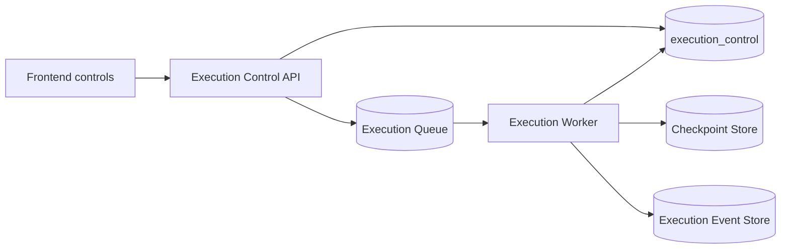
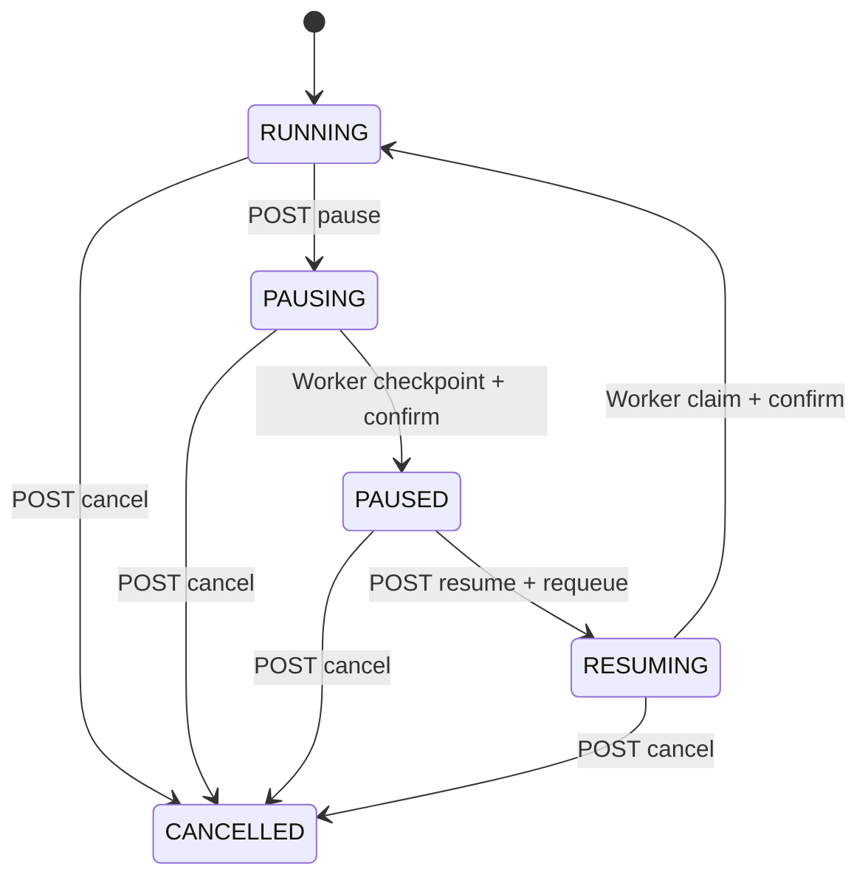

# Phase17-B Human Control Runtime

## 1. Outcome

Phase17-B upgrades the existing status-only pause API into a durable human-control loop:



The implementation does not change Planner, AgentRuntime, Artifact, ToolRuntime, MCP, Java Backend, Creator protocol, Retry, or Reconciliation behavior.

The local default is restored to durable `queue` dispatch. `start-assistant.ps1` manages the Worker as a hidden child process, so a developer still starts one Assistant command instead of opening a separate Worker terminal.

## 2. Why the previous UI only showed “completed”

The prior local workaround changed `ASSISTANT_EXECUTION_DISPATCH` to `direct`. In direct mode the Assistant HTTP request waited for the whole Runtime execution. By the time the frontend received an execution ID, the execution was already terminal, so the progress card and controls had no observable running window.

Phase17-B restores:

```text
HTTP submit -> QUEUED response -> Worker execution -> frontend polling/SSE
```

The progress UI can therefore observe steps and issue pause, resume, and cancel commands while work is active.

## 3. Control model

`ExecutionStatus` remains the business execution lifecycle. Human intent is represented separately by `ExecutionControlState`:

| Control state | Meaning |
|---|---|
| `RUNNING` | No human stop request is active. |
| `PAUSING` | API accepted pause; Worker must stop at the next safe step boundary. |
| `PAUSED` | Worker saved a checkpoint and confirmed the pause. |
| `RESUMING` | API accepted resume and put the execution back in the durable queue. |
| `CANCELLED` | Human cancellation is durable; no later step may start. |

The transition path is:



Pause and cancel are cooperative, not process preemption. An already-running external tool call is allowed to return. The Worker then persists the completed step and honors control before selecting another step. This prevents an unknown partial side effect from being treated as safely interrupted.

## 4. Persistence

Control state is persisted in the new `execution_control` table:

| Column | Purpose |
|---|---|
| `execution_id` | One-to-one key to the canonical execution. |
| `state` | Current `ExecutionControlState`. |
| `reason` | User/operator reason. |
| `requested_at` | Time of the latest human request. |
| `updated_at` | Time of the latest control transition. |

A separate table was selected instead of altering the existing `execution` table during application startup. Existing executions without a row are read as `RUNNING`; the next repository save creates the control record. The same fields remain part of `PlanExecution` so memory tests and PostgreSQL mode use the same contract.

On confirmed pause, `RuntimeManager.save_checkpoint()` persists:

- completed step IDs;
- the next current step;
- control reason;
- a `PAUSED` snapshot marker.

`PlanExecution` remains authoritative. A checkpoint is a recovery snapshot, not a second execution-state source.

## 5. APIs

All APIs retain the existing execution ownership authorization check.

| Method | Path | Behavior |
|---|---|---|
| `POST` | `/api/v1/executions/{id}/pause` | Sets `PAUSING`; accepts an optional `{ "reason": "..." }`. |
| `POST` | `/api/v1/executions/{id}/resume` | Sets `RESUMING` and atomically returns the existing dispatch message to `READY`. |
| `POST` | `/api/v1/executions/{id}/cancel` | Sets both control and execution lifecycle to `CANCELLED`; skips unstarted steps. |
| `GET` | `/api/v1/executions/{id}/control` | Returns state, reason, timestamps, execution status, and current step. |

Execution list/status projections now include `control_state`, `control_reason`, and request time where applicable.

Durable pause/resume is rejected when the application is explicitly configured with `ASSISTANT_EXECUTION_DISPATCH=direct`, because direct mode has no durable Worker continuation context.

## 6. Worker behavior

`ExecutionWorker` checks control state:

1. after starting a pending execution;
2. before retry/crash recovery;
3. at the top of every step-selection loop;
4. before the next tool can be invoked.

For `PAUSING`, it saves the checkpoint, emits `EXECUTION_CHECKPOINT_SAVED`, confirms `PAUSED`, and returns `RunOutcome.PAUSED`. The queue consumer ACKs the old delivery and releases the execution lease.

For `RESUMING`, it confirms `RUNNING` after claim. The scheduler only returns `PENDING` steps whose dependencies are complete, so completed steps are not executed again.

For `CANCELLED`, it returns `RunOutcome.BLOCKED`. Pending/approval steps are persisted as `SKIPPED` with `EXECUTION_CANCELLED`; no later tool call is selected.

The queue requeue operation also handles the short race where resume is requested after the Worker confirmed `PAUSED` but before its old queue claim was ACKed. The message can move from `CLAIMED` to `READY`; the execution lease still prevents concurrent execution.

## 7. Events and timeline

Phase17-B adds:

- `EXECUTION_PAUSE_REQUESTED`
- `EXECUTION_CHECKPOINT_SAVED`
- `EXECUTION_PAUSED`
- `EXECUTION_RESUME_REQUESTED`
- `EXECUTION_RESUMED`
- `EXECUTION_CANCELLED` with reason payload

The Assistant execution card now shows control state, current step, reason, progress, steps, and the latest timeline events. Buttons follow control state:

- `RUNNING`: Pause and Cancel;
- `PAUSING`: Cancel;
- `PAUSED`: Resume and Cancel;
- `RESUMING`: Cancel;
- terminal: controls hidden.

The frontend execution waiter now treats `PAUSED`, `WAITING_APPROVAL`, and `WAITING_HUMAN` as settled nonterminal outcomes. Previously it could poll forever after a pause.

## 8. Startup behavior and authentication prerequisite

Defaults:

```dotenv
ASSISTANT_EXECUTION_DISPATCH=queue
ASSISTANT_EXECUTION_QUEUE_CONSUMER=true
ASSISTANT_API_PORT=8094
```

Start the Assistant with:

```powershell
.\scripts\start-assistant.ps1
```

The script starts the API and its managed hidden Worker. A separate `start-assistant-worker.ps1` is only needed when `ASSISTANT_PROCESS_ROLE=api` is intentionally used.

Queue execution requires a valid service JWT in `ASSISTANT_WORKER_ACCESS_TOKEN`. The current local token was audited as expired. Startup scripts now fail fast with a non-secret error instead of allowing Creator to fail later with `ExpiredSignatureError`. A fresh service JWT with the `greenbook-assistant-runtime` audience must be configured; Phase17-B does not mint identities or change the Java/Creator authentication protocol.

## 9. Verification

New test file: `tests/unit/test_phase17b_human_control_runtime.py`.

Covered scenarios:

1. Generate completes, pause is honored before quality validation, and a durable checkpoint is saved.
2. Repository/Worker adapters are recreated from the same database, resume starts at validation, and generate is not repeated.
3. Cancellation during generate prevents validation and publication tool calls.
4. Resume requeues a message even during the old Worker claim-settlement race.
5. Existing queue, execution-state, event-stream, Runtime guard, and persistence tests remain green.

Verification result:

```text
Python focused regression: 50 passed
Frontend: tsc + vite build passed
Startup environment: .venv-v2 compile/import and FastAPI app creation passed
Local PostgreSQL bootstrap: storage=postgres, execution_control=true
```

No large-scale test suite or external Java/Creator E2E was run. A live authenticated E2E remains blocked until the expired Worker service JWT is replaced.

An expanded check also exposed two pre-existing `test_run_api_retirement.py` failures: the current worktree still exposes legacy Run operation routes and lacks the test's expected approve route. Phase17-B did not change those legacy route decisions.

## 10. Changed areas

- Core control/state/checkpoint: `execution/models.py`, `state_manager.py`, `runtime_manager.py`, `runtime_guard.py`, `worker.py`, `events.py`
- Persistence/queue: `execution/persistence.py`, `postgres_repository.py`, `execution_queue.py`
- API/Worker result boundary: `runtime_routes.py`, `runtime_agent_service.py`
- Frontend: `execution.ts`, `executionService.ts`, `AssistantPanel.tsx`, `TaskCenterPage.tsx`
- Local startup: `.env.example`, `start-assistant.ps1`, `start-assistant-worker.ps1`, `Import-GreenBookEnv.ps1`
- Tests: Phase17-B test plus control/event/guard compatibility updates

## 11. Known limits

- Pause/cancel does not terminate an in-flight HTTP/LLM/tool call; control is applied at the next safe step boundary.
- The service-JWT issuance/rotation mechanism is still an external deployment responsibility.
- The new table is created by the existing SQLAlchemy Runtime metadata bootstrap. A separately managed production migration tool should own DDL once deployment migrations are formalized.
