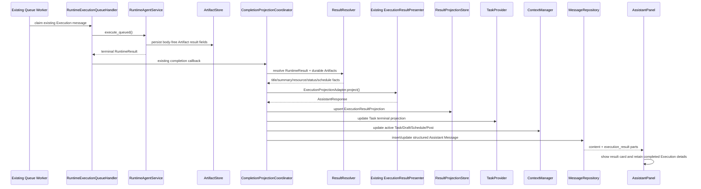

# Phase17-C Durable Result Projection Implementation

> 状态：已完成  
> 日期：2026-08-11  
> 基线审计：`docs/progress/PHASE17_RESPONSE_EXPERIENCE_AUDIT.md`

## 1. 实施结果

Phase17-C 已完成审计报告中的 P0 结果投影闭环。Runtime 成功执行后不再把“已完成：原始用户输入”作为最终用户响应，而是统一经过：

```text
Execution
  -> ResultResolver
  -> ExecutionProjectionAdapter
  -> ExecutionResultPresenter
  -> AssistantResponse
  -> ExecutionResultProjection
  -> CompletionProjectionCoordinator
  -> Structured Conversation Message
```

本阶段没有新增 Agent 能力，没有修改 Planner、TaskGraph、AgentRuntime、Java Backend、Creator 协议、MCP 协议、Execution Queue 或 Queue Worker 的消费算法。

## 2. 完成后的真实链路



独立 Worker 和 API 内置 Worker 使用 `RuntimePersistence.result_projection_store`，因此 PostgreSQL 模式下共享同一 Result Projection 表。

## 3. ResultResolver 与已有 Presenter 接入

新增 `ResultResolver`，只负责把 RuntimeResult、Execution Steps 和 ArtifactStore 中的持久事实整理成已有 Presenter 接受的 RuntimeResult 结构。

它不生成用户文案。最终文案继续由已有模块负责：

- `ExecutionProjectionAdapter`
- `ExecutionResultPresenter`
- `AssistantResponse`

`RuntimeAgentService._finish_execution()` 的成功 `content` 现在为空，不再生成固定回声文案。对于其他执行路径返回的有意义自定义文本，Resolver 会保留；只有旧的“已完成：...”回声模板会被丢弃。

## 4. Durable ExecutionResultProjection

新增模型：

```text
ExecutionResultProjection
├── execution_id
├── task_id
├── conversation_id
├── run_id
├── trace_id
├── status
├── artifacts
├── schedule
├── next_actions
├── summary
├── assistant_response
├── created_at
└── updated_at
```

PostgreSQL 表：

```text
assistant_execution_result_projections
```

实现提供：

- `MemoryExecutionResultProjectionStore`：测试和显式 Memory profile。
- `PostgresExecutionResultProjectionStore`：生产 Runtime profile。
- PostgreSQL/SQLite 原子 upsert，重复完成回调和重启 reconciliation 不会创建重复 Projection。
- API 与 Worker 通过统一 `RuntimePersistenceFactory` 获取 Store。

刷新恢复有两条持久路径：

1. Conversation Message 持久化结构化 `parts`，前端刷新后直接恢复结果卡片。
2. ExecutionResultProjection 保存完整安全投影，Worker/API 重启 reconciliation 可恢复并补写 Message、Task 和 Conversation Context。

## 5. ArtifactStore 修复

### 5.1 Memory/PostgreSQL 一致字段

Artifact 现在显式暴露并持久化以下字段：

| 字段 | 说明 |
|---|---|
| `title` | 草稿或结果标题 |
| `summary` | 用户可见安全摘要 |
| `resource_type` | `DRAFT` / `SCHEDULE` / `POST` 等 |
| `resource_id` | 对应业务资源 ID |
| `status` | `draft` / `SCHEDULED` 等业务状态 |
| `run_at` | UTC 执行时间 |
| `timezone` | 用户业务时区 |
| `step_id` | 产出该 Artifact 的 Execution Step |

MemoryArtifactStore 与 PostgresArtifactStore 共同调用同一安全投影函数，避免测试模式有完整 ToolResult、生产模式却丢字段。

### 5.2 正文边界

正文不进入 PostgreSQL Artifact：

- `content`
- `body`
- `body_markdown`
- `raw_text`
- 原始 `tool_result`

这些字段仍由 Java/Creator 业务存储负责。ArtifactStore 只保留标题、摘要、稳定资源引用和调度信息。

### 5.3 类型化 Resource ID

Capability Artifact 提取规则改为：

| Artifact 类型 | 唯一允许的资源字段 |
|---|---|
| `DRAFT` / `POST_DRAFT` / `CONTENT_DRAFT` | `draft_id` |
| `SCHEDULE` / `PUBLICATION_SCHEDULE` | `schedule_id` |
| `POST` / `PUBLISHED_POST` | `post_id` |

已经删除 `draft_id -> schedule_id -> post_id` 的通用顺序猜测。Schedule ToolResult 即使同时包含 draft_id 和 schedule_id，也只会选择 schedule_id。

## 6. CompletionProjectionCoordinator

新增 Coordinator 作为所有终态 Execution 的完成投影边界，负责：

1. 调用 ResultResolver。
2. 调用已有 ExecutionProjectionAdapter/Presenter。
3. 原子 upsert ExecutionResultProjection。
4. 更新 Task：
   - terminal status；
   - Execution ref status；
   - Artifact refs；
   - Draft/Schedule/Post resource index；
   - completed_at / error。
5. 更新 Conversation Context：
   - active_task_id；
   - active_artifact_id；
   - active_draft_id；
   - active_schedule_id；
   - active_post_id；
   - last_successful_run_id。
6. 生成并持久化结构化 Assistant Message。
7. 更新兼容 run_store，但 run_store 不再是恢复结果的唯一来源。

Coordinator 支持幂等重放：

- 已有 Projection：直接恢复 AssistantResponse。
- 已有旧纯文本 Message：按 trace_id 更新为富结果 Message，不额外制造重复消息。
- Message 缺失：重新创建结构化 Message。
- Task/Conversation 投影缺失：再次幂等同步。

## 7. Structured Message Contract

`assistant_messages` 新增：

- `parts JSONB`
- `run_id`
- `execution_id`

终态消息的 parts 结构：

```json
[
  {
    "type": "execution_result",
    "execution": {
      "execution_id": "...",
      "task_id": "...",
      "status": "COMPLETED",
      "summary": "...",
      "steps": []
    },
    "artifacts": [
      {
        "type": "POST_DRAFT",
        "artifact_id": "...",
        "title": "Java 学习路线：从基础到实践",
        "summary": "覆盖核心语法、项目练习和持续复盘。",
        "resource_type": "DRAFT",
        "resource_id": "draft-java-17c"
      },
      {
        "type": "PUBLICATION_SCHEDULE",
        "artifact_id": "...",
        "resource_type": "SCHEDULE",
        "resource_id": "schedule-java-17c",
        "run_at": "2026-08-12T00:00:00Z",
        "timezone": "Asia/Shanghai",
        "status": "SCHEDULED"
      }
    ],
    "schedule": {},
    "next_actions": ["查看草稿", "修改草稿"]
  }
]
```

Message GET API 现在返回持久化 parts、run_id 和 execution_id。

## 8. AssistantPanel 展示

AssistantPanel 新增持久结果卡片，展示：

- 完成摘要；
- 草稿标题；
- 内容摘要；
- Draft ID；
- 本地化发布时间；
- Schedule 状态和 Schedule ID；
- “查看并修改草稿”；
- “查看任务详情”；
- 可折叠 Execution ID、Task ID 和 Step 信息。

执行完成后不再清空当前 Execution Snapshot，完成态卡片和 Timeline 仍保留；刷新页面后则从结构化 Message 恢复结果与 Execution 摘要。

UI 延续现有 Design Token、SVG Icon 和 AssistantPanel 视觉体系。新增操作入口具备：

- 44px 最小触控高度；
- 可见键盘焦点；
- 文本 + 图标状态，不只依赖颜色；
- 稳定的 Execution ID 作为 React key；
- 移动端自动换行；
- 现有 reduced-motion 支持。

## 9. 数据库迁移

新增：

- `004_structured_assistant_messages.sql`
- `005_artifact_result_projection_fields.sql`

两份迁移都是单条 PostgreSQL statement，兼容 asyncpg prepared statement 限制，不会再次触发“cannot insert multiple commands into a prepared statement”。

Result Projection 表由统一 RuntimePersistence metadata 幂等创建；Artifact migration 使用 `ALTER TABLE IF EXISTS`，因此 ContextManager 独立初始化时不会因 Artifact Runtime 尚未创建表而失败。

## 10. 主要修改文件

### 新增

- `packages/assistant_core/greenbook_assistant_core/execution/result_projection.py`
- `apps/assistant_api/greenbook_assistant_api/services/result_resolver.py`
- `apps/assistant_api/greenbook_assistant_api/services/completion_projection_coordinator.py`
- `packages/assistant_core/greenbook_assistant_core/db/migrations/004_structured_assistant_messages.sql`
- `packages/assistant_core/greenbook_assistant_core/db/migrations/005_artifact_result_projection_fields.sql`
- `tests/unit/test_phase17c_result_projection.py`

### 修改

- Runtime persistence composition：`persistence_provider.py`、`execution/__init__.py`
- Artifact：`models.py`、`persistence.py`、`store.py`
- 类型化 ID：`capability_executor.py`
- Runtime 完成 envelope：`runtime_agent_service.py`
- Completion callback：`execution_completion_publisher.py`
- API/Worker composition：两个 `main.py`
- Task completion projection：`task_provider.py`
- Conversation/Message persistence：`context_manager.py`、`db/repositories.py`、`api/routes.py`
- Frontend：`AssistantPanel.tsx`、`AssistantPanel.module.css`、`types/assistant.ts`
- Existing publisher regression test。

## 11. 测试结果

### 后端

相关回归与 Phase17-C 测试：

```text
70 passed in 0.95s
```

覆盖：

- Java 学习帖子草稿 + Schedule 完成模拟；
- Execution `COMPLETED`；
- Draft/Schedule Artifact 持久化；
- title/draft_id/schedule_id/run_at 进入结构化 Message；
- Durable Projection 存在；
- 新 Store 实例恢复 Projection；
- Task completion refs/resource index；
- Conversation active draft/schedule；
- Memory/Postgres Artifact 字段一致；
- 正文不进入 PostgreSQL Artifact；
- DRAFT/SCHEDULE/POST 类型化资源 ID；
- 旧 completion reconciliation；
- RuntimeAgentService、ConversationRuntimeAdapter、Queue Runtime、Execution Presenter 回归。

### Python 静态检查

新增和核心修改文件通过 Ruff。

### Frontend

```text
npm run lint   -> passed
npm run build  -> passed
```

Vite 生产构建完成，359 个模块正常转换。

## 12. 保持不变的边界

以下模块没有修改业务算法或协议：

- Planner
- TaskGraph
- AgentRuntime
- Execution Queue
- ExecutionQueueWorker claim/lease/ack 行为
- Retry
- Reconciliation 执行算法
- Java Backend
- Creator Agent 协议
- MCP Tool 协议

独立 Worker 只修改 Composition：向既有 `RuntimeExecutionQueueHandler` completion callback 注入 Coordinator，并在启动时执行持久投影 reconciliation；Worker 的消费、lease 和工具执行逻辑没有改变。

## 13. 验收结论

Phase17-C 已将 GreenBook Runtime 从“执行成功后只回显用户输入”改为可持久、可恢复、结构化的结果投影链路。

对于“明天上午八点发布一篇关于如何学好 Java 的帖子”，系统现在能够在完成后返回并持久化：

- 生成结果摘要；
- 草稿标题；
- 内容摘要；
- Draft ID；
- Schedule ID；
- 发布时间与时区；
- 等待发布状态；
- 后续查看和修改入口；
- 可回看的 Execution 信息。

本阶段未调用真实外部 Java/Creator 服务执行新的线上写操作；验证使用真实 Runtime Result/Artifact/Projection 数据结构和 PostgreSQL 兼容 SQLAlchemy Store 进行确定性模拟，避免污染现有业务数据。
