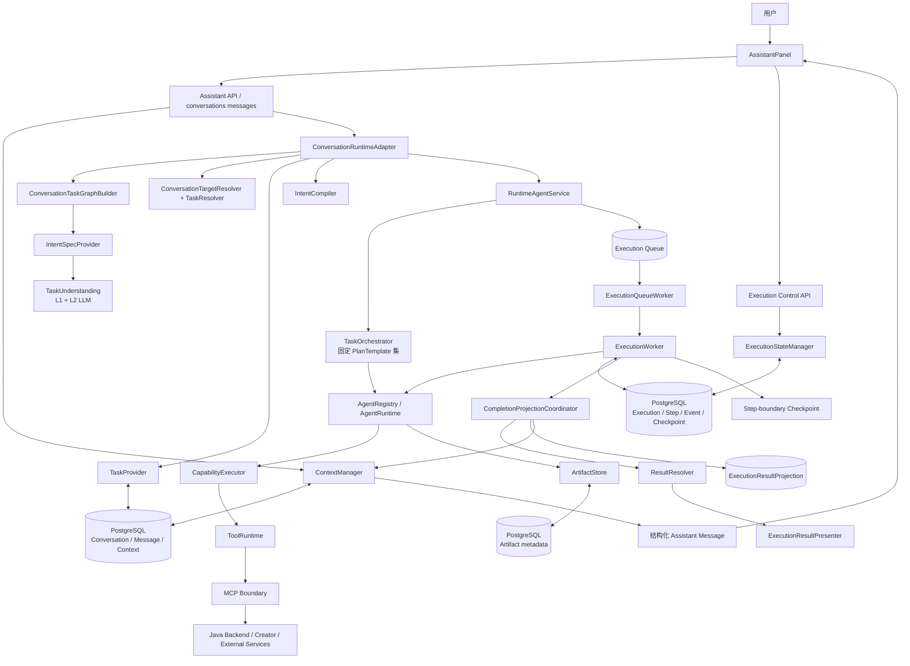
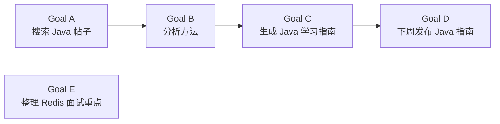

# Phase17-D Conversation Intelligence & Continuous Task Runtime Audit

> 审计日期：2026-08-11  
> 审计范围：Assistant Conversation Runtime、Intent/Target/Task/Graph、Agent Runtime、Human Control、Result Projection、Memory、前端消费链路及相关测试。  
> 审计性质：只读架构审计；本阶段未修改 Planner、Runtime、Queue、Worker、Tool、前端或外部服务代码。

## 0. 执行摘要

GreenBook 当前已经不是普通 ChatBot，也不是“只调用一次大模型后返回文本”的应用。它已经具备持久化 Conversation、稳定 Task ID、持久化 Execution/Step/Checkpoint、队列 Worker、Artifact、Agent Plugin Contract、人工暂停/继续/取消、失败重试与完成结果投影等 Runtime 基础设施。

但它目前更准确的定位是：

> **面向社区内容业务的、可持久恢复的单任务工作流 Runtime，叠加了初步的多目标拆解与 Operator 式执行控制。**

它还不是完整的“持续任务 Operator Runtime”。主要差距不在某一个 Java 发帖案例，而在 Conversation 与 Runtime 之间缺少稳定的连续任务语义：

- Conversation 历史和摘要已经持久化，但没有真正进入 Intent、Planner、Creator 或 Response 决策。
- Task 有稳定 ID，但自然语言 Target Resolution 只支持部分弱引用；时间引用、状态引用和“上一条”等表达不闭环。
- UPDATE/CANCEL 能形成 Intent，但“任务命令”和“业务资源修改”仍混在一起；自然语言暂停、继续、取消不能稳定映射到 Execution Control。
- Multi-Goal Graph 可以建图，但生产队列模式下依赖节点不会等待上游 Artifact，独立节点也不会并行。
- 一次复合请求中的多个 Execution 共用 `run_id/trace_id`，完成投影可能互相覆盖，前端也只跟踪第一个 `execution_id`。
- Human Control 的 Execution 状态已持久化；澄清、审批、补充输入的 HumanInteraction 仍是进程内状态。
- Result Projection 已解决“只显示已完成”的主路径问题，但多任务聚合、查询结果、失败原因翻译和可执行下一步仍不完整。
- Memory 能写入和召回，但当前召回结果没有被 Planner、Creator 和 Presenter 消费，个性化尚未形成行为闭环。

### 0.1 能力评分

| 维度 | 评分 | 当前真实状态 |
|---|---:|---|
| Conversation 持久性 | 7/10 | PostgreSQL 可恢复；摘要策略有重复累积与信息丢失风险 |
| 单任务 Identity | 7/10 | Task UUID、Execution 引用和资源索引已持久化；自然语言绑定不稳定 |
| Intent 通用性 | 5/10 | Formal IntentSpec 完整；非 CREATE 路径高度依赖 LLM，降级能力弱 |
| Target Resolution | 5/10 | 序号、部分弱引用和属性词可用；时间、状态、显式资源 ID 不完整 |
| 多任务/多目标 | 4/10 | 可拆图和拓扑排序；队列依赖、聚合投影、并行和部分恢复未闭环 |
| Agent 插件化 | 6/10 | AgentRuntime/Executor/Registry 已进入执行链；规划仍受固定模板约束 |
| Human Control | 6/10 | Execution 控制持久可靠；对话式澄清/审批/目标修改不持久 |
| Result Experience | 7/10 | 单 Execution 结构化结果已落地；多结果、查询和错误翻译仍不足 |
| Memory/个性化 | 2/10 | 有数据结构和召回调用，但未影响实际规划、创作与回复 |
| 执行失败恢复 | 8/10 | Queue/Checkpoint/Retry/Reconciliation 成熟；Conversation 命令恢复较弱 |

## 1. 审计依据与判定原则

本报告以当前生产调用链为准，重点阅读：

- `apps/assistant_api/greenbook_assistant_api/main.py`
- `apps/assistant_api/greenbook_assistant_api/api/routes.py`
- `apps/assistant_api/greenbook_assistant_api/api/runtime_routes.py`
- `apps/assistant_api/greenbook_assistant_api/services/conversation_runtime_adapter.py`
- `apps/assistant_api/greenbook_assistant_api/services/runtime_agent_service.py`
- `apps/assistant_api/greenbook_assistant_api/services/completion_projection_coordinator.py`
- `packages/assistant_core/greenbook_assistant_core/conversation/`
- `packages/assistant_core/greenbook_assistant_core/task/`
- `packages/assistant_core/greenbook_assistant_core/orchestration/`
- `packages/assistant_core/greenbook_assistant_core/agent_runtime/`
- `packages/assistant_core/greenbook_assistant_core/execution/`
- `packages/assistant_core/greenbook_assistant_core/human/`
- `packages/assistant_core/greenbook_assistant_core/agent_memory/`
- `zhiguang-fe/src/features/assistant/`
- `tests/unit/`、`tests/integration/`、`tests/e2e/` 和 `evaluation/`

判定时区分四类状态：

- **已闭环**：生产入口、持久化、Worker 与前端/调用方都实际使用。
- **部分闭环**：有模型或存储，但缺少某段消费或恢复链路。
- **仅框架存在**：类和测试存在，但生产主链未调用。
- **缺失**：没有能够承载该语义的稳定模型或生产调用链。

## 2. 当前真实架构与调用链



### 2.1 一次首轮任务的真实链路

1. `api/routes.py::send_message()` 在 Runtime 模式转入 `_send_runtime_message()`。
2. `_prepare_message_history()` 通过 `ContextManager` 读取摘要和最近消息，并持久化当前用户消息。
3. `ConversationRuntimeAdapter.execute()` 先尝试构建 `ConversationTaskGraph`，再解析单个或多个 `IntentSpec`。
4. `IntentSpec` 经 `to_task_intent()` 兼容转换为 `TaskIntent`。
5. `TaskProvider.create_task()` 为新任务生成稳定 `task_id` 并写入 PostgreSQL；纯 QUERY 例外，不创建 Task/Execution。
6. `IntentCompiler` 创建 `TaskContext`，`RuntimeAgentService.execute()` 选择固定 PlanTemplate 并创建 Execution。
7. Queue 模式返回 `QUEUED`，Worker 后续 claim Execution；每个 Step 经 `AgentRuntime -> AgentExecutor -> CapabilityExecutor -> ToolRuntime -> MCP` 执行。
8. Worker 完成后调用 `CompletionProjectionCoordinator`，写 `ExecutionResultProjection`、更新 Task/Conversation active resource，并创建或更新结构化 Assistant Message。
9. 前端轮询/SSE 读取 Execution、Step、Event，同时最终从 Conversation Message 恢复结果卡片。

### 2.2 对话与执行的两条状态线

当前系统实际维护两条相关但不完全统一的状态线：

```text
Conversation -> Message -> SessionContext.active_* -> TaskProvider
                                      |
                                      +-> Execution -> Step -> Artifact -> Projection
```

Task 是业务目标 Identity，Execution 是一次执行尝试或一次修改操作。这个区分是合理的；问题是目前缺少一个正式的“Turn/Command”聚合，把某轮用户命令、被操作 Task、一个或多个 Execution、最终一条聚合回复稳定关联起来。

## 3. Conversation 生命周期审计

### 3.1 第一次提出任务时如何创建 Task

首轮消息不是由 Conversation 模型直接创建 Task，而是经过语义边界：

```text
POST message
  -> routes._send_runtime_message
  -> ContextManager.load / append_message
  -> ConversationRuntimeAdapter.execute
  -> IntentSpecProvider.resolve / resolve_graph
  -> to_task_intent
  -> TaskProvider.create_task
  -> IntentCompiler.compile
  -> RuntimeAgentService.execute
```

`TaskProvider` 使用 `TaskScope(user_id, tenant_id, conversation_id)` 隔离任务，并生成 UUID `task_id`。Task、Goal、ExecutionReference 和 ResourceIndex 都可以持久化，因此首轮 Task Identity 本身是稳定的。

### 3.2 第二轮如何判断新建、修改、追加、查询或取消

当前判断主要由 `IntentSpec.actions[0]` 经 `task/intent_compat.py::to_task_intent()` 映射：

| Formal Action | Task relation | 当前语义 |
|---|---|---|
| CREATE / SEARCH / ANALYZE / PUBLISH | NEW_TASK | 新任务 |
| UPDATE | MODIFY_TASK | 修改已有任务，需 Target Resolution |
| DELETE | CANCEL_TASK | 进入取消语义，但实际计划通常是取消发布资源 |
| QUERY | DIRECT | 直接查询；当前不会形成 `QUERY_TASK` |
| UPDATE_OR_CREATE | NEW_TASK | 兼容式 upsert，目标复用语义不充分 |

“追加任务”没有独立 Intent。一个新目标通常被解析为另一个 NEW_TASK；对同一目标的追加要求可能被解析为 UPDATE，也可能被 LLM 合并进 COMPOSITE Intent。系统没有一等的 `APPEND_GOAL` 或 Task Command 语义，因此行为依赖 LLM 对句子的解释。

TaskProvider 虽有 `cancel_task()`，但 `ConversationRuntimeAdapter` 的正常 DELETE 链路不会直接调用它；DELETE 多数被编译为 `CANCEL_SCHEDULE` 能力。结果是“取消业务发布”和“取消 Task/Execution”并非同一件事。

### 3.3 是否存在稳定 Task Identity

**存在，但绑定稳定性只达到部分闭环。**

- Task UUID 持久化，更新可以在同一个 Task 下追加 ExecutionReference。
- `CompletionProjectionCoordinator` 会把 Artifact/资源引用写回 Task 与 Conversation。
- `SessionContext.active_task_id` 只能保存一个活动 Task；多任务并存时不足以表达候选集合。
- 后续消息能否继续同一个 Task，依赖 TargetResolver 是否识别自然语言引用。
- 已完成 Task 可以继续被 UPDATE；已取消 Task 会被拒绝。这一规则是清晰的。
- Task 的初始 Goal 通常不会随每次修改形成可审计的 Goal Revision；后续 `_sync_task_index()` 主要记录 action/resource，而非完整目标变更历史。

### 3.4 超过上下文窗口后如何保持目标一致

Conversation 持久化已实现：

- `ContextManager` 默认保留最近 12 条消息。
- 消息数达到 24 时生成长期 `conversation_summary`。
- Conversation、Message、Context 均写 PostgreSQL，可跨 API 重启和跨天读取。

但目标一致性仍有三个关键问题：

1. `history` 被放入 `RuntimeContext.conversation_history`，当前 IntentSpecProvider、TaskOrchestrator、ArgumentBinder、Creator 参数和 Result Presenter 都不消费它。换言之，历史“被加载”，但没有真正影响决策。
2. 生产初始化未提供 LLM `summary_builder`，默认摘要只是旧消息拼接，缺少 Task ID、未完成 Goal、决策、约束、实体引用等结构化保真。
3. 压缩不会标记已摘要消息；后续每次压缩再次读取全部旧消息，并把已有摘要与旧消息重复拼接，最后截取 6000 字符。长期运行后可能重复累积并截掉最早目标。

因此当前跨天恢复主要依靠 PostgreSQL Task/Artifact 和单一 `active_*` 指针，而不是对话智能本身。

## 4. Intent 理解能力审计

### 4.1 Formal Intent 覆盖面

`IntentSpec` 支持 `CREATE / UPDATE / DELETE / QUERY / SEARCH / ANALYZE / PUBLISH / UPDATE_OR_CREATE`，支持 SIMPLE、COMPOSITE、CONDITIONAL 以及约束和 `target_hint`。它能表达内容领域的大部分业务动作，但没有 `PAUSE / RESUME / RETRY / DUPLICATE / APPROVE / PROVIDE_INPUT / APPEND_GOAL` 等持续任务命令。

### 4.2 典型表达的生产路径

| 用户表达 | 预期 | 当前确定性路径 | 审计判断 |
|---|---|---|---|
| 帮我写一篇 Java 学习文章 | CREATE | L1 可无损投影为 Formal IntentSpec | 稳定支持 |
| 生成一个新人学习指南 | CREATE | L1 词表未必命中，通常依赖 L2 | LLM 依赖 |
| 帮我整理一下 Redis 面试题 | CREATE | “整理”语义主要依赖 L2 | LLM 依赖 |
| 把刚才那个改一下 | UPDATE | L1 能看出修改，但 L1 非 CREATE 会被 Provider fail-closed；L2 是否触发取决于评分 | 高误拒风险 |
| 发布时间提前 | UPDATE SCHEDULE | 时间变更较容易触发 L2 Formal Intent | 部分支持，仍需目标解析 |
| 标题换一个 | UPDATE DRAFT | 主要依赖 L2，且缺少明确新标题时应进入补充输入 | 部分支持 |
| 内容再丰富一点 | UPDATE DRAFT | 主要依赖 L2 | 部分支持 |
| 取消刚才那个 | CANCEL | L1 非 CREATE 无法投影；L2 + Target Resolution 才能闭环 | 高误拒/误义风险 |
| 不要发布了 | CANCEL SCHEDULE | 可能被识别为 DELETE SCHEDULE | 业务取消可用，Execution 取消不等价 |
| 删除这个任务 | DELETE TASK | Formal model 可表达；Planner 主要面向取消 schedule | Task 删除语义未闭环 |
| 看看昨天生成的文章 | QUERY | L2 可生成 QUERY，但“昨天”目标过滤未接入生产 resolver | 部分支持 |
| 有哪些帖子效果比较好 | QUERY/ANALYZE | Search/Analytics 能力存在 | 可执行，结果呈现较弱 |
| 分析最近 Java 帖子，然后总结方法，写文章，下周发布 | COMPOUND | L2 graph/IntentSpec 可表达，固定 FULL_PIPELINE 可覆盖单交付物 | 单任务可用，多节点队列有风险 |

### 4.3 降级行为实测

本次使用当前 `IntentSpecProvider` 的无 LLM 路径对上述 13 个表达做了只读探测：只有明确的“帮我写一篇 Java 学习文章”成功；其余 12 个返回 `INTENT_UNSUPPORTED` 或 `INTENT_SPEC_UNAVAILABLE`。

该结果不代表在线 LLM 一定误判，但说明：**当前系统不是以规则保证基础 Conversation Command，再用 LLM 增强；而是除少数 CREATE 外，基础修改、取消和查询本身也依赖 LLM 可用性与输出质量。**

### 4.4 Intent 评测风险

- Intent 数据集测试包含无条件成功断言，失败样本不会阻止测试通过。
- Live LLM evaluation 在无 API Key 时跳过，结束仍是非门禁式断言。
- 当前没有一组把“新建/修改/追加/查询/取消 + 指代消解 + 生产模型”作为发布门禁的 Conversation Contract Evaluation。

## 5. Target Resolution 审计

### 5.1 当前真实解析链

```text
IntentSpec.target_hint
  -> ConversationRuntimeAdapter 的 ConversationTaskIndex 预解析
  -> ConversationTargetResolver
  -> TaskProvider
  -> TaskResolver 二次解析
  -> TaskContext.active_artifact_id
  -> ArgumentBinder / SessionContext.active_* 补全工具参数
```

项目中还存在 `TaskReferenceResolver` 和 `ResourceResolver`，但它们不在当前 Conversation 生产主链中。多个 resolver 对“最近、昨天、资源状态”的定义不一致，形成隐式语义漂移。

### 5.2 引用类型覆盖

| 引用类型 | 示例 | 当前支持度 | 风险 |
|---|---|---:|---|
| 强引用：内部 Task ID | 指定 task_id | 部分 | `TaskIntent.target_task_id` 可用，但自然语言/接口没有稳定暴露和解析该引用 |
| 强引用：Artifact/资源 ID | draft_id/post_id | 弱 | TaskResolver 主要匹配 summary/resource kind，不是精确 artifact/resource ID |
| 弱引用 | 刚才那个、那篇 | 部分 | 单候选时可命中；多候选返回 ambiguous，不会静默猜测，这一点合理 |
| 上一条/前一个 | 上一条 | 不完整 | 有“前一篇”式逻辑，但“上一条”没有统一语义 |
| 序号引用 | 第二篇 | 支持 | 按 ConversationTaskIndex 稳定顺序解析；任务列表变化时需在 UI 同步序号 |
| 属性引用 | Java 那篇 | 部分 | 可从 goal/title/resource kind 和英文技术词匹配 |
| 时间引用 | 昨天生成的 | 生产缺失 | 时间窗口逻辑存在于未接入的 resolver，当前主 resolver 不按日期过滤 |
| 状态引用 | 准备发布的那个 | 缺失 | 不按 SCHEDULED/PAUSED/FAILED 等状态稳定筛选 |
| 动作历史引用 | 刚改过标题的 | 部分 | 针对少量 action history 有特例，不是通用谓词解析 |

### 5.3 错误绑定风险

- 多任务时单一 `active_task_id/active_draft_id/active_schedule_id` 会把“缺参数”补到最近资源；若上游 target 未精确解析，可能操作错误对象。
- Resolver 在多候选弱引用时选择返回 ambiguous 而不是任意绑定，这个安全原则是正确的。
- 但 ambiguous 当前被 Adapter 转成失败 `RuntimeResult`，没有形成持久化澄清问题、候选卡片和用户回答后的恢复点。
- “第二篇”按 Task 排序，而不是按当前可见 Artifact 列表排序，用户看到的序号与内部序号可能不一致。

## 6. Task 生命周期审计

### 6.1 操作矩阵

| 操作 | Task 层 | Execution 层 | Conversation 自然语言 | 是否保持同一 Task |
|---|---|---|---|---|
| CREATE | 支持 | 创建 Execution | 支持 | 新 Task |
| UPDATE | 支持，追加 ExecutionReference | 新 Execution | 部分支持 | 目标解析成功时是 |
| DELETE/CANCEL | 有 TaskProvider API，但主链多为取消发布 | 支持 cancel Execution | 语义混合 | 不稳定 |
| PAUSE | 无 Task 状态 | 持久化支持 | 未映射 | Task 不变 |
| RESUME | 无 Task 状态 | 持久化支持 | 未映射 | Task 不变 |
| RETRY | 无 Task 命令 | Step/Execution API 支持 | 未映射 | 通常 Task 不变 |
| DUPLICATE | 缺失 | 缺失 | 缺失 | 不适用 |

### 6.2 连续操作案例

“创建完成 -> 修改内容 -> 修改发布时间 -> 取消 -> 重新发布”理论上可以围绕同一个 Task 保存多次 Execution，但成立条件是每轮都正确解析同一目标。当前缺少：

- Task Command/Revision 的一等持久模型；
- 同一 Task 的并发命令序列化或版本检查；
- 修改时对旧 Execution 的冲突策略；
- 取消 Task、取消发布资源、取消当前 Execution 三者的明确用户语义；
- 被取消后“重新发布”究竟恢复原 schedule、创建新 schedule，还是创建新 Task 的统一规则。

当上一 Execution 尚未完成，用户再说“标题换一个”时，系统可能创建第二个 Execution；没有基于 Task version/checkpoint 的乐观并发控制，也不会原子地修改正在运行的计划。

## 7. 多任务、多目标与 TaskGraph 审计

### 7.1 已实现能力

- Semantic LLM 可以把一条消息拆为多个独立 Goal，并返回 `depends_on`。
- `ConversationTaskGraph` 能校验依赖并做拓扑排序。
- 节点可标记 read-only、Agent 名称和输入/输出 Artifact 类型。
- 同一交付物的搜索、分析、创作、发布可保留为一个 COMPOSITE Goal，由 `FULL_PIPELINE` 执行。
- 独立业务目标可以创建不同 Task/Execution。

### 7.2 示例请求的理论拆解

用户：“帮我分析 Java 帖子并写学习指南，同时整理 Redis 面试重点，下周发布。”



合理执行关系应是 A→B→C→D，E 与 A/B/C 可并行。当前 semantic graph 能表达该图，但生产 Queue 模式并不能完整兑现它。

### 7.3 P0：Queue 模式依赖 Artifact 不闭环

`ConversationRuntimeAdapter.execute_graph()` 按拓扑顺序调用每个节点。Queue 模式下，上游写任务会立即返回 `QUEUED`，此时尚无 Artifact；Adapter 随即从该结果提取空 ArtifactRefs，再排入下游节点。因此图上“依赖”只控制了入队顺序，没有控制实际执行顺序和 Artifact 可用性。

直接模式测试可以通过，是因为上游在返回前已经执行完成；这不能证明生产 Queue Graph 正确。

同时，某节点失败后 Adapter 仍会继续遍历后续节点，最终返回 `PARTIAL`，但没有把依赖失败节点标记为 BLOCKED，也没有针对独立分支的恢复策略。

### 7.4 P0：多 Execution 的结果聚合会覆盖

同一复合消息中的子节点复用同一个 `run_id/trace_id`。`CompletionProjectionCoordinator` 查找现有 Assistant Message 时使用“execution_id 相同 **或 trace_id 相同**”。第二个子 Execution 完成后可能更新第一个子 Execution 的消息，而不是形成一个稳定的 Graph/Turn 聚合结果。

API 的 202 响应虽然包含 `execution_ids/task_ids`，前端 `AssistantRunAccepted` 当前主要消费单个 `execution_id`，执行详情只跟踪第一个 Execution。数据库中的每个 `ExecutionResultProjection` 仍可存在，但 Conversation 结果体验不完整。

### 7.5 并行与部分失败

- 无依赖节点目前仍按 for-loop 串行创建/执行，不做并行调度。
- 没有持久化 GraphRun/RunGroup 聚合状态。
- 没有“只重试失败分支”“修改某一 Task 后重跑其后继节点”的图级操作。
- 没有单任务修改时对其他并行 Task 的隔离控制界面。

结论：当前 Multi-Task 是**语义建图可用、生产连续执行未闭环**，不应按成熟 Operator 多任务能力对外承诺。

## 8. Agent Runtime 审计

### 8.1 实际执行链

```text
TaskOrchestrator
  -> PlanTemplate / capability
  -> AgentRegistry.resolve
  -> AgentRuntime.execute
  -> Search/Analytics/Creator/Quality/Publish AgentExecutor
  -> CapabilityExecutor
  -> ToolRuntime
  -> MCP
```

Phase16-B 的 Plugin Contract 已进入真实 Step 执行链，AgentRuntime 会做 Agent 查找、输入 Artifact 校验、Executor 调用、输出校验和 Timeline 记录。这不是只有 metadata 的伪 Registry。

### 8.2 动态组合边界

动态性目前位于“已知 capability 对应哪个 Agent”这一层。规划层仍使用固定模板：`SINGLE_SEARCH`、`CREATE_WITH_RESEARCH`、`CREATE_AND_PUBLISH`、`FULL_PIPELINE` 等。`TaskOrchestrator` 自身也明确不是 general-purpose AI planner。

因此：

- 若新增 Agent 只是替换/扩展既有 capability，且输入输出 Artifact Contract 相容，可通过 RuntimeContainer 注册 Executor/metadata，核心 Planner 可不改。
- 若新增的是全新 capability 或全新业务拓扑，通常还需修改 capability catalog、Planner 模板/选择规则、工具 Contract 和 Argument Binding。
- `TaskGraphBuilder` 仍对部分 UPDATE/DELETE 语义做 Agent/capability 重写，说明不是完全由 Plugin Metadata 驱动。

SearchAgent、AnalyticsAgent、CreatorAgent、QualityAgent、PublishAgent 均已注册；“动态组合”受现有模板集合限制，而非根据任意 Goal 自动合成新计划。

## 9. Human Interaction 审计

### 9.1 已闭环的 Operator 控制

- `pause / resume / cancel / get control` Execution API 已存在。
- `ExecutionControlState` 与原因持久化到 PostgreSQL。
- Worker 在 Step 边界检查控制状态，暂停时写 Checkpoint、Event 并释放 lease。
- Resume 重新入队，从已完成 Step 之后继续。
- 前端运行中显示暂停/取消，暂停后显示继续/取消，并保留 Timeline。

这是当前最成熟的 Operator 能力。限制是协作式中断：正在执行的外部 HTTP/MCP 调用不会被硬中止，只能在当前 Step 返回后停下。

### 9.2 未闭环的对话式 Human-in-the-loop

| 能力 | 当前状态 |
|---|---|
| 用户点按钮暂停/继续/取消 | 已闭环 |
| 用户说“先暂停”“继续刚才任务” | Intent 中无对应命令，未闭环 |
| Agent 请求审批 | Runtime 有 WAITING_APPROVAL/相关方法，但 API 侧仍混有旧 approval 路径 |
| Agent 请求澄清 | HumanInteraction 模型存在，生产持久恢复未闭环 |
| 用户提供补充信息 | 有 INPUT 类型框架，缺少稳定 API/Message/恢复链 |
| “改一下标题再发布” | 不能原子修改 paused Execution；通常创建新 Execution |

`HumanInteractionManager` 默认使用内存 `InteractionStore`，`RuntimeAgentService._paused_contexts` 也是进程内字典。API/Worker 重启或分进程部署后，澄清、审批、补充输入的上下文可能丢失。旧 `/approvals`、`run_store` 控制路径与新的 canonical Execution Control 并未完全统一。

## 10. Result Experience 审计

### 10.1 成功结果

Phase17-C 已建立：

```text
Execution completed
  -> ResultResolver
  -> ExecutionResultPresenter
  -> ExecutionResultProjection
  -> CompletionProjectionCoordinator
  -> structured Message.parts
  -> AssistantPanel result card
```

单 Execution 在 Artifact 数据完整时可以展示：完成摘要、草稿标题、内容摘要、资源状态、发布时间、时区、执行步骤、Timeline 和下一步。终态 Message 与 Projection 均可从 PostgreSQL 恢复。

### 10.2 仍存在的体验缺口

- 多 Execution 复合任务没有 Turn/Graph 级聚合结果，可能被 trace 更新覆盖。
- QueryHandler 的结构化 `data` 主要放在 `partial_results`；Presenter 对 QUERY_RESULT 的专门展示弱，查询完成后可能只看到泛化文本。
- `next_actions` 是字符串标签，不是带权限、参数和目标 ID 的 typed command，前端无法可靠执行“修改这个草稿”“重试失败分支”。
- Frontend 对活动执行的刷新发现仍部分依赖进程内 `run_store`；API 重启后，终态结构化消息可恢复，但未完成执行卡片的自动发现不够稳定。
- 单 Execution 的 Artifact 缺失时，Presenter 会退化为通用摘要，用户仍可能看不到实际业务结果。

### 10.3 失败结果

Presenter 已翻译少量错误（如 timeout、Creator unavailable、工具参数错误）。但未命中的错误会回退到原始 `error_message`，仍可能暴露 `JAVA_BACKEND_UNAVAILABLE`、底层异常文本、认证内部描述等实现细节。

工业级 Operator 失败响应至少应稳定表达：

- 用户能理解的原因；
- 已经完成到哪一步、哪些产物仍可用；
- 当前是可重试、需登录/授权、需补充输入，还是存在未知副作用；
- 作用于准确 execution/task/artifact 的下一步命令。

## 11. Memory 与个性化审计

### 11.1 数据存在与实际消费

| 能力 | 存储/模型 | 生产决策消费 | 结论 |
|---|---|---|---|
| Conversation recent messages | PostgreSQL | 只传入 RuntimeContext，后续未使用 | 仅存储/搬运 |
| Conversation summary | PostgreSQL | Intent/Planner/Creator 未使用 | 仅存储 |
| active task/resource | PostgreSQL | Target/Argument 绑定部分使用 | 部分闭环 |
| episodic/semantic/procedural memory | MemoryManager/MemoryStore | 召回到 `memory_context`，无下游消费者 | 未形成闭环 |
| User Preference | 前端/模型接口有痕迹 | API 返回空/default，Creator 参数未注入 | 未实现有效个性化 |
| Previous Task/Artifact | TaskProvider/ArtifactStore | Target 和结果投影部分使用 | 部分闭环 |

`RuntimeAgentService` 会调用 MemoryManager 回忆 preference、recent tasks 和 strategy，并写入 `ctx.memory_context`；代码中没有 Planner、CapabilityExecutor、Creator 调用或 Presenter 读取这些字段。MemoryStore 还是进程内实例，重启会丢失。

所以“用户喜欢简洁、技术深度、Markdown 格式，之后自动沿用”当前不成立。系统最多能保留 Conversation/Task/Artifact 事实，不能把偏好稳定转化为计划约束、Creator 输入和回复风格。

## 12. 失败恢复与长期任务审计

### 12.1 已完成

- Execution/Step/Event/Checkpoint 持久化。
- Queue lease、Worker claim、重启恢复。
- Retry、FailureClassifier、FailurePolicy、Reconciliation。
- 外部操作证据与重复调用防护。
- Artifact 与 ResultProjection 的进程重启恢复。
- Execution 人工暂停、继续、取消。

### 12.2 仍缺失

- Conversation Turn/Command 的幂等键和恢复状态。
- 多节点 GraphRun 的持久状态及依赖恢复。
- 持久化 HumanInteraction 与澄清回答后的原地续跑。
- 修改正在运行目标时的安全点、版本检查和后继计划重算。
- 多天后按时间/状态/属性准确找回目标的统一 Resolver。
- API 重启后从 canonical Execution/Projection 恢复全部活动任务，而不是依赖内存 run projection。

执行层恢复已经较成熟；Conversation 层尚不能保证“用户任何一轮命令都能在重启后继续到同一语义位置”。

## 13. 已完成能力、缺失能力与风险清单

### 13.1 已完成能力

1. PostgreSQL Conversation/Message/Context 持久化与最近消息读取。
2. 稳定 Task ID、Task Scope、ExecutionReference、ResourceIndex。
3. Formal IntentSpec 与 LLM semantic graph contract。
4. TaskGraph 建模和拓扑排序。
5. AgentRegistry + AgentRuntime + Executor Contract。
6. Queue Worker、Checkpoint、Retry、Reconciliation、Evidence。
7. ArtifactStore 与 durable ExecutionResultProjection。
8. Execution pause/resume/cancel 的 API、Worker 和前端闭环。
9. 单 Execution 结构化完成消息和结果卡片。

### 13.2 缺失或部分能力

1. Conversation history/summary 进入语义决策和创作参数。
2. 通用、统一、可解释的 Target Resolution。
3. Task Command 与 Task Revision 模型。
4. 队列模式下持久化 Graph dependency 和 Artifact gating。
5. 多 Execution 的 Turn/RunGroup 聚合结果。
6. 持久化澄清、审批、补充输入。
7. 对话式执行控制和在途目标修改。
8. Memory/Preference 对 Planner、Creator、Response 的实际影响。
9. Typed next actions 和完整用户错误分类。
10. Conversation 级端到端评测门禁。

### 13.3 风险分级

| 等级 | 风险 | 影响 |
|---|---|---|
| P0 | Queue TaskGraph 仅按入队顺序处理依赖，上游 Artifact 未生成就提交下游 | 复合任务可能缺输入、乱序或错误执行 |
| P0 | 多子 Execution 共用 trace，CompletionProjection 按 trace 更新消息 | 子任务结果覆盖，用户看不到完整结果 |
| P0 | 前端主要跟踪单个 execution_id | 多任务过程、失败分支和控制对象不可见 |
| P0 | 历史/摘要已读取但未进入 Intent/Planner | 多轮修改和跨天目标一致性依赖偶然的 target hint |
| P0 | TargetResolver 不支持生产时间/状态引用，且多个 resolver 语义分裂 | “昨天那个”“准备发布的那个”可能找不到或绑定错误 |
| P0 | HumanInteraction/paused context 仍在内存 | 审批/澄清跨进程或重启后无法可靠恢复 |
| P1 | CANCEL 同时可能表示 Task、Schedule、Execution | 用户意图与副作用边界不清晰 |
| P1 | 无同 Task 并发命令/版本控制 | 在途修改可产生冲突 Execution |
| P1 | 非 CREATE 的基础 Intent 降级不可用 | LLM 波动会使修改、取消、查询不可用 |
| P1 | 错误 Presenter 覆盖不足 | 暴露内部错误，缺少可恢复建议 |
| P1 | Memory recall 无消费者 | 个性化界面和模型存在但行为无效 |
| P2 | 固定 Planner 模板限制新 capability 自动组合 | 新业务流程仍需修改 Planner/contract |

## 14. 测试与审计可信度

本次未运行大规模测试，只运行了与 Conversation/Phase17 直接相关的聚焦测试。

- 23 个 Phase17、Intent、Target、Task/Graph、Result Projection 和 Human Control 相关测试逻辑通过；第一次运行有 3 个临时目录权限错误，改用工作区 basetemp 后这 3 个全部通过，因此不是业务失败。
- `tests/unit/test_conversation_target_projection.py` 无法收集：它仍导入 `routes.py` 中已经移除的 `_conversation_target_task` 等私有函数。
- `tests/e2e/test_runtime_long_task_experience.py` 的 2 个测试失败：测试仍假设旧的进程内 `detach/background_result` 模型，未提供当前 Runtime 所需的完整 TaskContext，也没有走 canonical Queue/Worker 链路。
- 多任务测试大多使用立即返回的 fake runtime/direct execution，未验证 PostgreSQL Queue 模式下的跨 Execution Artifact 依赖和完成消息聚合。
- 真实 Creator/Java/MCP E2E 依赖凭证时会跳过，不能作为默认发布门禁。

因此现有测试对单模块回归有价值，但会高估 Continuous Conversation 和 Multi-Task 的生产成熟度。

## 15. 下一阶段开发计划

路线应优先补齐语义与持久边界，不需要推翻现有 Execution、Agent、Artifact 或 Planner。

### P0：必须修复——形成 Continuous Task 最小闭环

#### P0-1：引入持久化 Turn/Command 与 RunGroup 关联

- 为每轮用户消息建立稳定 `turn_id/command_id`。
- 一轮可关联一个或多个 target Task、Execution 和 ResultProjection。
- 子 Execution 使用独立 trace；使用 `parent_turn_id/run_group_id` 聚合，而不是用同一 trace 更新消息。
- Conversation Message 投影按 Turn 聚合所有成功、失败和等待分支。
- API/前端完整消费 `execution_ids/task_ids`，展示并控制准确分支。

这不是替换 Task/Execution，而是在两者之间补上当前缺失的关联聚合。

#### P0-2：让 TaskGraph 在 Queue 中成为持久执行约束

- 持久化 GraphRun、NodeExecution、dependency 状态。
- 下游仅在依赖节点成功且要求的 Artifact AVAILABLE 后可入队/claim。
- 上游失败时将依赖后继标记 BLOCKED；独立分支可继续。
- 支持仅重试失败节点及其后继，不重复成功分支。

#### P0-3：统一 Target Resolution

- 保留一个生产 `TargetResolver`，其输入是 scoped Task/Artifact/Execution snapshot。
- 支持精确 task/artifact/resource ID、弱引用、序号、时间窗口、属性、资源状态和动作历史。
- Resolver 返回 resolved/ambiguous/not_found + 候选及解释，不直接猜测。
- 把“昨天”“上一条”“准备发布”“第二篇”的语义做成 Contract Evaluation。

#### P0-4：把 Conversation Context 真正接入理解

- 给 IntentSpecProvider 输入结构化 ContextSnapshot：长期摘要、最近消息、active tasks、未完成 goals、资源和时间区，而不是无界原始历史。
- 修复摘要重复累积；记录 summarized boundary，生成面向任务事实的结构化 summary。
- Task/Artifact 事实优先于自然语言摘要，避免摘要成为新的事实来源。

#### P0-5：持久化 HumanInteraction

- 将 approval/clarification/input request、候选、响应、关联 execution/step/checkpoint 写 PostgreSQL。
- Worker 只依据 durable interaction state 恢复。
- 删除或隔离旧的内存 approval/run 控制路径，Execution API 成为唯一控制事实源。

### P1：Operator 增强

1. 建立明确 Task Command：CREATE、MODIFY、APPEND_GOAL、CANCEL_TASK、CANCEL_SIDE_EFFECT、PAUSE_EXECUTION、RESUME、RETRY、DUPLICATE。
2. 为同 Task 命令增加 revision/version 和冲突策略；在安全点支持修改后续未执行 Step，而不重放已完成副作用。
3. 将自然语言“暂停/继续/取消/重试”映射到准确 Execution Control，并在歧义时请求澄清。
4. 把 `next_actions` 升级为 typed action：目标 ID、权限、参数 schema、可用条件和 UI label。
5. 建立统一用户错误目录，按可重试、授权、依赖、输入、未知副作用输出用户语言和恢复动作。
6. 允许无依赖 Graph 节点并行执行，并提供多 Task 的局部修改、局部取消和部分结果视图。
7. 将 User Preference 持久化，并显式注入 Planner constraint、Creator request 和 Response style；提供可查看、关闭和覆盖机制。
8. 建立 Conversation Operator E2E：跨天、重启、歧义澄清、在途修改、多分支部分失败、审批后续跑。

### P2：长期能力

1. 结构化 Entity/Relationship Memory，支持跨 Conversation 的用户授权引用和保留策略。
2. 在固定模板基础上增加 capability-contract 驱动的受约束规划，而不是直接替换成熟模板。
3. 增加计划模拟、side-effect budget、审批策略和执行前可解释预览。
4. 建立长期任务 SLO、Graph/Turn 级 tracing、Conversation consistency 指标和失败聚类。
5. 对历史任务提供 fork/duplicate/replay，但复用 Artifact 时保留 provenance 与权限校验。

## 16. 最终结论

GreenBook 已拥有一个可信的 Durable Execution Runtime 骨架，尤其是 Execution、Queue、Worker、Artifact、Retry/Reconciliation、Human Execution Control 和单结果投影。这些基础不需要推倒重构。

当前限制系统成为社区场景 Operator 的关键，不是 Agent 数量，也不是再增加一个 Planner，而是以下五个连续性边界：

1. **一轮用户命令到多 Task/Execution 的持久聚合 Identity；**
2. **Conversation Context 到 Intent/Target/Planner 的真实消费；**
3. **队列模式下 TaskGraph 依赖与 Artifact readiness；**
4. **可恢复的澄清、审批、补充输入和目标修改；**
5. **多结果、部分失败和下一步操作的统一用户投影。**

完成上述 P0 后，项目才可从“持久化工作流助手”稳定升级为“支持多轮、多目标、跨天恢复和人工接管的 Continuous Task Runtime”。
