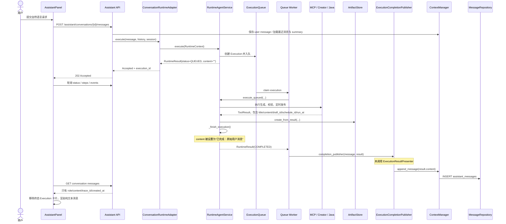
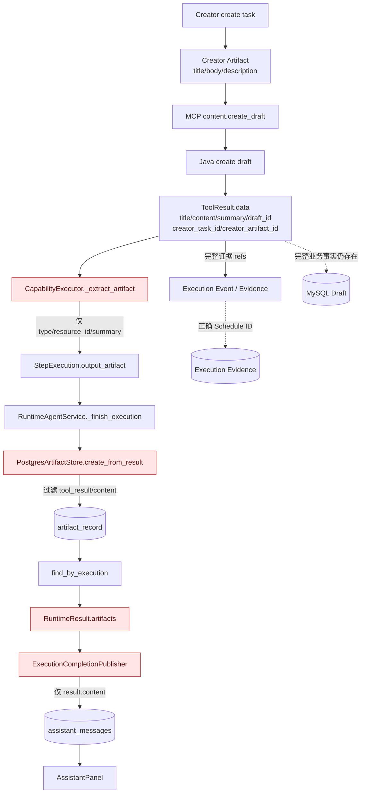

# GreenBook Agent Runtime 用户响应体验审计

> 审计日期：2026-08-11  
> 审计范围：Assistant API、Conversation Runtime、Execution Runtime 结果边界、Artifact 持久化、MCP/Java 业务结果、AssistantPanel、Task Center、Conversation/Memory 上下文  
> 审计方式：代码静态追踪 + 针对用户日志中真实 `conversation_id` / `execution_id` 的 PostgreSQL、MySQL 只读核验  
> 变更边界：本次不修改任何运行时代码，只生成本报告。

## 0. 结论摘要

这次任务不是“没有生成内容”，也不是“没有安排发布时间”。真实执行已经完成：

- Creator 生成了标题、正文和摘要；Java Backend 创建了草稿。
- PostgreSQL Execution 中三个 Step 均为 `COMPLETED`。
- MySQL 中存在 3153 字节的 Markdown 草稿。
- MySQL 中存在 `SCHEDULED` 发布记录，执行时间是 `2026-08-12 00:00:00 UTC`，即 `Asia/Shanghai` 的 `2026-08-12 08:00`。
- 因为这是未来定时发布，当前 `post_id` 为空是正确状态，不代表任务失败。

用户只看到“已完成：明天上午八点发布一篇关于如何学好 Java 的帖子”的直接原因是：

1. `RuntimeAgentService._finish_execution()` 把最终文本写成固定模板 `已完成：{原始用户消息}`。
2. 队列完成后的 `ExecutionCompletionPublisher` 直接保存 `result.content`，没有调用项目中已经存在的 `ExecutionResultPresenter`。
3. PostgreSQL `ArtifactStore` 在写入时丢弃了 `tool_result`、正文和部分资源字段；即使现在接入 Presenter，也无法只从持久化 Artifact 还原完整标题、正文和发布时间。
4. Queue Worker 完成后没有回写最终 Task/Conversation 投影。真实 Task 仍是 `READY`，Execution 引用仍是 `QUEUED`，Task Artifact 和资源索引为空；Conversation 只有 `active_task_id`，没有 `active_draft_id`、`active_schedule_id`。
5. 前端的 Execution 卡片是临时状态；收到终态 Assistant Message 后会移除。消息接口只返回纯文本，前端没有结构化 Artifact、Schedule、Next Actions 可展示，因此执行过程消失后只剩固定文本。

所以当前真实状态是：**执行层成功，业务数据存在；结果投影层断开，Artifact 读模型信息不足，Conversation/Task 最终投影未同步，前端只能展示纯文本。**

## 1. 审计样本与真实业务结果

本报告使用用户日志中的真实执行样本：

| 字段 | 实际值 |
|---|---|
| 用户请求 | 明天上午八点发布一篇关于如何学好 Java 的帖子 |
| `conversation_id` | `66e23289-8cb5-48b0-90b3-5ab16c5056db` |
| `run_id` | `a5cd4e02-57f0-42a7-8f38-8e5a64668efc` |
| `task_id` | `5a6069ae-6da0-46e2-ac02-2ada36e064d9` |
| `plan_id` | `a34b979d-5dcd-4a0e-85b5-636452bf958d` |
| `execution_id` | `e5147e9a-368f-46ef-9c0a-6fb09db67ce7` |
| Execution 状态 | `COMPLETED` |
| 完成时间 | `2026-08-11T03:58:14.626649Z` |

### 1.1 PostgreSQL Execution Step

| 顺序 | Capability | 状态 | Step 输出 |
|---|---|---|---|
| 1 | `GENERATE_CONTENT` | `COMPLETED` | DRAFT handle；草稿资源 ID `345415590422384640`；摘要中有标题 |
| 2 | `VALIDATE_QUALITY` | `COMPLETED` | VALIDATION_REPORT handle |
| 3 | `SCHEDULE_PUBLISH` | `COMPLETED` | SCHEDULE handle；Checkpoint 中有 `2026-08-12T00:00:00Z` / `Asia/Shanghai` |

`STEP_COMPLETED` Evidence 还记录了：

- Creator Task ID：`923f3433-cda0-4183-8e5f-a28fb7b401fd`
- Creator Artifact ID：`art_89f51f312d16077b358518c55e9ee58384d2f3ac9ff3511f2ff32150935ceb50`
- Java Draft ID：`345415590422384640`
- Java Schedule ID：`345415591588401152`

### 1.2 MySQL Java Backend 业务记录

`know_posts` 中存在草稿：

| 字段 | 实际值 |
|---|---|
| `draft_id` | `345415590422384640` |
| 标题 | `2024年Java学习路线图：从零基础到就业的完整指南` |
| 描述 | `根据用户目标生成如何学好 Java学习路线文章：覆盖核心概念、实践路径和常见问题。` |
| 状态 | `draft` |
| 内容来源 | `AI_ASSISTED` |
| 内容对象 | `knowposts/345415590422384640/content.md` |
| 内容大小 | 3153 bytes |

`schedule_publications` 中存在发布计划：

| 字段 | 实际值 |
|---|---|
| `schedule_id` | `345415591588401152` |
| `draft_id` | `345415590422384640` |
| `run_at` | `2026-08-12 00:00:00 UTC` |
| `timezone` | `Asia/Shanghai` |
| 用户本地时间 | `2026-08-12 08:00` |
| 状态 | `SCHEDULED` |
| `published_post_id` | `NULL`，等待未来发布 |

结论：标题、正文、草稿和发布时间详情都真实存在，缺失发生在 Assistant 结果返回链路，不在 Creator 或 Java 创建链路。

## 2. 当前用户响应生成链路

### 2.1 完整链路图



### 2.2 文件、函数与调用关系

#### 请求进入 Runtime

1. `apps/assistant_api/greenbook_assistant_api/api/routes.py:959`  
   `send_message()`：识别 Runtime 模式并调用 `_send_runtime_message()`。
2. `apps/assistant_api/greenbook_assistant_api/api/routes.py:847`  
   `_send_runtime_message()`：加载 Conversation History，调用 `ConversationRuntimeAdapter.execute()`，返回 `202 Accepted`。
3. `apps/assistant_api/greenbook_assistant_api/services/conversation_runtime_adapter.py:101`  
   `ConversationRuntimeAdapter.execute()`：生成 Intent/Task/RuntimeContext，调用 Runtime Service。
4. `apps/assistant_api/greenbook_assistant_api/services/runtime_agent_service.py:130`  
   `RuntimeAgentService.execute()`：创建 PlanExecution；Queue 模式下入队并返回空 `content` 的 `QUEUED` 结果。
5. `apps/assistant_api/greenbook_assistant_api/services/queue_execution_handler.py`  
   `RuntimeExecutionQueueHandler.__call__()`：Worker claim 后调用 `RuntimeAgentService.execute_queued()`。
6. `apps/assistant_api/greenbook_assistant_api/services/runtime_agent_service.py:173`  
   `execute_queued()`：从 Queue Payload 重建 RuntimeContext，执行既有 Execution。

#### 最终 Assistant Message 生成与保存

1. `apps/assistant_api/greenbook_assistant_api/services/runtime_agent_service.py:950`  
   `_finish_execution()` 汇总 Step、Artifact、错误和调度结果。
2. `apps/assistant_api/greenbook_assistant_api/services/runtime_agent_service.py:1136`  
   成功文本直接设置为 `已完成：{ctx.user_message[:100]}`。这是当前正常完成分支的最终文本源。
3. `apps/assistant_api/greenbook_assistant_api/services/execution_completion_publisher.py:23`  
   `ExecutionCompletionPublisher.__call__()` 接收 Worker 的 RuntimeResult。
4. `apps/assistant_api/greenbook_assistant_api/services/execution_completion_publisher.py:72`  
   `_publish()` 直接取 `result.content`，没有调用结果 Presenter。
5. `packages/assistant_core/greenbook_assistant_core/conversation/context_manager.py:136`  
   `ContextManager.append_message()` 调用持久化 Repository。
6. `packages/assistant_core/greenbook_assistant_core/db/repositories.py`  
   `MessageRepository.add()` 写入 PostgreSQL `assistant_messages`。
7. `apps/assistant_api/greenbook_assistant_api/api/routes.py:1346`  
   `get_messages()` 读取并返回消息。
8. `zhiguang-fe/src/components/assistant/AssistantPanel.tsx:711`  
   前端通过 `AssistantMarkdown` 渲染 `message.content`。

真实数据库中的最终 Assistant Message 正是：

```text
已完成：明天上午八点发布一篇关于如何学好 Java 的帖子
```

### 2.3 重启恢复分支

`ExecutionCompletionPublisher.reconcile()` 会为“Execution 已终态但 Assistant Message 尚未投影”的记录补消息。该分支同样根据原始用户消息生成固定“已完成”文案，而且构造的 `_RecoveredRuntimeResult` 不含 Steps、Artifacts 或 Schedule。

因此无论正常完成发布还是重启后补偿发布，当前都不会生成富结果响应。

## 3. Execution 完成后数据库里有什么

### 3.1 存在的数据

- PostgreSQL：Execution、三个 Step、完整 Execution Events、Queue ACK、External Operation/Evidence、三个 `artifact_record`。
- MySQL：Java Draft 与 Publication Schedule。
- Creator：Creator Task 和 Creator Artifact 的 ID 已进入 Execution Evidence。
- Conversation：用户消息和固定模板 Assistant Message。

### 3.2 ID 对照

| 语义 | ID | 位置 |
|---|---|---|
| Execution | `e5147e9a-368f-46ef-9c0a-6fb09db67ce7` | PostgreSQL Execution |
| Task | `5a6069ae-6da0-46e2-ac02-2ada36e064d9` | PostgreSQL `assistant_tasks` |
| Java Draft | `345415590422384640` | MySQL `know_posts` / Execution Evidence |
| Java Schedule | `345415591588401152` | MySQL `schedule_publications` / Execution Evidence |
| Creator Task | `923f3433-cda0-4183-8e5f-a28fb7b401fd` | Execution Evidence / Creator |
| Creator Artifact | `art_89f51f...ceb50` | Execution Evidence / Creator |
| 持久化 DRAFT Artifact | `5dc7e80d-0f76-44b4-a840-1946fd3be1c2` | PostgreSQL `artifact_record` |
| 持久化 VALIDATION Artifact | `e5cba6e4-ab8f-42d3-a4c3-f780a55263dc` | PostgreSQL `artifact_record` |
| 持久化 SCHEDULE Artifact | `dea511e5-c3eb-45f2-9b81-a3893b787a16` | PostgreSQL `artifact_record` |
| Published Post | `NULL` | 尚未到发布时间，符合预期 |

### 3.3 Artifact ID 存在两套

Step `output_artifact` 中的 ArtifactHandle ID 与最终 `artifact_record.artifact_id` 不相同。原因是 `_finish_execution()` 没有直接持久化已有 handle，而是调用 `create_from_result()` 再创建一个 Artifact。

这不是用户只看到固定文本的唯一原因，但会增加以下风险：

- Step、Timeline、ArtifactStore 和前端之间无法用同一 Artifact ID 直接关联。
- 重启后只能依赖 Execution ID 或资源 ID 再解析。
- 审计时容易误判某个 Step Artifact 是否就是最终持久化 Artifact。

### 3.4 Task 投影实际状态

真实 `assistant_tasks` 行仍然是：

| 字段 | 实际值 |
|---|---|
| `status` | `READY` |
| `artifacts` | `[]` |
| `execution_refs[0].status` | `QUEUED` |
| `resource_index` | `[]` |
| `last_action` | `UPDATE_SCHEDULE` |

原因在于 `ConversationRuntimeAdapter` 在 API 入队返回时调用 `_register_runtime_artifacts()` 和 `_persist_task_projection()`；此时结果只是 `QUEUED`，尚无最终 Artifact。Worker 完成后的 `ExecutionCompletionPublisher` 只发布消息和更新进程内 `run_store`，没有再次同步 Task 投影。

### 3.5 Conversation Context 实际状态

真实 `assistant_conversations` 行：

| 字段 | 实际值 |
|---|---|
| `active_task_id` | `5a6069ae-6da0-46e2-ac02-2ada36e064d9` |
| `active_artifact_id` | `NULL` |
| `active_draft_id` | `NULL` |
| `active_schedule_id` | `NULL` |
| `active_post_id` | `NULL` |
| `recent_entities` | `[]` |
| `recent_tool_calls` | `[]` |
| `last_successful_run_id` | `NULL` |

这说明 Conversation Persistence 已经工作，但 Queue 完成结果没有回写长期上下文。第二天用户说“修改昨天那个帖子”时，系统不能仅依赖 Conversation Context 得到这个真实 Draft/Schedule。

## 4. Artifact 真实链路



### 4.1 Creator 和 MCP 是否返回完整内容

是。`services/greenbook_mcp/greenbook_mcp_server/tools/content.py:62` 的 `create_draft()`：

1. 调 Creator 创建并等待任务完成。
2. 读取 Creator Artifact，提取 title/body/description。
3. 调 Java 创建草稿并 GET 验证。
4. 返回包含 `draft_id`、`title`、`content`、`summary`、`creator_task_id`、`creator_artifact_id` 的 ToolResult。

`services/greenbook_mcp/greenbook_mcp_server/tools/publication.py:50` 的 `schedule()` 返回 `schedule_id`、`draft_id`、`run_at`、`timezone`、`status`，并写 Evidence ResourceRef。

### 4.2 Artifact 是否创建、保存、关联

| 检查项 | 结论 |
|---|---|
| Creator 后是否创建 ArtifactHandle | 是，Step 中存在 |
| 是否保存到 ArtifactStore | 是，存在三个 `artifact_record` |
| 是否关联 Task | ArtifactStore 中 `owner_task_id` 正确 |
| 是否关联 Execution | ArtifactStore 中 `owner_execution_id` 正确 |
| 是否回写 Task.artifacts/resource_index | 否，真实 Task 两者均为空 |
| 是否回写 Conversation active draft/schedule | 否，真实字段均为空 |
| 是否返回给最终 Conversation Message | 否，Publisher 只保存纯文本 |

### 4.3 Artifact 数据丢失点

#### 丢失点 A：CapabilityExecutor 只构造轻量 ArtifactHandle

`packages/assistant_core/greenbook_assistant_core/execution/capability_executor.py:250` 的 `_extract_artifact()` 只保留 Artifact 类型、一个资源 ID 和 summary，不保留 ToolResult 的 title/content/run_at/timezone/status。

其中资源 ID 选择顺序是 `draft_id -> schedule_id -> post_id`。Schedule ToolResult 同时含 `draft_id` 和 `schedule_id`，所以 SCHEDULE handle 错误地选择了 Draft ID。真实 Step 数据已验证此问题：

- Step SCHEDULE Artifact 的 `resource_id`：`345415590422384640`（错误，实际为 Draft ID）
- Evidence 中的 Schedule ID：`345415591588401152`（正确）

#### 丢失点 B：Memory 与 PostgreSQL ArtifactStore 行为不一致

`packages/assistant_core/greenbook_assistant_core/artifact/store.py` 中：

- 内存 `ArtifactStore.create_from_result()` 会把 `tool_result.data` 放入 metadata。
- `PostgresArtifactStore.create_from_result()` 只写 `tool_name` 和 `capability`。
- `_compact_metadata()` 明确过滤 `body`、`body_markdown`、`content`、`tool_result`、`raw_text`。
- `artifact_record` 的持久化映射也不能完整恢复 resource/summary/step 等投影字段。

因此测试若主要使用 MemoryArtifactStore，Presenter 可以看到丰富 payload；生产 PostgreSQL 模式却只得到空 `data`。这是典型的测试/生产语义不一致。

#### 丢失点 C：Message 只保存文本

`MessageView` 虽然有 `parts`，但 `get_messages()` 构造返回值时没有填充 parts、run_id、execution_id、artifacts 或 next_actions。`assistant_messages` 当前也只持久化文本和 trace。

## 5. Response Projection 检查

### 5.1 模块盘点

| 目标模块 | 是否存在 | 当前真实状态 |
|---|---|---|
| `ResponseProjection` | 部分存在 | 名称为 `ExecutionProjectionAdapter`，封装 Presenter |
| `ResultFormatter` | 部分存在 | `ExecutionResultPresenter` 承担格式化职责 |
| `AssistantResponseBuilder` | 没有同名类 | `ExecutionResultPresenter` 是功能等价实现 |
| `ArtifactResolver` | 不存在 | 没有在响应阶段根据 Artifact/Evidence/Java Resource 回填完整结果的统一 Resolver |
| 结构化 Assistant Response | 已定义 | `AssistantResponse` 含 message/artifacts/next_actions/execution/steps |
| Queue Completion 接入 | 未接入 | Publisher 不调用 ProjectionAdapter/Presenter |
| Message 持久化接入 | 未接入 | 结构化字段没有保存到 Conversation Message |
| Frontend 接入 | 未接入 | AssistantPanel 只消费纯文本和空 parts |

### 5.2 已有 Presenter 能做什么

`apps/assistant_api/greenbook_assistant_api/services/execution_presenter.py:197` 的 `ExecutionResultPresenter` 已能：

- 识别 DRAFT、SCHEDULE、VALIDATION_REPORT 等 Artifact。
- 提取 title、content/body/body_markdown、summary。
- 格式化本地发布时间和时区。
- 输出 Draft ID、Schedule ID、状态。
- 输出 `next_actions`、步骤、当前步骤和进度。
- 区分运行中、失败、等待审批、暂停和成功。

`AssistantService._present()` 会调用它，但当前主消息路由直接调用 `ConversationRuntimeAdapter`，Queue 完成则直接进入 `ExecutionCompletionPublisher`。所以这套 Presenter 目前只在测试和非主链 AssistantService 路径生效，不在用户这次真实请求链路中生效。

### 5.3 不能只“接上 Presenter”

仅把 Publisher 改成调用 Presenter 仍不够，因为生产 PostgreSQL Artifact 已经丢失 title/content/run_at/resource_id 等数据。正确修复必须同时保证 Presenter 的输入是可恢复的完整 Result Projection，或者在响应阶段通过稳定引用重新解析 Java/Creator 资源。

## 6. 前端展示能力检查

### 6.1 AssistantPanel

当前能展示：

- Conversation 纯文本消息。
- 执行中的 Step 名称、状态和进度。
- Pause/Resume/Cancel/Retry 控制。
- 最近八条原始 Execution Event 的事件名和时间。
- Execution/Task/Plan ID 等调试元数据。

当前不能展示：

- 草稿标题。
- 正文或内容预览。
- Artifact 卡片与 Artifact ID。
- Draft ID / Schedule ID 的业务链接。
- 格式化后的发布时间和时区。
- 质量校验结果。
- 下一步操作，如“查看草稿”“修改草稿”“取消定时发布”。
- 完成后仍可回看的执行 Timeline。

关键行为：`AssistantPanel` 在 Execution 终态后轮询 Conversation Messages；一旦发现新的 Assistant Message，就执行 `setExecution(null)`。因此执行卡片和过程会从界面移除，最终只留下 Message。由于 Message 只有固定纯文本，用户自然看不到执行过程和结果详情。

### 6.2 Execution Detail API

后端存在：

- `GET /api/v1/executions/{id}`
- `GET /api/v1/executions/{id}/steps`
- `GET /api/v1/executions/{id}/events`
- `GET /api/v1/executions/{id}/timeline`

但 status/steps 模型不返回 Step `output_artifact`，也没有面向用户的 Result/Artifacts 响应。前端 `executionService.waitForExecution()` 只请求 status、steps、events，没有调用 `/timeline`。

### 6.3 Task Center

Task Center 能列出 Execution、Creator Task、Schedule、Post 等不同来源的项目，并能展示 Runtime Step 和控制按钮。但当前 Assistant Execution 项：

- 标题由 current step/task_id 推导，不是用户任务结果标题。
- 描述主要是 execution_id。
- 详情只有状态、进度和 Step。
- 没有通过 execution_id 解析关联草稿、Artifact 和 Schedule。
- Schedule 列表使用独立的 Scheduled Action 数据源，不等于本次 Runtime 对 Java `schedule_publications` 的统一结果投影。

因此“后端有数据但前端没展示”成立；更准确地说，是后端业务系统和 Evidence 有数据，但提供给前端的 Assistant API 读模型没有把这些数据汇总起来。

### 6.4 展示能力矩阵

| 信息 | 后端真实存在 | Assistant API 返回 | AssistantPanel 展示 | Task Center 展示 |
|---|---:|---:|---:|---:|
| 标题 | 是，MySQL/ToolResult | 否 | 否 | 仅 Post 独立数据源可能展示 |
| 正文 | 是，Java Object | 否 | 否 | 否 |
| 草稿 ID | 是 | Execution Evidence 中有，Message 无 | 否 | 未与 Execution 聚合 |
| Schedule ID | 是 | Evidence 中有，Message 无 | 否 | 未与 Execution 聚合 |
| 发布时间/时区 | 是 | Checkpoint/Evidence 中有，Message 无 | 否 | 非统一来源 |
| Step 过程 | 是 | status/steps/events 有 | 仅执行中临时展示 | 可展示基础 Step |
| 完整 Timeline | 是 | `/timeline` 有 | 未调用 | 未调用 |
| Artifact | 是，但持久化内容不完整 | 没有用户结果接口 | 否 | 否 |
| Next Actions | Presenter 已能生成 | 主链未返回 | 否 | 否 |

## 7. 个性化与长期上下文检查

| 能力 | 实现状态 | 是否用于执行 | 是否用于最终响应 |
|---|---|---:|---:|
| Conversation PostgreSQL 持久化 | 已实现 | 是 | 只用于消息历史 |
| Recent Messages | 已实现，默认最近 12 条 | 被放入 RuntimeContext | 没有参与最终文案生成 |
| Conversation Summary | 已实现，24 条触发压缩 | 可作为 history 输入 | 没有参与最终文案生成 |
| Active Task | 已实现且本样本已保存 | 可用于后续任务定位 | 最终消息不引用 |
| Active Draft/Schedule/Post | 字段已实现 | 本样本完成后未回写 | 无法用于响应或次日恢复 |
| Previous Task | TaskProvider/TaskRegistry 有解析能力 | 部分用于目标解析 | 不用于结果说明 |
| Runtime Artifact | 执行层已创建 | 用于依赖与 Step | 没有接入最终响应 |
| 用户偏好 Memory | Runtime 内有 MemoryManager | 召回到 `memory_context` | 没有下游读取点 |
| Episodic/Strategy Memory | 有进程内记录与召回代码 | 有限 | 没有接入响应 |
| Memory API | 路由存在 | 返回空数组/默认关闭 | 前端拿不到真实 Runtime Memory |
| User Profile | 未发现 Assistant 主链注入 | 否 | 否 |
| 时区 | 已持久化并传入工具 | 是，Schedule 时间正确 | 没有展示 |

### 7.1 Conversation History 的真实作用

`ContextManager.load()` 会返回 summary 和最近消息；`_prepare_message_history()` 将它们传给 `ConversationRuntimeAdapter`，再进入 `RuntimeContext.conversation_history`。当前 Runtime 主执行链主要把它作为上下文载荷和 Queue Payload 保存，并没有在 `_finish_execution()` 或 Publisher 中用于生成个性化答复。

旧式 LLM Agent 的 `agent.py` 会把 conversation_history 加入模型消息，但当前用户请求采用的是 ConversationRuntimeAdapter -> RuntimeAgentService -> Queue Worker 链路，最终响应并非由这个 LLM Agent 生成。

### 7.2 Memory 的真实作用

`RuntimeAgentService._recall_memories()` 会写入 `ctx.memory_context`，但代码搜索只发现写入和测试断言，没有发现 Planner、Executor 或 Presenter 对 `memory_context` 的消费。Assistant API 的 `/memories`、`/memory/episodes` 当前返回空列表，`/memory/settings` 返回默认关闭。

所以当前 Memory 更接近“已建模型/存储入口，尚未接入用户响应”，不能支撑“我根据你上次的偏好……”这类可验证个性化反馈。

## 8. 问题分级

### P0：必须修复

| 编号 | 问题 | 证据 | 影响 |
|---|---|---|---|
| P0-1 | Queue 完成链路绕过已有 Presenter | Publisher 直接保存 `result.content` | 所有异步任务只能得到固定完成文案 |
| P0-2 | PostgreSQL Artifact 丢失响应所需业务事实 | `tool_result/content` 被过滤，真实 artifact_record 无资源内容 | 重启后无法从 ArtifactStore 重建标题、正文、发布时间 |
| P0-3 | Worker 完成后不更新 Task/Conversation 最终投影 | 真实 Task 仍 `READY/QUEUED`，artifacts/resource_index 为空；Conversation draft/schedule 为空 | 多天任务、后续修改和结果关联不可靠 |
| P0-4 | SCHEDULE Artifact 选错 resource_id | `_extract_artifact()` 优先取 `draft_id`；真实 Step 已复现 | 如果直接展示会把 Draft ID 当 Schedule ID，可能造成错误操作 |
| P0-5 | Conversation Message 没有结构化结果 | Message 只有 content/trace，parts 永远为空 | 前端无法稳定展示 Artifact、Schedule、Next Actions |

### P1：应该优化

| 编号 | 问题 | 影响 |
|---|---|---|
| P1-1 | Completion reconcile 仍生成固定文案，且丢失所有结果字段 | API/Worker 重启后的用户体验更差，无法恢复富结果 |
| P1-2 | Execution API 没有统一 Result Projection 读取端点 | 刷新页面后只能重新拼 status/steps/events，不能读取最终业务结果 |
| P1-3 | 前端在终态消息出现后移除 Execution 卡片 | 用户无法回看过程；“完成后变空/只剩消息”是当前设计行为 |
| P1-4 | 前端未消费已有 `/timeline` | Tool、External Operation、Artifact Timeline 无法呈现 |
| P1-5 | ArtifactHandle 与持久化 Artifact 使用不同 ID | Step、Timeline、Task 和 UI 的可追踪性降低 |
| P1-6 | Task/Run 兼容投影包含进程内状态 | API 重启后运行详情和富元数据无法保证恢复 |
| P1-7 | 成功语义没有区分“已生成草稿”“已安排发布”“已实际发布” | 用户可能误以为帖子已经发布 |

### P2：后续增强

| 编号 | 问题 | 建议方向 |
|---|---|---|
| P2-1 | 无可验证的个性化响应 | 在结果投影中使用时区、历史任务、用户偏好，但必须标注数据来源 |
| P2-2 | 没有内容预览与业务深链 | 为 Draft/Post/Schedule 提供明确查看、修改、取消入口 |
| P2-3 | 质量校验结果不可见 | 展示简明质量结论，详细报告折叠 |
| P2-4 | Memory API 与 Runtime Memory 脱节 | 统一持久化和读取边界后再开放用户可见 Memory |
| P2-5 | Next Actions 没有交互契约 | 将 Presenter 的字符串升级为带 action/type/resource_id 的稳定结构 |

## 9. 缺失模块与断开的现有模块

### 9.1 真正缺失

1. **Durable Execution Result Projection**  
   缺少一个可在完成、刷新和重启后读取的统一结果读模型，至少关联 execution/task/draft/schedule/artifacts/presentation。
2. **Response-time Artifact Resolver**  
   缺少从 ArtifactReference、Execution Evidence 或外部 Resource ID 恢复 title/content/schedule 的只读解析边界。
3. **Structured Conversation Result Persistence**  
   缺少将 `AssistantResponse` 的 artifacts、next_actions、execution_id 等结构化字段与消息一起持久化的机制。
4. **Worker Completion Projection Coordinator**  
   缺少在 Execution 终态后统一更新 Message、Task、Conversation Context 和 Result Projection 的完成边界。

### 9.2 已存在但未接入主链

1. `ExecutionResultPresenter`
2. `ExecutionProjectionAdapter`
3. `AssistantResponse` / `PresentationArtifact`
4. Execution Timeline API
5. Conversation summary/recent messages
6. Runtime Memory recall

这些模块不应被重复实现；优先修复主链接入和持久化输入语义。

## 10. 修改建议

以下是审计建议，不是本次代码变更。

### 10.1 P0 最小闭环

1. 以 Execution 终态为唯一触发点，先构建并持久化完整 Result Projection，再发布 Conversation Message。
2. 正常完成和 `reconcile()` 必须走同一个 Presenter/Resolver 路径，不能分别生成文案。
3. 统一 Memory/Postgres ArtifactStore 的可观察语义：正文可继续存 Blob/Java，只需持久化稳定资源引用和安全摘要；但 title、resource kind/id、run_at、timezone、status、step_id 必须可恢复。
4. 修复 Artifact resource ID 的类型化选择：DRAFT 取 draft_id，SCHEDULE 取 schedule_id，POST 取 post_id，不能用通用字段顺序猜测。
5. Worker 完成后幂等回写：
   - Task status/execution ref/artifact refs/resource index；
   - Conversation active task/artifact/draft/schedule/post 和 last successful run；
   - Assistant structured message/result projection。
6. Message API 返回结构化 `presentation` 或稳定 `parts`，包含 execution_id、artifacts、schedule、next_actions；前端不要从中文文本反向解析业务数据。

### 10.2 P1 用户界面闭环

1. AssistantPanel 终态后保留一个可折叠的执行摘要，而不是删除全部 Execution UI。
2. 使用 `/timeline` 或统一 Result API 展示关键事件，不直接向用户堆原始 EventType。
3. 草稿结果至少展示标题、内容摘要、Draft ID 和“查看/修改草稿”。
4. 定时发布结果明确展示本地时间、时区、Schedule ID 和 `SCHEDULED` 状态。
5. 文案严格区分：
   - 草稿已生成；
   - 发布已安排；
   - 帖子已实际发布。

### 10.3 P2 个性化

1. 个性化只使用已验证来源：用户时区、持久化偏好、历史 Task、关联 Artifact。
2. 最终响应可以说明“已按你的 Asia/Shanghai 时区安排”，但不能在偏好数据为空时伪造个性化。
3. Memory 应先持久化并接入统一 Context，再用于 Planner/Presenter；目前不应依赖进程内 Memory 生成承诺。

## 11. 建议的目标响应示例

对本次真实任务，一个基于现有事实、没有编造的结果响应至少应是：

```text
已为你生成 Java 学习帖子草稿，并安排在明天上午 8:00（Asia/Shanghai）发布。

标题：2024年Java学习路线图：从零基础到就业的完整指南
内容摘要：覆盖 Java 核心概念、实践路径和常见问题。
草稿 ID：345415590422384640
发布时间：2026-08-12 08:00（Asia/Shanghai）
发布状态：等待发布
定时任务 ID：345415591588401152

你可以继续查看或修改草稿，也可以取消定时发布。
```

这里不应显示“已发布”，因为 `published_post_id` 仍为空，当前事实只是“已生成草稿并安排发布”。

## 12. 验收标准

修复完成后，至少应通过以下真实链路验收：

1. 同一请求完成后，Assistant Message 展示标题、摘要、Draft ID、发布时间、时区、Schedule ID 和准确状态。
2. 刷新前端后，结果仍可从 PostgreSQL/Java 稳定恢复，不依赖 API 进程内 `run_store`。
3. API 或 Worker 重启后，`reconcile()` 生成的响应与正常完成响应语义一致。
4. `assistant_tasks` 的 status、execution ref、artifact refs、resource index 与 Execution 终态一致。
5. `assistant_conversations.active_draft_id/active_schedule_id` 已更新，第二天“修改昨天那个帖子”可以解析到真实资源。
6. SCHEDULE Artifact 的 resource ID 必须是 `schedule_id`，不能是 `draft_id`。
7. AssistantPanel 完成后仍能查看折叠 Timeline；不再只剩固定纯文本。
8. 生产 PostgreSQL 模式和测试 Memory 模式对 Presenter 暴露相同的安全结果字段。

## 13. 最终判断

GreenBook Agent Runtime 当前的执行、队列、外部调用和 Evidence 链路已经能够完成这类任务；此次真实样本证明 Creator、Java Draft 和定时发布都成功。

当前缺口不在“Agent 会不会做事”，而在“系统能否把已经做成的事情，以持久、准确、结构化、可恢复的方式告诉用户”。已有 Presenter 表明项目已经设计过这一层，但主 Queue Completion 链路没有接上，生产 ArtifactStore 又无法提供 Presenter 所需事实。

因此本阶段应优先修复结果投影闭环，而不是新增 Agent 能力或重新设计 Planner。完成 P0 后，系统才能从“后台执行成功但只回一句固定文案”升级为可解释、可继续操作、可跨天恢复的 Operator 风格 Agent Runtime。
