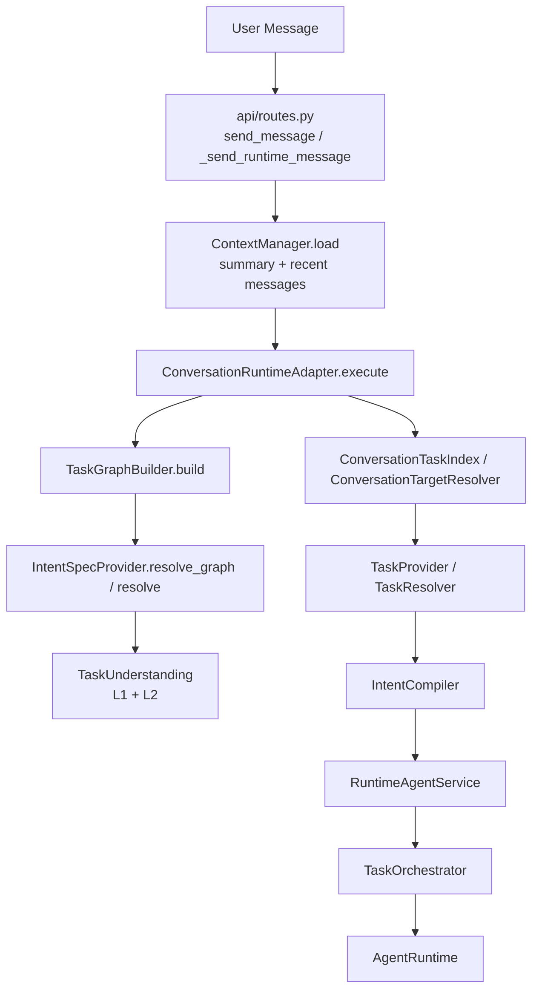
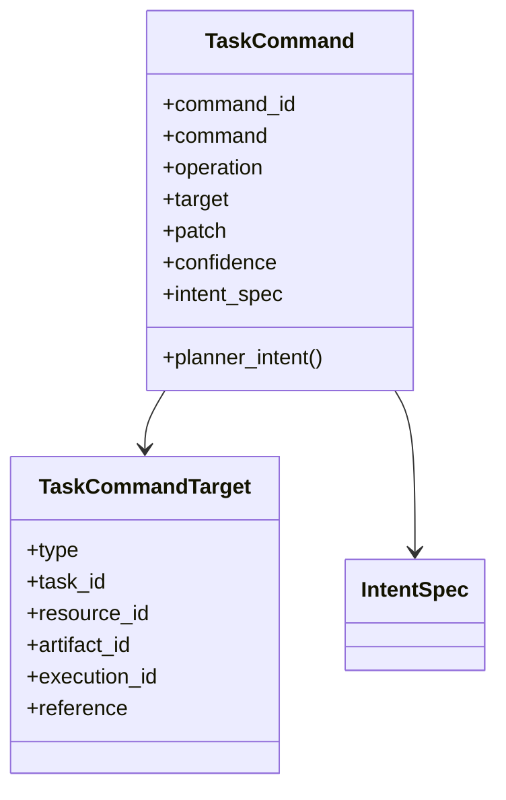
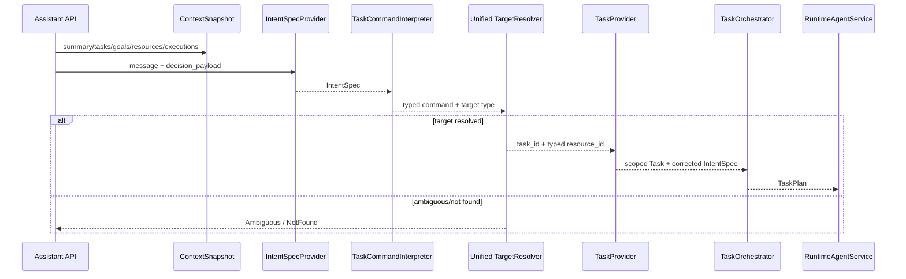

# Phase18-A Conversation Command Runtime Implementation

> 日期：2026-08-11  
> 范围：Conversation Command、统一目标解析、结构化决策上下文、结果聚合与 AssistantPanel 体验  
> 约束：未修改 Execution 状态机、Queue Worker 核心、AgentRuntime、Artifact 协议、Java 接口或 MCP 协议

## 0. 结论

Phase18-A 已将 Conversation 主链从“Intent 直接进入 Task/Planner”调整为：

```text
User Message
  -> ContextSnapshot
  -> IntentSpec / ConversationTaskGraph
  -> TaskCommand
  -> Unified TargetResolver
  -> TaskProvider（精确 Task 绑定）
  -> Planner
  -> Execution
  -> Result Projection Aggregation
  -> Structured Assistant Message
```

本期没有增加 Agent，也没有对“Java”“修改时间”等特定文本打补丁。Command Interpreter 不读取用户原始字符串，而是基于已验证的 `Action × Resource × Constraint` 语义生成命令。最关键的行为变化是：`UPDATE + TIME` 或 `UPDATE + SCHEDULE` 被归一为 `MODIFY / UPDATE_RUN_AT`，目标类型固定为 `SCHEDULE`，Planner 选择 `PublishAgent / MANAGE_SCHEDULE`，不再选择 Creator 的 `IMPROVE_CONTENT`。

Phase18-A 已闭环的命令是：

- `CREATE`
- `MODIFY_SCHEDULE`
- `MODIFY_DRAFT`
- `CANCEL_SCHEDULE`
- `QUERY`

`APPEND_GOAL`、对话式 `PAUSE/RESUME/RETRY` 已进入一等命令枚举，但本期没有接入解释器与 Control API；不能把它们描述为已完成。

说明：需求中指定的 `docs/progress/PHASE17_D_CONVERSATION_INTELLIGENCE_AND_CONTINUOUS_TASK_RUNTIME_AUDIT.md` 在当前仓库不存在。本次读取并以实际文件 `docs/progress/PHASE17D_CONVERSATION_OPERATOR_AUDIT.md` 为基线。

## 1. Phase18-A1：现有链路审计

### 1.1 修改前的真实消息链路



对象与决策位置：

| 阶段 | 文件 | 函数/类 | 审计发现 |
|---|---|---|---|
| API 消息入口 | `apps/assistant_api/greenbook_assistant_api/api/routes.py` | `send_message()`、`_send_runtime_message()`、`_prepare_message_history()` | Context 已加载，但原来主要进入 `RuntimeContext.conversation_history` |
| Conversation 适配 | `apps/assistant_api/greenbook_assistant_api/services/conversation_runtime_adapter.py` | `ConversationRuntimeAdapter.execute()` | Intent、目标绑定和 Task 创建/更新在同一方法串联，但缺少 Turn/Command 一等语义 |
| Graph/Intent | `packages/assistant_core/greenbook_assistant_core/task/graph.py` | `TaskGraphBuilder.build()` | 原调用没有结构化 ContextSnapshot |
| Intent Provider | `packages/assistant_core/greenbook_assistant_core/task/intent_spec_provider.py` | `resolve_graph()`、`resolve()` | L1/L2 只看到当前文本及有限 task hints |
| L1/L2 理解 | `packages/assistant_core/greenbook_assistant_core/task/understanding.py` | `understand()`、`_try_l2_v2()` | “修改”可被识别为 UPDATE，但资源类型仍依赖表达和 L2 输出 |
| 旧目标解析 | `packages/assistant_core/greenbook_assistant_core/task/multi_task.py`、`task/resolver.py` | 多个 resolver | 主要解析 Task，不稳定解析具体 Draft/Schedule/Post；不同 resolver 有不同回退语义 |
| Task 绑定 | `apps/assistant_api/greenbook_assistant_api/services/task_provider.py` | `resolve_task()` | 对修改请求执行 Task scope 与状态校验，但不能替代资源级语义解析 |
| Planner | `packages/assistant_core/greenbook_assistant_core/orchestration/orchestrator.py` | `_intent_spec_requirement_types()`、`_select_template()` | 原来所有 UPDATE 都映射为 IMPROVE，丢失 Resource 语义 |
| Agent 选择 | `packages/assistant_core/greenbook_assistant_core/orchestration/agent_registry.py` | `resolve_agent()` | `PublishAgent` 原 metadata 没有声明 `MANAGE_SCHEDULE` |

### 1.2 “修改时间为五分钟之后”失败的真实原因

这不是单一模块故障，而是四个连续缺口共同造成：

1. **Intent 资源语义可能错误。** L1 能捕获 UPDATE，但在没有“发布”等词时不能稳定得出 SCHEDULE；L2/Graph 可能保留 UPDATE，却把 Resource 生成为 DRAFT。实际进入 Creator 路径说明生产链最终得到的是内容修改语义。
2. **Context 已加载但未进入 Intent 决策。** Conversation summary、active resource 和历史消息没有作为结构化输入传给 `IntentSpecProvider`/Graph，因此模型看不到“上一轮已经创建 schedule”这一事实。
3. **旧 TargetResolver 只稳定绑定 Task。** 即使找到上一 Task，也没有形成 `{type: SCHEDULE, schedule_id: ...}` 的强类型目标；资源身份随后依靠 session/argument fallback。
4. **Planner 存在确定性错误。** `_intent_spec_requirement_types()` 原逻辑将所有 `UPDATE` 转成 `IMPROVE`，即使 Intent 正确为 `UPDATE SCHEDULE`，仍会选择 `SINGLE_IMPROVE -> CreatorAgent`。

因此，问题分类为：Intent 上下文缺失 + 资源目标解析缺失 + TaskCommand 缺失 + Planner 丢失 Resource 语义。Creator 报错只是错误规划的下游表现，不是根因。

### 1.3 A1 修改、测试与风险

- 修改文件：无；A1 为只读审计。
- 架构变化：无。
- 验证方法：静态调用链、Planner 模板映射、Agent capability metadata 与现有测试交叉验证。
- 风险：未查询线上 PostgreSQL 中该次 execution 的历史记录；结论来自当前代码的确定性路径和“实际进入 Creator”这一可观察事实。

## 2. Phase18-A2：Command、Resolver 与 ContextSnapshot 设计

### 2.1 TaskCommand

新增 `conversation/commands.py`，将“用户本轮想控制什么”从内容 Intent 和执行细节之间分离：



命令类型：`CREATE`、`MODIFY`、`APPEND_GOAL`、`CANCEL_TASK`、`CANCEL_RESOURCE`、`PAUSE_EXECUTION`、`RESUME_EXECUTION`、`RETRY_EXECUTION`、`QUERY`。

本期操作类型：`CREATE_CONTENT`、`UPDATE_RUN_AT`、`UPDATE_DRAFT`、`CANCEL_SCHEDULE`、`QUERY`。

`TaskCommand.planner_intent()` 是兼容边界：它保留现有 Intent/Planner 协议，只修正 Resource 语义，不把 Tool、Agent 或模板名称写入命令模型。

### 2.2 统一 TargetResolver

新增 `conversation/target_resolver.py`，生产 Conversation 主链只使用这一语义解析器。旧 `ConversationTaskIndex` 仍用于 Task/Goal/Execution 投影，但不再承担自然语言目标猜测；`TaskProvider` 只负责精确 Task 绑定、scope 和生命周期校验。

输入为 `ConversationContextSnapshot`，候选集来自：

- active task/resource 指针
- conversation scope 内 Task
- Task resource index
- Artifact reference
- Execution reference
- recent operations

支持：

| 引用类型 | 示例 | 判定方式 |
|---|---|---|
| 强引用 | task_id、draft_id、schedule_id、post_id、execution_id | 精确 identity 匹配 |
| 弱引用 | 刚才那个、上一条、那篇文章 | active typed resource 或唯一候选；多个候选返回 Ambiguous |
| 序号引用 | 第二篇 | 对稳定候选顺序取序号 |
| 属性引用 | Java 那篇、Redis 那篇 | 对标题/摘要/标签做属性词匹配 |
| 时间引用 | 昨天生成的、上周的 | 对候选 `updated_at` 过滤 |
| 状态引用 | 准备发布的、失败的、暂停的 | 对规范化 status 过滤 |

输出严格为 `Resolved / Ambiguous / NotFound`。当证据不足或存在多个候选时，不按“最近一个”自动猜测。

### 2.3 结构化 ConversationContextSnapshot

`ConversationContextSnapshot.decision_payload()` 只提供决策所需的有界结构：

```json
{
  "conversation_summary": "...",
  "active_tasks": [],
  "unfinished_goals": [],
  "recent_operations": [],
  "available_resources": [],
  "executions": [],
  "user_preferences": []
}
```

完整 recent messages 不进入该 payload，避免把全部历史直接塞给 Intent/Graph。Snapshot 当前进入：

- `TaskGraphBuilder`
- `IntentSpecProvider.resolve_graph()`
- `IntentSpecProvider.resolve()`
- `TaskUnderstanding` 的 L2 prompt
- `TaskCommandInterpreter`
- `TargetResolver`
- `RuntimeContext` 及 Queue 序列化

`user_preferences` 字段和传递链已建立，但生产环境尚未把 Memory/User Profile 的偏好召回结果注入 session，本期不会把它描述为已实现个性化。

### 2.4 A2 修改、测试与风险

修改文件：

- `packages/assistant_core/greenbook_assistant_core/conversation/commands.py`
- `packages/assistant_core/greenbook_assistant_core/conversation/target_resolver.py`
- `packages/assistant_core/greenbook_assistant_core/conversation/context_manager.py`
- `packages/assistant_core/greenbook_assistant_core/conversation/__init__.py`
- `packages/assistant_core/greenbook_assistant_core/task/intent_spec_provider.py`
- `packages/assistant_core/greenbook_assistant_core/task/understanding.py`
- `packages/assistant_core/greenbook_assistant_core/task/graph.py`

测试结果：强引用、属性/时间/状态引用、无证据拒绝猜测、Intent Graph 有界上下文均由 Phase18-A 单元测试覆盖。

剩余风险：时间引用目前依据 resource snapshot 的 `updated_at`，尚未细分“生成时间”“发布时间”“最后修改时间”；复杂时间语义仍需更丰富的资源索引字段。

## 3. Phase18-A3：Conversation Command Runtime 实现

### 3.1 新生产链



以“修改时间为五分钟之后”为例，新的中间结果为：

```json
{
  "command": "MODIFY",
  "operation": "UPDATE_RUN_AT",
  "target": {
    "type": "SCHEDULE",
    "task_id": "<resolved-task-id>",
    "resource_id": "<resolved-schedule-id>"
  },
  "patch": {
    "run_at_expression": "五分钟之后",
    "run_at": "<canonical-UTC-time>"
  }
}
```

随后：

```text
UPDATE + SCHEDULE
  -> goal category MANAGE_SCHEDULE
  -> SINGLE_MANAGE_SCHEDULE
  -> capability MANAGE_SCHEDULE
  -> PublishAgent
```

### 3.2 实现行为

| 用户语义 | Command | Planner/处理路径 | 状态 |
|---|---|---|---|
| 新建内容/复合创建 | CREATE | 保持现有 TaskGraph/Planner | 已接入 |
| 修改发布时间 | MODIFY / UPDATE_RUN_AT | PublishAgent / MANAGE_SCHEDULE | 已接入 |
| 修改草稿 | MODIFY / UPDATE_DRAFT | CreatorAgent / IMPROVE_CONTENT | 已接入 |
| 取消发布计划 | CANCEL_RESOURCE / CANCEL_SCHEDULE | PublishAgent / CANCEL_SCHEDULE | 已接入 |
| 查询 | QUERY | ReadOnlyQueryHandler，不创建 Task/Execution | 已接入 |
| 暂停/继续/重试的自然语言命令 | 对应枚举 | 尚未映射 Control API | 未接入 |
| APPEND_GOAL | 对应枚举 | 尚未修改 Task Goal | 未接入 |

### 3.3 Planner 与 Agent metadata 修复

- `TaskOrchestrator` 不再把所有 UPDATE 都折叠成 IMPROVE。
- `UPDATE SCHEDULE` 使用 `SINGLE_MANAGE_SCHEDULE`。
- `MANAGE_SCHEDULE` category fallback 同样指向 `SINGLE_MANAGE_SCHEDULE`，避免没有 Formal IntentSpec 时误走 cancel。
- `PublishAgent` metadata 声明 `MANAGE_SCHEDULE`，使 Registry 能按 capability 动态发现执行器。
- 未修改 Planner 模板业务、TaskGraph 算法或 AgentRuntime 执行逻辑。

### 3.4 RuntimeContext 与 Queue 恢复

`RuntimeContext` 增加：

- `conversation_context`
- `task_command`

`RuntimeAgentService` 的 Queue payload 序列化/反序列化保留这两个字段，因此 Worker claim 或进程重启后不会丢失本轮命令和决策上下文。Worker 核心消费逻辑没有变化。

### 3.5 A3 修改、测试与风险

修改文件：

- `apps/assistant_api/greenbook_assistant_api/services/conversation_runtime_adapter.py`
- `apps/assistant_api/greenbook_assistant_api/models/runtime_context.py`
- `apps/assistant_api/greenbook_assistant_api/services/runtime_agent_service.py`
- `packages/assistant_core/greenbook_assistant_core/orchestration/orchestrator.py`
- `packages/assistant_core/greenbook_assistant_core/orchestration/agent_registry.py`
- `tests/unit/test_phase18a_conversation_command_runtime.py`

测试结果：Command 到 Adapter、Task 精确绑定、Planner 模板和 Agent 选择已覆盖；相关后端回归 38 项通过，Phase16-B AgentRuntime + Phase17-C Projection + Phase18-A 联合回归 22 项通过。

剩余风险：本期没有启动 Java/Creator/MCP 做在线 E2E，因此验证到 Agent capability 与 Runtime 边界；外部服务对 `MANAGE_SCHEDULE` 的实际返回仍需在完整环境做一次 smoke test。

## 4. Phase18-A4：Result Experience 与 AssistantPanel

### 4.1 对话结果

`AssistantPanel` 现在优先消费 structured `execution_result` parts，而不是把后端 content 当作唯一结果：

- 完成摘要
- 草稿标题与内容摘要
- draft ID
- 发布时间与 timezone
- schedule ID 与状态
- 查看文章、修改内容、调整发布时间、取消发布、查看任务详情

操作按钮不会绕过 Conversation Runtime 直接修改业务资源；它们把带明确资源语义的后续命令填入对话输入框，仍由 Command/Target/Planner 主链处理。

### 4.2 执行过程

- 执行过程与业务结果分离。
- 默认只显示用户可理解的状态；详细 steps 放在折叠区域。
- step capability 映射为产品语言。
- 不显示 `EXECUTION_STARTED`、`STEP_FAILED`、`JAVA_BACKEND_UNAVAILABLE` 等内部事件/错误码。
- 暂停、继续、取消控件仍使用 Phase17-B Control API，没有改动其状态机。

### 4.3 失败体验

后端 `ExecutionResultPresenter` 和前端均采用用户可理解的失败分类：

- 输入问题
- 权限/认证问题
- 外部服务暂时不可用
- 可重试失败
- 外部副作用状态未知
- 通用未知失败

Presenter 不再用原始 technical exception 作为最终用户 fallback。前端展示“原因 + 已保留结果 + 恢复建议”，调试信息仍可通过后端日志和 Execution API 检查。

### 4.4 多任务结果

- API accepted response 类型支持 `execution_ids` / `task_ids`。
- 前端同时跟踪本次请求中的所有 Execution，不再只订阅第一个 `execution_id`。
- 执行中显示各子任务进度与完成/失败数量。
- `CompletionProjectionCoordinator` 按同一 trace 合并 sibling execution result parts，不再用后完成的结果覆盖先完成结果。
- 完成后 structured message 以多结果卡片展示，每个子任务保留自己的 execution、artifact 与 schedule。

### 4.5 A4 修改、测试与风险

修改文件：

- `apps/assistant_api/greenbook_assistant_api/services/completion_projection_coordinator.py`
- `apps/assistant_api/greenbook_assistant_api/services/execution_presenter.py`
- `zhiguang-fe/src/components/assistant/AssistantPanel.tsx`
- `zhiguang-fe/src/components/assistant/AssistantPanel.module.css`
- `zhiguang-fe/src/services/runtimeExecutionLabels.ts`
- `zhiguang-fe/src/types/assistant.ts`

验证结果：

- `npm run build`：通过（TypeScript + Vite production build）。
- `npm run test:execution`：通过。
- completion projection sibling aggregation 单元测试：通过。

剩余风险：

- 当前多任务卡片的子项标题优先来自最终 Artifact；执行中、Artifact 尚未生成时只能显示“任务 1/2…”。要显示更语义化的运行中标题，需要 accepted payload 暴露 goal summary。
- “调整发布时间/取消发布”目前是对话式下一步，不是结果卡直接调用业务 API，这是为了维持统一 Command Runtime 和人工可见性。
- 尚未做浏览器视觉回归、屏幕阅读器和暗色主题专项测试；本期完成了语义标签、focus 样式和最小 44px 操作区，但不能声称完整无障碍验收。

## 5. 完整修改文件清单

### 新增

- `packages/assistant_core/greenbook_assistant_core/conversation/commands.py`
- `packages/assistant_core/greenbook_assistant_core/conversation/target_resolver.py`
- `tests/unit/test_phase18a_conversation_command_runtime.py`
- `zhiguang-fe/src/services/runtimeExecutionLabels.ts`
- `docs/progress/PHASE18A_CONVERSATION_COMMAND_RUNTIME_IMPLEMENTATION.md`

### 修改

- `packages/assistant_core/greenbook_assistant_core/conversation/__init__.py`
- `packages/assistant_core/greenbook_assistant_core/conversation/context_manager.py`
- `packages/assistant_core/greenbook_assistant_core/task/graph.py`
- `packages/assistant_core/greenbook_assistant_core/task/intent_spec_provider.py`
- `packages/assistant_core/greenbook_assistant_core/task/understanding.py`
- `packages/assistant_core/greenbook_assistant_core/orchestration/orchestrator.py`
- `packages/assistant_core/greenbook_assistant_core/orchestration/agent_registry.py`
- `apps/assistant_api/greenbook_assistant_api/models/runtime_context.py`
- `apps/assistant_api/greenbook_assistant_api/services/conversation_runtime_adapter.py`
- `apps/assistant_api/greenbook_assistant_api/services/runtime_agent_service.py`
- `apps/assistant_api/greenbook_assistant_api/services/completion_projection_coordinator.py`
- `apps/assistant_api/greenbook_assistant_api/services/execution_presenter.py`
- `zhiguang-fe/src/components/assistant/AssistantPanel.tsx`
- `zhiguang-fe/src/components/assistant/AssistantPanel.module.css`
- `zhiguang-fe/src/types/assistant.ts`

仓库在本阶段开始前已有大量未提交修改；以上只列出 Phase18-A 实际触及文件，没有回退或覆盖其他阶段的用户修改。

## 6. 测试汇总

| 验证 | 结果 |
|---|---|
| 最终后端联合回归（Phase18-A + Adapter + Intent + Planner + Phase17-C + Phase16-B） | `49 passed` |
| Phase18-A + Adapter + Intent + Planner focused suite | `38 passed` |
| Phase16-B AgentRuntime + Phase17-C Projection + Phase18-A | `22 passed` |
| Phase18-A 新增/改动 Python 文件 Ruff | 通过，0 error |
| Frontend execution tests | 通过 |
| Frontend TypeScript + Vite production build | 通过，359 modules transformed |
| Java/Creator/MCP 在线 E2E | 未运行；遵守不运行大规模/外部集成测试的边界 |

## 7. 未破坏边界确认

本阶段没有修改：

- Execution status/control state 枚举和状态迁移规则
- Execution Queue claim/lease/ack 核心逻辑
- Execution Worker step 执行核心
- Retry / Reconciliation
- AgentRuntime / AgentExecutor
- Artifact model/protocol
- ToolRuntime / MCP 协议
- Java Backend 与 Creator 外部协议

变化发生在这些边界之前或之后：执行前增加 Command/Resolver/Context，执行后增加 projection aggregation 和前端呈现。

## 8. 剩余风险与下一步边界

### P0（继续成为持续任务 Runtime 前必须闭环）

1. **对话式 Control Command 尚未接入。** `PAUSE_EXECUTION / RESUME_EXECUTION / RETRY_EXECUTION` 只有一等模型，尚未从 Intent 解释并调用现有 Control API。
2. **APPEND_GOAL 尚未实现。** 当前追加目标仍可能形成新 Task 或依赖 LLM 生成复合图。
3. **生产 Queue 的 Graph dependency 风险未在本期处理。** Phase17-D 审计指出 dependent node 在异步队列中等待上游 Artifact 的闭环仍不完整；本期约束禁止修改 Queue/Worker 核心。

### P1（Operator 体验增强）

1. 将 user preference/memory recall 注入 ContextSnapshot，而不只是保留字段。
2. 为 TargetResolver 增加 resource `created_at/run_at/published_at`，使时间引用按业务时间精确解析。
3. 为 Ambiguous 结果增加前端候选澄清卡，而不是只返回失败文案。
4. accepted multi-task payload 增加 goal label，使运行中子任务不依赖序号占位。
5. 为 QUERY 结果增加与 execution result 一致的 structured query projection。

### P2（长期能力）

1. 持久化 Command/Turn identity，把一次用户命令、多个 Execution 和一条聚合回复作为可审计整体。
2. 建立 Conversation Command evaluation：命令分类、指代消解、歧义拒绝、跨天恢复、多任务局部修改。
3. 在不改变 AgentRuntime 的前提下，逐步让 Planner 消费 `unfinished_goals` 和 preference constraints。

## 9. 当前真实状态

Phase18-A 后，GreenBook 已不再把每个后续用户消息都当作“新的内容意图”。它具备了持续任务控制的基础语义边界：Command 表达本轮控制意图，TargetResolver 绑定已有任务资源，Planner 只接收已归一的资源语义，结果按一次用户请求聚合展示。

但它还不是完整 Operator Runtime：自然语言 pause/resume/retry、追加 Goal、交互式歧义澄清和生产队列 DAG 等待仍未闭环。当前最准确的定位是：**已经具备可扩展 Conversation Command 主链的社区任务 Runtime，而非完成全部持续控制能力的通用 Operator。**
