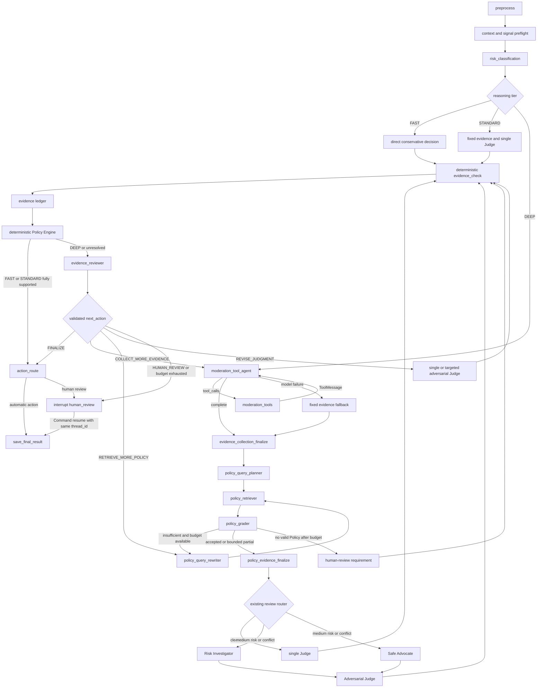

# Content moderation

The moderation module is the core domain of this service. It uses the FastAPI lifecycle, LangGraph checkpoint and store contracts, Pydantic schemas, authentication, and LangSmith tracing configuration provided by this repository.

The production community boundary reads real post and comment context from the Zhiguang Java service.

## End-to-end graph

The moderation service keeps one `ModerationState` and one final `AgentDecision` contract. Dynamic
context collection, formal Policy retrieval, single/Multi-Agent review, evidence validation, and
semantic review/correction, and human resume are stages of the same checkpointed LangGraph
execution.



## Scope

Version one accepts text and classifies exactly one of `NORMAL`, `ADVERTISING`, `ABUSE`, or `PRIVACY`. Final actions are `PASS`, `REJECT`, or `LIMIT`; `HUMAN_REVIEW` represents a paused task rather than a completed decision.

After initial classification, a bounded ReAct loop lets the evidence Agent choose only the
necessary read-only moderation tools. Official LangGraph `ToolNode` execution returns
`ToolMessage` observations to the Agent. Successful calls are cached by normalized tool name and
arguments in Graph State; maximum rounds, total calls, and per-round parallel calls prevent an
unbounded loop. Model or tool failures never produce an automatic enforcement decision. A model
failure uses the preserved fixed evidence path, while missing critical evidence routes to human
review.

The adaptive cascade selects one bounded reasoning tier. Low-risk, high-confidence `NORMAL`
content with no contextual or deterministic risk signal uses `FAST` and creates a conservative
direct decision without a Judge or semantic Reviewer. Clear content uses `STANDARD`, fixed
evidence retrieval, and one Judge. Comments, report-triggered tasks, incomplete context,
low-confidence classifications, and scores in the configured ambiguity band use `DEEP`, retaining
dynamic tools, Agentic Policy RAG, adversarial review, and semantic correction. Insufficient
evidence pauses at `human_review` with `interrupt()`. The review endpoint resumes the same
checkpoint using `Command(resume=...)` and the task's `thread_id`.

Every direct or Judge result first passes deterministic evidence validation. The evidence-ledger
node assigns stable claim IDs and records source type, source ID, exact content span when
available, confidence, provenance, and Policy-condition links. The deterministic Policy Engine
then checks current Policy IDs, supported actions, semantic condition grades, exclusions, and
upstream evidence requirements. It never chooses a stricter action than the Judge proposed.
Supported `FAST` and `STANDARD` decisions can finalize immediately; unresolved decisions continue
to the semantic Evidence Reviewer. The Reviewer cannot issue an action itself. Its structured
route is validated by ordinary Python before the Graph either finalizes, collects targeted
evidence, retrieves a more specific Policy, reruns the minimum necessary Judge/advocate nodes, or
pauses for human review.

## Code map

The implementation stays inside this repository's Python architecture:

- `src/agents/moderation/`: graph state, prompts, routing, model adapter, and graph nodes.
- `src/agents/moderation/tools/`: bounded tool factory, runtime controls, ToolNode execution,
  cache, authorization, and trace metadata.
- `src/agents/moderation/nodes/policy_*.py`: Policy query planning, applicability grading,
  query rewriting, loop routing, final evidence projection, evidence ledger, and deterministic
  action constraints.
- `src/agents/moderation/nodes/evidence_reviewer.py`: semantic review, route validation, correction
  preparation, progress checks, and targeted Multi-Agent rerun selection.
- `src/agents/moderation/nodes/evidence_reviewer_model.py`: structured Reviewer model adapter and
  timeout/parse failure handling.
- `src/agents/moderation/reviewer.py` and `reviewer_observability.py`: deterministic route guards,
  privacy-safe trace metadata, and correction-cycle tracing.
- `src/agents/moderation/policy_rag_graph.py`: independently testable Agentic Policy RAG subgraph;
  production execution uses the same nodes inside the main moderation graph.
- `src/community/`: Zhiguang Java provider boundary and Agent context tools.
- `src/moderation/schemas/`: API and structured-decision Pydantic models.
- `src/moderation/models/`: SQLAlchemy definitions for tasks, policies, logs, cases, and signals.
- `src/moderation/repositories/`: task, policy, log, case, and statistics persistence.
- `src/moderation/services/`: workflow orchestration, runtime wiring, Redis queue, and policy/statistics services.
- `src/rag/policy/`: legacy Policy retrieval plus Agentic vector/keyword/hybrid retrieval backed by
  PostgreSQL facts and optional Qdrant candidates.
- `src/rag/cases/`: corrected-case retrieval for supporting evidence only.
- `src/rag/qdrant.py`: Qdrant policy and reviewed-case vector index.
- `src/service/routes/moderation.py`: authenticated FastAPI endpoints.
- `src/database/migrations/`: Alembic baseline and community upgrade revisions.
- `tests/moderation/`, `tests/service/test_moderation_routes.py`, and
  `tests/service/test_api_surface.py`: graph, resume, storage, RAG, and API coverage.

The runtime integration points are `src/agents/agents.py`, `src/core/settings.py`,
`src/service/service.py`, `langgraph.json`, `.env.example`, `compose.yaml`,
`pyproject.toml`, `uv.lock`, and `docker/Dockerfile.service`.

The implementation retains one moderation state graph and one final `AgentDecision` contract.
Dynamic evidence collection feeds both the single-Judge and Risk/Safe/Judge paths; those review
agents do not call tools again. The fixed evidence nodes remain available solely as a compatibility
fallback.

## Agentic Policy RAG

The Policy RAG subgraph is formal rule collection, not a second moderation Judge:

```text
Dynamic Tool Agent       = gathers context, signals, and lightweight preliminary evidence
Agentic Policy RAG       = finds and validates formal platform rules
Risk / Safe Agents       = argue from the same validated evidence package
Single / Adversarial Judge = produces the existing AgentDecision
Evidence Check           = enforces deterministic evidence and action constraints
Evidence Ledger          = records typed claims, provenance, spans, and Policy conditions
Policy Engine            = deterministically allows, enforces, or escalates the proposed action
Evidence Reviewer        = semantically audits the decision and requests the smallest safe correction
```

`policy_query_planner` receives the content, initial risk, Signals, dynamic evidence summary, and
any preliminary Policy Tool results. It emits no more than three scenario-specific queries plus
risk/severity filters, required conditions, exclusion checks, and `VECTOR`, `KEYWORD`, or `HYBRID`
mode. If its model call fails, the existing fixed risk query template is used.

`policy_retriever` treats Qdrant only as a semantic candidate index. It loads every candidate's
current enabled record from PostgreSQL before the rule can enter the Graph, filters effective and
expiry dates, selects the current version, deduplicates Policy IDs, and applies a bounded,
explainable vector/keyword score. A Qdrant failure falls back to PostgreSQL keyword retrieval. A
PostgreSQL fact-source failure cannot be replaced by Qdrant metadata and forces a safe human-review
path.

`policy_grader` first runs deterministic validation, then grades semantic relevance, applicability,
missing conditions, triggered exclusions, supported actions, and confidence. Similar wording alone
does not make a rule applicable. Accepted and partially applicable rules are kept separate; rejected
rules never return to final evidence.

When evidence is weak, `policy_query_rewriter` uses the Grader's missing topics and conditions to
make the query more concrete, adjust filters, or switch retrieval mode. Normalized query signatures
and State-local cache prevent duplicate execution. The loop stops when evidence is sufficient, the
query does not change, no new Policy is found, or the configured retrieval budget is exhausted.

`policy_evidence_finalize` produces one `PolicyEvidenceSummary` shared by Single Judge, Risk
Investigator, Safe Advocate, and Adversarial Judge. With partial valid evidence, review may continue
at reduced confidence. With no valid formal Policy, the task cannot be automatically passed or
penalized and is routed to human review.

The deterministic Evidence Check additionally enforces:

- A Judge may cite only an applicable or explicitly partial Policy from the final summary.
- `REJECT` requires at least one current valid Policy and matching content evidence.
- `LIMIT` requires a Policy whose supported actions include `LIMIT`.
- Expired, disabled, Grader-rejected, similar-case-only, and user-history-only evidence cannot
  justify enforcement.
- Insufficient Policy evidence cannot produce a high-confidence automatic penalty.

## Evidence Reviewer correction loop

The Evidence Reviewer runs only after the deterministic Evidence Check. It checks whether the
Judge's action, risk score, confidence, content/context evidence, and Policy applicability are
semantically coherent. It also checks that author history, reports, and similar cases remain
supporting signals rather than sole enforcement evidence. It never returns a new `AgentDecision`.

Its `EvidenceReviewerDecision.next_action` is validated before routing:

- `FINALIZE` continues to the existing deterministic action router only when the decision passed.
- `COLLECT_MORE_EVIDENCE` returns to the existing Tool Agent with Reviewer feedback and preserves
  prior results and normalized call cache.
- `RETRIEVE_MORE_POLICY` returns to Query Rewriter when possible, or Query Planner when the plan
  itself is invalid; unrelated Tool nodes are not rerun.
- `REVISE_JUDGMENT` reruns Single Judge or, for Multi-Agent review, only Adversarial Judge by
  default. Risk/Safe are rerun selectively when their own output is affected.
- `HUMAN_REVIEW` uses the existing checkpoint, `interrupt()`, and `Command(resume=...)` path.

State records independent total, Tool, Policy, and judgment revision counters. Equivalent
revision signatures, no new evidence/Policy, an unchanged decision with unresolved problems, low
Reviewer confidence, model/parse errors, or exhausted budgets all fail closed to human review.
The configured Graph recursion limit is a final safety bound, not the primary loop-control method.

## Storage

PostgreSQL is the production source of truth. SQLAlchemy owns separate moderation and demo-community tables:

- `moderation_task`: input, agent decision, bounded dynamic-evidence audit, Agentic Policy RAG
  audit, adversarial audit, final Evidence Reviewer summary, human decision, status, final action,
  `thread_id`, and optimistic version.
- `moderation_action_log`: append-only task, agent, reviewer, and system events.
- `moderation_policy`: enabled platform policies and their default actions.
- `moderation_review_case`: concrete agent decisions overturned by a reviewer.
- `moderation_signal`: report, author-history, text-pattern, and context-completeness evidence.

Redis stores a sorted index of pending task IDs. Qdrant stores policy and corrected-case vectors. Database-backed retrieval and pending-task queries remain available if either optional service is unavailable.

Migration `0005_agentic_policy_rag_contracts.py` adds Policy applicability/exclusion conditions,
violation/safe examples, severity, supported actions, tags, effective windows, and the bounded
`moderation_task.policy_rag` JSON audit. Migration `0006_evidence_reviewer_audit.py` adds the bounded
`moderation_task.evidence_review` summary. Each Reviewer attempt is stored as a separate
`EVIDENCE_REVIEWED` action-log event, so full iteration history does not inflate the task row. Run
`alembic upgrade head` after pulling these changes.

Async task execution uses a fenced lease. The service captures both `locked_by` and
`attempt_count` before invoking LangGraph, then compares both under a row lock before applying
either success or failure. A reclaimed task therefore rejects late output from the expired worker
instead of allowing an older graph result to overwrite the current attempt.

## API

All endpoints use the existing bearer authentication when `AUTH_SECRET` is configured.

```text
POST /moderation/tasks
GET  /moderation/tasks?status=WAITING_REVIEW
GET  /moderation/tasks/{task_id}
GET  /moderation/tasks/{task_id}/logs
POST /moderation/tasks/{task_id}/review
POST /moderation/policies
GET  /moderation/policies
GET  /moderation/statistics
```

Create a task:

```json
{
  "content": "Limited offer. Contact me on Telegram.",
  "content_id": "post-123",
  "platform": "default",
  "creator_id": "user-42",
  "metadata": {"channel": "community"}
}
```

Resume an interrupted review with the version returned by the task API:

```json
{
  "action": "LIMIT",
  "risk_type": "ABUSE",
  "reviewer_id": "reviewer-7",
  "comment": "Reduce distribution; intent is ambiguous.",
  "expected_version": 2,
  "idempotency_key": "review-post-123-v2"
}
```

## Run

Docker Compose starts PostgreSQL, Redis, Qdrant, runs the database migration, and then starts the FastAPI service:

```bash
docker compose up --build
```

The moderation console and API are available from the same FastAPI service at `http://localhost:8088`; OpenAPI is available at `http://localhost:8088/docs`.

Compose runs `alembic upgrade head` before starting FastAPI. For a local or standalone PostgreSQL deployment, run the migration explicitly and disable automatic schema creation:

```bash
alembic upgrade head
MODERATION_AUTO_CREATE_SCHEMA=false python src/run_service.py
```

An older database that already has the original four moderation tables but no `alembic_version` record can be adopted with `alembic stamp 0001` followed by `alembic upgrade head`.

For local development without infrastructure, leave `REDIS_URL` and `QDRANT_URL` empty. The moderation domain then uses `data/databases/moderation.db`, the database review queue, and database retrieval. LangGraph checkpoints use `data/databases/checkpoints.db`. Set `MODERATION_DATABASE_URL` explicitly when moderation data should use a database independent of the LangGraph checkpoint configuration.

LangSmith tracing reads the standard `LANGSMITH_TRACING`, `LANGSMITH_API_KEY`, `LANGSMITH_PROJECT`, and `LANGSMITH_ENDPOINT` environment variables. Every graph execution is tagged `moderation` and includes the moderation task ID as trace metadata.

The dynamic evidence trace names are `moderation_tool_agent`, `moderation_tool_execution`, and
`evidence_collection_finalize`. Trace metadata contains task/risk/tool counters and never raw
content or full contact values. The task API exposes a bounded
`agent_decision.evidence_collection` audit with call status, cache hits, evidence summaries,
missing evidence, budget state, and the recommended path. Complete tool results and model-private
reasoning are not persisted.

Agentic Policy RAG uses the node/trace names `policy_query_planner`, `policy_retriever`,
`policy_grader`, `policy_query_rewriter`, and `policy_evidence_finalize`. Metadata is allowlisted
and bounded to task/risk identifiers, redacted query summaries, modes, counts, rounds, fallback and
budget flags, accepted Policy IDs, model name, and latency/token data supplied by the model client.
Raw content, full contact values, and private chain-of-thought are not attached to trace metadata.
The task's `policy_rag` JSON and `AGENT_DECIDED` log keep the structured audit needed by the API and
browser console without persisting complete model prompts or vector documents.

Evidence Reviewer trace names are `evidence_reviewer`, `reviewer_route_validation`, and
`reviewer_revision_cycle`. Metadata is restricted to task/Judge identifiers, iteration and revision
counters, problem types, validated route, confidence, budget state, model/latency/token metrics,
and redacted error codes. Raw content, contact values, prompts, and private reasoning are excluded.
The task API combines the bounded task summary with per-iteration `EVIDENCE_REVIEWED` logs.

Tool Calling limits are configured centrally:

```text
MODERATION_TOOL_CALLING_ENABLED=true
MODERATION_TOOL_MAX_ROUNDS=4
MODERATION_TOOL_MAX_TOTAL_CALLS=8
MODERATION_TOOL_MAX_PARALLEL_CALLS=3
MODERATION_TOOL_TIMEOUT_SECONDS=5
MODERATION_TOOL_MAX_RESULT_CHARS=4000
MODERATION_TOOL_MAX_RETRIES=1
MODERATION_TOOL_AGENT_TIMEOUT_SECONDS=30
```

Agentic Policy RAG limits are also configured centrally:

```text
MODERATION_POLICY_RAG_ENABLED=true
MODERATION_POLICY_RAG_MAX_QUERIES_PER_ROUND=3
MODERATION_POLICY_RAG_MAX_RETRIEVAL_ROUNDS=2
MODERATION_POLICY_RAG_MAX_TOTAL_POLICIES=20
MODERATION_POLICY_RAG_VECTOR_TOP_K=5
MODERATION_POLICY_RAG_KEYWORD_TOP_K=5
MODERATION_POLICY_RAG_FINAL_TOP_K=8
MODERATION_POLICY_RAG_VECTOR_WEIGHT=0.65
MODERATION_POLICY_RAG_KEYWORD_WEIGHT=0.35
MODERATION_POLICY_RAG_MIN_VECTOR_SCORE=0.45
MODERATION_POLICY_RAG_MIN_COMBINED_SCORE=0.50
MODERATION_POLICY_RAG_GRADER_MIN_CONFIDENCE=0.65
MODERATION_POLICY_RAG_ALLOW_PARTIAL=true
MODERATION_POLICY_RAG_FALLBACK_TO_DATABASE=true
MODERATION_POLICY_RAG_AGENT_TIMEOUT_SECONDS=30
```

Disabling `MODERATION_POLICY_RAG_ENABLED` preserves the legacy Policy path. Leaving `QDRANT_URL`
empty exercises PostgreSQL retrieval; leaving both Qdrant and Redis empty remains a supported local
development mode. No retrieval failure is interpreted as `NORMAL`.

Evidence Reviewer limits are configured independently:

```text
MODERATION_EVIDENCE_REVIEWER_ENABLED=true
MODERATION_REVIEWER_MAX_ITERATIONS=2
MODERATION_REVIEWER_MAX_TOOL_REVISIONS=1
MODERATION_REVIEWER_MAX_POLICY_REVISIONS=1
MODERATION_REVIEWER_MAX_JUDGMENT_REVISIONS=2
MODERATION_REVIEWER_MIN_CONFIDENCE=0.65
MODERATION_REVIEWER_HUMAN_ON_BUDGET=true
MODERATION_REVIEWER_HUMAN_ON_ERROR=true
MODERATION_REVIEWER_ALLOW_FAST_PATH_ON_ERROR=false
MODERATION_REVIEWER_TIMEOUT_SECONDS=30
MODERATION_GRAPH_RECURSION_LIMIT=64
```

With the default fail-closed settings, an unavailable Reviewer cannot silently approve or penalize
a task. Disabling the Reviewer preserves the pre-existing deterministic Evidence Check flow.

## Review console

The moderation service exposes APIs only. Administrators review tasks in the GreenBook frontend;
the former standalone simulation console and fake `/community/*` surface have been removed.

## Verification

Runtime integration verification uses a configured live model and the real Java
community adapter:

```powershell
$env:PYTHONPATH="src"
.\.venv\Scripts\python.exe -m pytest tests\moderation -q
.\.venv\Scripts\python.exe -m pytest tests\service\test_moderation_routes.py tests\service\test_community_routes.py tests\database\test_moderation_migrations.py -q
.\.venv\Scripts\ruff.exe check src tests
.\.venv\Scripts\mypy.exe src
```

Infrastructure-backed smoke testing additionally requires Docker and the migrated PostgreSQL
database. See [the Windows minimal startup guide](moderation-local-development.md) for the exact
commands.
